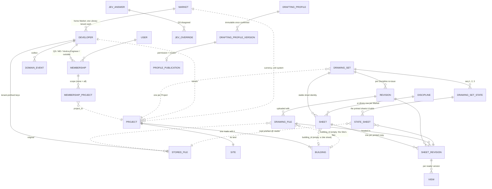
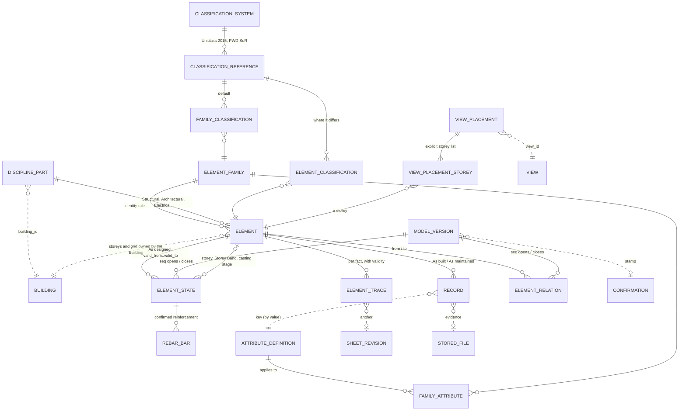
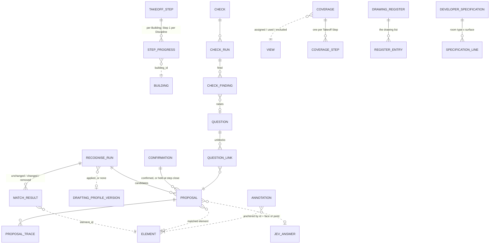
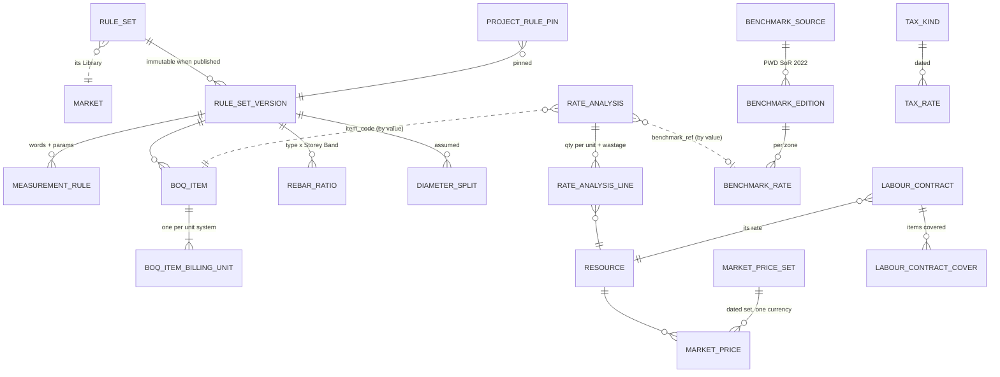
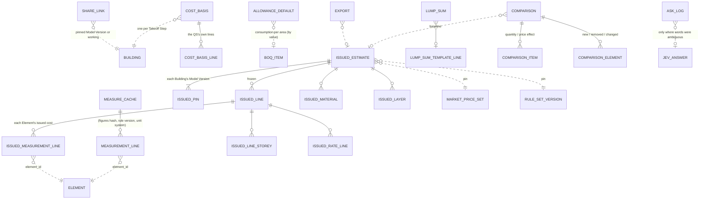

# Vextrus — the data model

Revised in session 02 (28 Sep 2026); re-signed under the owner's delegation: "Take every necessary
actions, update and write all files to end the session." First drafted on 26 Sep 2026 in session 01 for
the owner's review; the owner's rulings on its open questions are in §6.

It starts from the sketch in `docs/research/stack-data.md` §10 and applies every ADR that overrides it:
0002, 0005–0011, 0015, 0016, 0026–0031, 0033 and 0034 (which merged 0020, 0021 and 0023), and from
session 02 ADRs 0035–0040 with the amendments of 27–28 Sep 2026 (0002, 0003, 0006, 0007, 0008, 0010,
0011, 0014, 0015, 0016, 0022, 0028, 0030, 0033, 0034), plus `docs/specs/bd-defaults.md`. Where this page
and an ADR disagree, the ADR wins; report the mismatch. Terms are `CONTEXT.md`'s (§1.3). It is a guide
for build sessions, so it gives key fields, not every column.
- **M0's additions** (the M0 plan's step D0, 26 Sep 2026, from the M0 spec's "Amendments after
  sign-off" and the plan's rulings) are in §3.0, §3.2 and §3.4: invitation fields, the drawings tables'
  M0 fields, the lists M0 fixes, Coverage with `assigned` and one row per Takeoff Step, and the drawing
  list.
- **Session 02's changes** are marked "(s02)" with the grill question that ruled them
  (`docs/reviews/session-02-grill.md` holds each ruling in the owner's words) and the ADR. The largest:
  the Building Model is the **Live Model** (`building_model` → `live_model`), with Life Phases,
  Attributes, Records, Discipline Parts and Element Relations; a Project holds a Site and Buildings;
  Markets are data; an Element is one physical piece; issuing freezes each Element's Measurement Lines.
  "Live" in its old sense of working or unfrozen is now "working".
- **The M0 plan's reviews** (28 Sep 2026; `docs/reviews/M0-plan-s02-resolution.md`, decided under the
  owner's delegation and open to the owner's reversal) are marked "(s02 review" and the finding's id.
  The largest: row-level security is enabled without FORCE, with cross-tenant reads only through
  named functions (three then; six since #75: §2, §3.0, §3.1); one Library rule (§2); M0 creates
  only the `live_model` tables the owner ruled (§3.3); Disciplines are Library rows per Market, and
  Step 1 runs per Discipline (§3.2, §3.4).

## 1. Conclusions

### 1.1 The shape
The data sits in one Postgres with row-level security on every tenant table.
- **Markets are data** (s02 Q15; ADR 0038). A Market row (Bangladesh the only one) holds the currency,
  the format profile, the unit systems, the languages, the time zone, the work week and the home
  region. Every Developer and Project points to one, and each Market has its own Library.
- **A Project holds a Site and one or more Buildings** (s02 Q4; ADR 0036). Every building-scoped row
  carries its Building from M0, and M0 makes one Building per Project.
- **Drawings stay as read.** A Drawing Set (one per Project, across its Buildings and Disciplines) has
  Sheets, each with its Discipline and its Building (or the Site). Each Sheet has one Sheet Revision
  per printed copy, keyed by (sheet, source file, location), so a re-issue or a second copy in one file
  is its own. A **Drawing Set State** holds the printed sheets it reads, keyed by their Sheet
  Revisions, and names the reader version; a Revision or a reader upgrade makes a new state (M0 has
  one). A **Drafting Profile** holds
  one consultant office's conventions for one Discipline (s02 Q16; ADR 0039).
- **`takeoff` holds what the machine says**, in drawing units: Proposals with their Traces,
  Questions, Checks, Coverage and the append-only Confirmations.
- **`live_model` holds the Live Model: only what the QS confirmed, in SI** (s02 Q1, Q2, Q31; ADRs 0035,
  0040).
  - There is one Live Model per Building, in one coordinate frame and one identity space. It is made of
    **Discipline Parts**, one per Discipline (Library rows per Market; for Bangladesh Structural,
    Architectural, Electrical, Plumbing and sanitary, Fire, Mechanical (HVAC), Lift and Gas: s02 review
    Q8), that share the Building's storeys and grid. Typed, versioned **Element Relations** join
    Elements, often across Parts.
  - An **Element** is one physical piece (a column in one storey, s02 Q5). Its UUIDv7 is permanent
    across Revisions and Life Phases and is also its IFC GlobalId.
  - Its **As designed** facts are **Element States** with a validity range in Model Versions: a typed
    core plus `attrs` checked against **Attribute Definitions** (s02 Q14; ADR 0037). A new state is
    written only when a fact changes, and only `takeoff`'s confirm service writes one.
  - Its **As built** and **As maintained** values are **Records**: append-only, each naming who, when,
    on what evidence and the design version in force. A Record never makes a Model Version and never
    moves a figure. A **Deviation** is computed on read (s02 Q6).
  - Traces are copied in on Confirmation.
- **Money is computed on read, and carries its currency.** Measuring is a pure function of (confirmed
  facts, pinned Rule Set version). Pricing applies the Developer's Rate Analyses at the current Market
  Price set.
  - `boq` caches the Measurement Lines, keyed by a hash of the figure-feeding facts, and stores no
    working figure.
  - An **Issued Estimate** freezes the result with its four pins (each Building's Model Version, the
    Drawing Set State, the Rule Set version and the Market Price set), down to each Element's
    Measurement Lines. So every Element has a working cost and an issued cost (s02 Q7; ADR 0028).
  - Every comparison splits the quantity effect from the price effect.

Library data lives under one system tenant per Market, that Market's Vextrus Library (s02 Q15; ADR 0038:
a Market "with its own Library"). It holds the default Rule Set, Rate Analyses, Rebar Ratios, the
benchmark, tax kinds, Construction Stage names, allowances, starter prices, the Disciplines (s02 review
Q8), Attribute Definitions and, once published, Drafting Profiles. A tenant reads its own Market's
Library through a read-only policy, never writes it, and gets a copy on first use; every Library table's
identity is `(tenant_id, key)` (§2, the Library rule).

### 1.2 Where the sketch had to change
Rows 1–21 compare the sketch in `stack-data.md` §10 with session 01's draft of this page. Stale entries
in them are amended in place and marked (s02). Rows 22–35 are session 02's changes to that draft, and
rows 36–39 the M0 plan's reviews (28 Sep 2026).

| # | Before | Now | Forced by |
|---|---|---|---|
| 1 | `DRAWING_SET_REVISION`: one letter for the whole set | Revision (the consultant's re-issue), Sheet Revision per sheet, and a Drawing Set State mapping each sheet to its revision | 0015 am. |
| 2 | Reader versions only on derived files | A reader upgrade makes a new Drawing Set State and runs through the same matching; every Trace names its reader and version | 0015 am., 0029, 0031 §3 |
| 3 | `ELEMENT_STATE` with status proposed / confirmed / removed; Proposals hang off it | Proposals and candidate geometry live in `takeoff`. `live_model` has no "proposed" status, only confirmed states (s02: and states "awaiting answer", row 33) | 0031 §4 |
| 4 | One Element State per Element per Revision | A validity range `[valid_from_seq, valid_to_seq)` in Model Versions, written only on change. Reissuing 3 sheets writes rows only for what changed | 0015 am. (per-sheet revisions) |
| 5 | Identity from type, mark and anchor | Identity per Element Family (column, shear wall, core: grid intersection + storey, one Element per storey, the Storey Band a fact (s02); beam: axis segment; wall: axis overlap; slab: polygon overlap; opening: host wall + position). A mark is only a hint | 0015 am. |
| 6 | One `TRACE` table keyed by entity handle + bbox, owned ambiguously | A Trace anchor is a value type owned by `drawings`: DWG (file sha256, reader + version, sheet, insert-handle chain, entity handle); PDF (…, page, path index, box). `ProposalTrace` lives in `takeoff`; `ElementTrace` lives in `live_model`, copied in on Confirmation | 0031 §2, §4; 0029 |
| 7 | `BOQ_ITEM` per Revision and a stored `QUANTITY_SOURCE` | The working Priced BOQ is computed on read; its Measurement Lines are a cache keyed by (Building, a hash of the figure-feeding facts, Rule Set version, unit system) (s02, row 26). Each project pins a Rule Set version, and published versions are immutable | 0031 §1 |
| 8 | "SI in every numeric column" | Drawings and Proposals stay in the drawing's units, and only `live_model` is SI. Market Prices are held in their quoted unit and their set's currency. A BOQ Item has a Billing Unit per unit system, set in the Rule Set, and its quantity is rounded per item | 0008 am. |
| 9 | Market Price history by effective date per Resource; `EXPORT_ISSUE` | Dated Market Price sets; an Issued Estimate is a frozen snapshot with its pins; exports point to it | 0028 |
| 10 | Direct cost only | Estimate Layers (preliminaries, site overheads, contingency, taxes at dated Tax Rates); the Benchmark Rate printed and net, with its mark-up as data per benchmark edition (s02: the benchmark source is the Market's, PWD's SoR for Bangladesh) | 0006 am. |
| 11 | A labour line inside each Rate Analysis | A Labour Contract has its own unit, its own BOQ line and a list of the items it covers; a covered item's labour lines drop out | 0006 am. |
| 12 | — | Cost Basis per Takeoff Step (measured, or an allowance held as consumption per unit of Gross Floor Area priced at Market Prices; owner's rulings 26 Sep 2026); `CostBasis` in §3.5 replaces the draft's `TradeBasis` per Trade (s02). Construction Stages (fixed order, renamable); procurement lead time per Resource | 0002 am. |
| 13 | A single Rebar Basis and quantity on the state | Three Rebar Bases. Rebar Ratios by element type × Storey Band and an assumed diameter split, both in the Rule Set version. Confirmed bars are held in `live_model` | 0010 am., 0031 §4 |
| 14 | — | Junction ownership is a Measurement Rule, not an engine constant | 0009 am. |
| 15 | `QUESTION` unblocks Element States | Questions unblock Proposals; a Check catalogue, Check runs and findings; Coverage per view | 0027 |
| 16 | — | A per-tenant Jev answer cache and a log of the QS's overrides | 0011 am. |
| 17 | RLS "from the beta" | RLS from M0; a Vextrus Engineer's Membership is by invitation, time-bound and revocable | 0034 (was 0021) am. |
| 18 | Element type as a column | Element Families are data rows (`ElementFamily`), mirroring `engine/families/<family>/`, each with its Discipline Part, IFC class and classification references (s02) | 0031 §5 |
| 19 | — | Per upload: the LibreDWG vs ACadSharp cross-check with quarantine, a PDF upload report and a flag for Bangla text in ANSI fonts | 0029, 0014 am., 0031 §11 |
| 20 | — | The fourteen Takeoff Steps, then each MEP Part's own steps from M3 (s02); the Developer's Specification by room type; a template of MEP lines with ৳/sft sanity ranges, which are the MEP Parts' allowances until they are read (s02) | 0007 am., 0040 |
| 21 | Tenant-less library tables, copied on first use | The same tables, with a Library tenant per Market (s02) whose rows that Market's tenants may read but not write; copying is then a row copy; every Library table's identity is `(tenant_id, key)` (s02 review A6, row 37). *The Library-as-tenant shape is my recommendation; ADR 0038 fixes one Library per Market* | 0038 |
| 22 | "Building Model": confirmed facts only | The **Live Model**: one identity per Element across three Life Phases; As designed on Element States, As built and As maintained as Records; a Deviation shown, never absorbed | 0035 (Q1, Q2, Q6) |
| 23 | One building per Project (§7) | A Project holds a Site and one or more Buildings; every building-scoped row carries `building_id`; M0 makes one Building per Project; a Sheet is assigned to a Building | 0036 (Q4) |
| 24 | A column Element per Storey Band (`col\|B/2\|GF..3F`) | One Element per physical piece (`col\|B/2\|4F`); the Storey Band is a fact of each piece and the QS's group. A Revision that moves a band boundary changes facts instead of removing and adding Elements | 0015 am. (Q5) |
| 25 | Family facts in `params` jsonb | A typed core plus `attrs` JSONB whose every key is an Attribute Definition's; definitions as Library data per Market with permanent keys; Records for later Life Phases; classification references (Uniclass 2015, PWD SoR) on the Family or the Element | 0037 (Q14, Q19) |
| 26 | The cache keyed by `facts_seq` | Keyed by a hash of the figure-feeding facts: a casting-stage edit makes a Model Version and moves no figure | 0037, 0031 am. |
| 27 | An Issued Estimate froze per item and per storey | It also freezes each Measurement Line (Element, BOQ Item, quantity, frozen rate): each Element's issued cost | 0028 am. (Q7) |
| 28 | `market` a `BD` literal; money "৳ `dec(16,2)`"; `billing_unit_imperial` + `_metric`; PWD-named benchmark columns; `TaxRate.kind` `vat`/`ait`; `Question.text` in English; one Library | A Market row; the currency on money-owning rows, scale ≥ 3, rounding to the currency's minor unit; Billing Units as rows per unit system; a generic benchmark source; tax kinds as data; machine sentences as a message code and parameters; a Library per Market; times in UTC | 0038 (Q15), 0008 am. |
| 29 | Membership per Developer | Plus an optional list of Projects; people from outside the Developer only by named, scoped, time-bound invitation into its tenant | 0034 am. (Q11) |
| 30 | UUIDv7 "generated by the app on PG16"; policy `current_setting('app.tenant_id')` | `ids.new_id()` over Python 3.14's `uuid.uuid7` on PostgreSQL 18; the policy reads the setting through `nullif`. *(Its note that constraints on populated tables need a role that bypasses RLS is superseded by row 36.)* | 0034 am. (Q18) |
| 31 | — | Drafting Profiles per consultant office and Discipline, in `drawings`: proposed, confirmed, reused, and published to the Library only with permission and review | 0039 (Q16) |
| 32 | MEP as template lump sums; Sheet discipline `mep`; `mep` an exclusion reason | Discipline Parts in one Live Model per Building; Disciplines on Sheets (Library rows per Market, eight for Bangladesh: s02 review Q8, row 39; the draft had six); Element Relations; MEP families and steps from M3; the MEP template's lines as the MEP Parts' allowances until read; `mep` withdrawn from the exclusion reasons | 0040, 0003 am., 0007 am. (Q29, Q31, Q32) |
| 33 | A step keeps its whole allowance until confirmed | A step may close with Questions open: held Elements written at their best candidate, flagged "awaiting answer"; failed Elements typed or excluded first | 0002 am. (Q22) |
| 34 | The assistant's eight templates and an `AskLog` | The Live Model's query: one structured query for the assistant and the viewer's filters; the log keeps the parsed query | 0011 am. (Q17) |
| 35 | IFC and GLB as export files built from the model | IFC-ready data (an IFC class per Family, a mapping per Attribute Definition, the Element's id as GlobalId); no IFC export or import in the MVP; GLB for the share link | 0035, 0022 am. (Q12) |
| 36 | Forced policies (`FORCE ROW LEVEL SECURITY`); a migration role that bypasses RLS for constraints on populated tables; widening clauses inside the one policy | Row-level security enabled without FORCE: `vextrus` owns the tables and migrates, `vextrus_app` connects and refuses to start otherwise; widening (the Library, a user's own Memberships) as separate `FOR SELECT` policies, every write own-tenant; named SECURITY DEFINER functions for cross-tenant reads (six in M0, §2); settings made `is_local` inside `transaction.atomic()`; no TRUNCATE grant (§2, §3.0) | 0034 am.; s02 review A1, A2 (measured) |
| 37 | Library tables keyed by bare keys; every `live_model` table created in M0 | Every Library table's identity is `(tenant_id, key)`, and a tenant row refers to a Library row by id (§2); M0 creates only the `live_model` tables the owner ruled, the rest in M1 ticket 08 (§3.3) | 0037; s02 review A6 |
| 38 | Sheet identity (set, discipline, number); a Site sheet undefined; Step 1 one step across Disciplines, its progress unique on (project, building, step) with the Building empty | Sheet identity (set, building, discipline, number); `DrawingFile.building_id`; Site sheets are a Site file's; Step 1's progress per Discipline, unique with nulls not distinct (§3.2, §3.4) | 0036, 0040; s02 review A10, Q6 |
| 39 | Six Disciplines in code; six exclusion reasons; the storey words of amendment 3; a drawing list read or pasted; the revision mark from the title block | Disciplines as Library rows per Market (eight for Bangladesh); seven exclusion reasons a Dhaka QS uses; "top" and "below ground floor" read, tanks never storeys; a typed range as a drawing list; the revision mark also from the file name (§3.2, §3.4) | 0038, 0040; s02 review Q1, Q4, Q8, Q9, Q10 |

### 1.3 Terms
The domain words these tables need are in `CONTEXT.md`: session 01 added the first batch (26 Sep 2026),
and session 02 added Live Model, Life Phase, Deviation, Attribute, Record, Discipline Part, Element
Relation, Drafting Profile, Market, Site, Building, Point and Run, and widened Element, Project,
Discipline, Takeoff Step and Check. Use them exactly. What remains here are implementation words:
- **Element State**: an Element's As designed facts over a range of Model Versions.
- **Model Version**: a numbered state of one Building's Live Model. Each Confirmation or carry-over
  makes one; a Record never does.
- **Drawing Set State**: the printed sheets a Drawing Set holds at one point, each by its Sheet
  Revision (the printed-sheet identity, §3.2), read by one reader version.
- **Attribute Definition** (s02): one kind of fact an Element can carry, defined once as data (key,
  type, unit dimension, labels, Families, Life Phases, IFC mapping). CONTEXT.md's Attribute is the fact;
  this is its definition. **Family Attribute**: a definition's applicability to one Element Family.
- **Figures hash** (s02): a hash of the facts that feed a figure; `boq`'s cache key.
- **Issued Measurement Line** (s02): one Measurement Line frozen by an Issued Estimate, with its
  Element, BOQ Item, quantity and frozen rate.
- **Estimate Layer**: one step of the Estimate above direct cost (preliminaries, site overheads,
  contingency, a tax).
- **Library**: a Market's system tenant holding what Vextrus ships for that Market.
- **Consumption Range**: the MD's per-area sanity range (rebar kg, cement bags, bricks, concrete per
  sft of Gross Floor Area); a Check of the sanity kind.
- **"Awaiting answer"** (s02 Q22) and **"changed in rev B, awaiting Confirmation"** (§6 ruling 1): the
  two flags on a figure that rests on something the QS has not yet settled.
- From `docs/research/qs-defaults.md` §6, not in CONTEXT.md: **Lap**, **Mark-up**.
- Proposed for M3, not yet in CONTEXT.md: **MEP System** and **Circuit** (groups of Equipment,
  Terminals and Runs; `docs/research/mep-measurement-and-model.md` §1.9).
- **The Check clash is closed.** CONTEXT.md now defines a Check against the source drawings, a
  conservation, or a sanity range (ADR 0027, 26 Sep 2026), which covers "labour from exactly one
  source", "owned volumes sum to the union" and the MD's consumption checks.

## 2. Conventions every module follows
- **Identity** (s02 Q14, Q18; ADRs 0034, 0037).
  - Every row has an `id uuid`, a UUIDv7 made in the app by `ids.new_id()` over Python 3.14's
    `uuid.uuid7`, with no database-side default. Migrations name only `ids.new_id`: a migration naming
    `uuid.uuid7` fails to load where that name differs (`docs/research/stack-versions.md`).
  - An Element's id is permanent across Revisions and Life Phases and is its IFC GlobalId (IFC's
    22-character form at export). Anything an export splits out of one Element (a bar mark's bars, a
    door leaf) gets an id derived from the Element's id and a local name, never a random one.
  - Business keys are unique *within the tenant*, so a unique index never leaks another tenant's
    values (stack-data §6.1).
- **The Library rule** (s02 review A6).
  - Every Library table's identity is `(tenant_id, key)`: its unique index leads with `tenant_id`, so
    each Market's Library, and a Developer's own rows beside it, may hold the same key without a clash.
    A child row's identity is its parent's id and its own key, indexed after `tenant_id` like every
    tenant index.
  - A tenant row refers to a Library row by id, never by a bare key a second Library could repeat.
    `Element` and `FamilyAttribute` name their Element Family by id, and `FamilyAttribute` names its
    Attribute Definition by id: a definition is one row per `(tenant_id, key)`, so the reference names
    one version.
  - Across modules and inside JSONB, a Library key is held by value (`item_code`, `family_key` outside
    `live_model`, a Discipline's key outside `drawings`, `attrs` keys, a Record's `attribute_key`).
    That is no reference: keys are permanent, so a value never changes meaning.
  - One key is global: the Market's `code` (`BD`), unique across every Library. Its index, which does not
    lead with `tenant_id`, is on the index rule's allowlist with its reason: there is one Market per
    code, whichever Library holds it, and every Developer's `market_id` points to it.
- **Tenancy** (ADR 0034 as amended; s02 review A1, A2: row-level security is **enabled without FORCE**,
  reversing the session's earlier default of forced policies, on the measurements below).
  - Every tenant table has `tenant_id uuid NOT NULL`, row-level security enabled (never forced) and its
    policies in its first migration. The own-tenant policy governs reads and writes alike:
    `tenant_id = nullif(current_setting('app.tenant_id', true), '')::uuid`. The `nullif` is needed
    because a transaction-local setting reads back as `''` on a pooled connection, and `''::uuid`
    raises (reproduced on PostgreSQL 16.15 and 18.6).
  - **Two roles** (`scripts/owner/db-roles.sql`). `vextrus` owns the schema, every table and the named
    functions below, and runs migrations; without FORCE the policies do not apply to the owner, so a
    migration validates its constraints against every row (below). The web and worker processes connect
    as `vextrus_app`: not a superuser, no `BYPASSRLS`, owning nothing. Each refuses to start unless it is
    connected as `vextrus_app` and that role lacks `BYPASSRLS` and owns no table; a CI test proves it.
    The Django admin runs as `vextrus_app` under the same policies.
  - **Widening is read-only.** Where a table admits rows beyond its own tenant (the Library, marker L
    below; the signed-in user's own Memberships, §3.0), the extra rows come through a separate
    `FOR SELECT` policy. PostgreSQL ORs permissive policies per command, so a widening admits reads only,
    and every insert, update and delete is held to the own-tenant policy. (Measured by the review:
    a `user_id` clause inside the one policy let the app role insert itself as `md` into another
    Developer, since `WITH CHECK` defaults to `USING`.)
  - **Cross-tenant reads** go only through named SECURITY DEFINER functions, each with its own test.
    M0 has six: `platform`'s four, `user_developers`, `staff_developers`, `invitation_by_token` and
    `ended_access` (§3.0), and `projects`' two, `ended_access_projects` and `invitation_projects`
    (§3.1), which read `platform` only through its own (a Project's code is `projects`' to resolve,
    Across modules below). Each is owned
    by `vextrus` (which the policies, without FORCE, do not filter), pins its `search_path`, returns only
    what its caller needs, and has EXECUTE revoked from PUBLIC and granted only to `vextrus_app`. The
    share link's lookup (§3.6) joins them under the same rules when share links are built.
  - **The settings live in a transaction.** The tenant middleware opens `transaction.atomic()` around
    the request and sets `app.tenant_id`, `app.user_id` and `app.library_id` with `is_local = true`
    (`set_config(…, true)`); Django's middleware otherwise runs outside the view's transaction, and a
    transaction-local setting made there is gone before the view reads. The job step runner does the
    same in each step's transaction.
  - **No TRUNCATE.** TRUNCATE bypasses row-level security, so `vextrus_app` is never granted it. Tests
    flush through an owner alias (a database alias connecting as `vextrus`), and a test asserts that the
    grant is absent.
  - A policy compares with the settings only: no joins, sub-selects or other function calls. Every
    tenant index leads with `tenant_id`, so the policy becomes an index condition (measured,
    `docs/research/global-markets-foundation.md` item 11). The exceptions are an allowlist, each entry
    with its reason (the Market's `code`, above).
  - A CI test checks that every tenant table has row-level security enabled and its own-tenant policy;
    global tables are an allowlist, each entry with its reason.
  - **Constraints on populated tables** (s02; corrected by the review, A2). The session's first finding
    (the component-store prototype, `.private/work/session-02/component-store/REPORT.md`: under FORCE, a
    foreign key added by the owner to a table holding rows failed) was half the behaviour. Measured on
    PostgreSQL 16.15 (not re-run on 18; `docs/reviews/M0-plan-s02-architecture-critic.md` A2): under
    FORCE, the owner adding a foreign key with no tenant set marked it valid over an orphan row, having
    checked nothing; with a tenant set, it failed falsely against Library rows it could not see. With
    FORCE lifted, the same key validated correctly. So with no FORCE, a migration run as `vextrus`
    adds a constraint to a populated table and checks every row, and no role that bypasses row-level
    security is needed (Cloud SQL's `postgres` user is not a superuser, so whether the beta could even
    create one was unverified).
  - **Project scope** (s02 Q11). A Membership may list Projects (none = all). RLS stays per tenant;
    every project-scoped service filters by the Membership's list, through the API and the admin alike
    (as the M0 spec has it).

  Markers in the tables below:
  - **T**: tenant only;
  - **L**: a Library table: the own-tenant policy, plus a `FOR SELECT` policy admitting the acting
    tenant's Market Library, `tenant_id = nullif(current_setting('app.library_id', true), '')::uuid`,
    the setting taken from the Developer's own row. Writes stay own-tenant only, so a tenant never
    writes the Library (tested). *The second setting is my recommendation: it keeps the policy free of
    joins*;
  - **G**: global, with no tenant (only the `User` and `ShareLink` lookups), kept inside each cell
    (ADR 0038 item 8).
- **Types.**
  - **Money** (s02 Q15; ADR 0038). Amounts are `dec(18,4)` with a currency. The currency (an ISO 4217
    code) sits on the owning row: the Project, the Market Price set, the Issued Estimate and the
    benchmark edition. Every money value in the API is `{amount, currency}`. Amounts and rates round
    to the currency's minor unit (2 for ৳; 3 for KWD, BHD and OMR), which the Market row gives. Money
    columns keep a scale of at least 3, so a 3-decimal currency needs no migration.
  - Prices and rates are `dec(14,4)` per their quoted unit, in their set's currency.
  - SI lengths are `dec(12,6)` m, and SI quantities `dec(18,6)`.
  - Billed quantities are `dec(16,3)` in the Billing Unit, rounded to that unit's decimals (2 by
    default, whole for countable units, 3 for tons; §6 rulings 4 and 6). *(s02: the draft's `dec(14,2)`
    could not hold tons to 3 dp.)*
  - Percentages are `dec(7,4)`.
  - Per-area figures (allowance consumptions, ৳ per sft lines, consumption ranges) keep their area
    unit (`sft` or `m2`), as a Rebar Ratio keeps the unit it was set in.
  - Nothing that feeds a figure is a float. Drawing geometry stays float inside the read-artefact
    files.
  - JSONB is used only for `attrs` (checked against Attribute Definitions), rule parameters, raw
    readings, Trace anchor detail, Drafting Profile conventions and message parameters. Numbers inside
    it are decimal strings.
  - **Times** are `timestamptz`, stored in UTC and shown in the Market's time zone; the work week is
    Market data (ADR 0038 item 7).
  - **Words** (ADR 0038 item 2). A sentence the machine writes (a Question, a Check finding, an upload
    report, an exclusion or Coverage reason) is stored as a message code and parameters, never as
    English prose; the catalogues are code, English the only one shipped. The codes live in each
    module's `messages/` package and in `engine/messages/` (docs/architecture.md; s02 review A5).
    Labels defined as data (Attribute Definitions, Element Families, Disciplines, BOQ Items,
    Construction Stage names, rule words) are `labels jsonb` per language, English required. Text a
    person types (an exclusion's "other" text, a note) is kept as typed.
- **Across modules.** The only foreign keys are within a module; ADR 0034 forbids joins across modules.
  - A *downward* id (to a lower layer) is read through that module's `services.py`.
  - An *upward* id (for example `ModelVersion.confirmation_id`) is an opaque audit stamp: stored and
    returned, never resolved by the lower module.
  - Every building-scoped row carries `building_id` from M0 (ADR 0036): a downward id to `projects`.
- **Append-only.** These tables are append-only:
  - Confirmation, DomainEvent, JevOverride and JevAnswer (s05: an answer never changes, since its
    key includes the model);
  - Element States, Element Relations and Traces (only `valid_to_seq` is ever set);
  - Records (s02: a correction is a new Record that supersedes the old one);
  - published Rule Set versions, confirmed Drafting Profile versions, frozen Market Price sets, and
    Issued Estimates with all their frozen rows, Issued Measurement Lines included (s02).
- **Events.** Every domain act writes one `platform.DomainEvent` in its own transaction; writing a
  Record is such an act. Jobs are deferred in the same transaction (Procrastinate, in its own schema).
  A job's arguments carry only `tenant_id` and ids, and the job's step runner sets `app.tenant_id` and
  `app.library_id` with `is_local = true` in each step's transaction before it touches data (Tenancy,
  above).

## 3. The modules, in layer order

### 3.0 `platform` (layer 0)
| Entity | Key fields | Identity | Tenant | References |
|---|---|---|---|---|
| Market (s02 Q15) | code (`BD`), labels; currency (ISO 4217 code, minor units, symbol and its position per language); format profile (grouping, e.g. lakh and crore; digit systems; the locale each language borrows: `en-IN` for Bangladesh's English, since Chrome has no `en-BD` formats; short-form scales); unit systems offered and default (Bangladesh: `imperial` by default, `metric`); languages offered and default (English the only one shipped); time zone (`Asia/Dhaka`); work week; default home region; benchmark source; library_id (its Library tenant) | code, unique across every Library (the one global key, on the index rule's allowlist: §2, the Library rule; s02 review A6) | L (a row of its own Library) | Developer (the Library) |
| Developer | name, market_id; library_id (its Market's Library, copied here so a request sets both policy settings from the tenant's own row; s02); home_region (the cell it lives in; s02); is_library bool | id (it *is* the tenant) | T (row = own; a user's other Developers only through `user_developers`, below) | Market |
| User | email (unique regardless of case: a unique index on `lower(email)`, not `citext`; 01a), name, phone, is_vextrus_staff | email | G (no policy: `vextrus_app` can read every row, an accepted risk, below) | — |
| Membership | role (`qs`/`md`/`vextrus_engineer`/`guest`; s02, the orchestrator's decision: a guest is read-only unless given the QS role instead; each Membership optionally scoped to Projects, below); outside_org (s02: the invited person's firm, a consultant's or contractor's office; empty for the Developer's own staff); invited_by, starts_at, expires_at (required for a Vextrus Engineer, default +30 days, renewable; for a Guest, set where the Developer wants it, as ADR 0034 rules: "time-bound where the Developer wants it"), revoked_at; the invitation: invited_email, invite_token_hash, accepted_at (M0) | (tenant, user) | T, plus a `FOR SELECT` policy on the signed-in user's own rows (below) | User, Developer |
| MembershipProject (s02 Q11) | project_id (an upward stamp): a Project this Membership may open; none = all | (membership, project) | T | Membership |
| StoredFile | sha256, key (starting with the tenant id, then the project id; s02), kind (`original`/`derived`/`export`/`evidence`, s02: a Record's evidence), media_type, size, producer + producer_version, source_sha256 | (tenant, key) | T | project_id (upward stamp) |
| DomainEvent | kind (`confirmation.recorded`, `revision.read`, `market_prices.frozen`, `record.written`…), project_id, building_id, subject_type + subject_id, actor_user_id, payload (ids and counts only), occurred_at | id (time-ordered) | T | — |
| JevAnswer | cache_key = sha256 of canonical JSON (sorted keys) over node, facts, question, options (with their descriptions, in the order offered) and model (s05, ticket 15: the node too, so no two nodes share a row), node, model_version (pinned, never an alias), options (the keys offered, in order), choice (one of them), confidence dec(5,4) from 0 to 1, **probabilities** (s05, ticket 15: JSONB, each option's probability as a decimal string, for "the kinds, most likely first", m0-screens 5) | (tenant, cache_key) | T | — |
| JevOverride | node, model_version, subject_id (a Proposal, upward stamp), jev choice, QS choice (never Jev's; one the answer offered), user, at; its (tenant, answer, node, model, jev choice) is its answer's, by a composite key (s05) | id | T | JevAnswer |

Every action is recorded under the acting user's own name (a Vextrus Engineer or an outsider
included). The client reads Membership to see who from outside has access, to which Projects, and
until when.

**Row-level security in `platform`** (s02 review A1; the rules are §2's).
- **Developer's** policy admits its own row only. **Membership's** widening is a `FOR SELECT` policy on
  the signed-in user's own rows, `user_id = nullif(current_setting('app.user_id', true), '')::uuid`, so
  the middleware finds a user's Memberships before a tenant is set. Writing a Membership stays
  own-tenant: a test repeats the review's measured cross-tenant insert and asserts that it fails.
- **The four named functions**, each owned by `vextrus` with `search_path` pinned, every name
  qualified, EXECUTE only to `vextrus_app`, each tested:
  - `user_developers`: the Developers of the signed-in user's current Memberships (id and name), for
    the "Which Developer?" chooser and `/api/me`;
  - `staff_developers`: every Developer (id and name), returned only when the signed-in user
    `is_vextrus_staff`, for the admin's pick (each pick writes a DomainEvent that Developer's MD sees);
  - `invitation_by_token`: the one pending invitation a token names, since that Membership has no user
    yet; the token carries its tenant, so the lookup is by tenant and token hash. It gives the
    Developer's Market's code too (#75), so the link's page is worded and formatted in that Market.
  - `ended_access` (#75): one row per Developer where the signed-in user's access has ended and they
    hold no current Membership now: their latest-ended Membership there, with the Developer's name,
    how and when it ended (its end date, if that passed first; else revoked), the name of whoever
    revoked it (the actor of its latest revoked act) and its Projects as ids, for the "Access ended"
    page on a fresh load (m0-screens §4.1), and the Developer's Market's code, since no Developer
    is current while that page shows. It takes no parameter, so nobody can ask about a Developer
    they never held.
- **A Developer's Market is fixed** (#75): `vextrus_app` may UPDATE a Developer's `name` only, and
  never DELETE one, so neither an update nor a delete and re-insert moves it to another Market while
  its Projects stay on the old one's currency. Its Market changes only by a migration, which must then
  re-check `projects_project_follows_market` against the Projects already made.
- **A Building keeps its Project, and a Site too** (#93): on `projects_project`, `projects_site` and
  `projects_building`, `vextrus_app` may SELECT, INSERT and UPDATE only the columns a person may change
  (never `project_id` or `tenant_id`; projects 0001), and never DELETE (projects 0003). Everything that
  names a Building by id (a DrawingFile's `building_id`, a Live Model Element's) belongs to whichever
  Project holds that id, and a delete with an insert under the same id would move it, whether the
  delete names the Building or its Project, whose key cascades to it as the tables' owner (measured on
  PostgreSQL 18.6). Only the owner deletes a Project, and its delete still takes its Site and Buildings
  with it. An act that must delete one needs a ruling first, and then a record of retired ids, filled
  on delete and checked on insert, never DELETE given back alone.
- **Staff and invitations.** In the admin, Vextrus staff create only a Developer's first MD invitation,
  never an active Membership of their own; a Vextrus Engineer enters a Developer's data only by that
  Developer's invitation (ADR 0034).
- **The global `User` table: an accepted, recorded risk.** It has no tenant and no policy (a policy
  could narrow it only with a join, which §2 forbids), so `vextrus_app` can read every user's email and
  phone. Only the app's code keeps one Developer's people from another's.

**Not tables** (s02 Q15, Q18; ADR 0038): `ids.new_id()`; the message catalogues (English only); one
formatter per value kind, driven by the Project's Market and the user's language, with drawing notation
(dimensions, marks, grid labels, sheet numbers) isolated left to right; the unit systems and their
exact SI factors, which are engineering, not a market's choice.

### 3.1 `projects` (layer 1)
| Entity | Key fields | Identity | Tenant | References |
|---|---|---|---|---|
| Project | code, name, address, market_id; currency (the Market's, stored; s02); unit_system (one its Market offers, default the Market's; was `display_units`, s02); benchmark_zone (a zone of the Market's benchmark source, default from the Market; was `sor_zone`, s02); status; target_cost amount + set_by (the MD) + set_at; saleable_area m² dec + entered_by | (tenant, code) | T | market_id ↓ |
| Site (s02 Q4) | name; boundary and site area once read or entered (empty in the MVP). External works and site services belong here | (project): one per Project | T | Project |
| Building (s02 Q4) | code, name ("Building 1" until named), ordinal; gfa_entered m² dec + entered_by (provisional, see walk-through a; moved here from Project, since Gross Floor Area is per Building) | (project, code) | T | Project |

Creating a Project creates its Site and one Building in the same transaction; the app never deletes
any of the three (§2, "A Building keeps its Project"). No screen shows a
Building picker until a second exists, which M4 reads (ADR 0036). Each Building has its own storeys,
grid, Live Model and Gross Floor Area, and Vextrus's price is per Building (ADR 0033).

**`projects`' two named functions** (#75), under §2's rules (owned by `vextrus`, `search_path`
pinned, every name qualified, EXECUTE only to `vextrus_app`, each tested), name Projects of a
Developer whose rows the reader cannot open. Each reads `platform` only through `platform`'s own named
function, and otherwise only `projects_project`:
- `ended_access_projects()`: the code of each Project each of the signed-in user's ended access gave
  (`ended_access`), for "Your access to KR-01 at Shapla Homes Ltd has ended" (m0-screens §4.1);
- `invitation_projects(tenant_id, token_hash)`: the code and name of each Project the one pending
  invitation a link names gives (`invitation_by_token`), for "…invited you as a Guest to KR-01 Kadam
  Residence" (§4.2).

### 3.2 `drawings` (layer 2)
| Entity | Key fields | Identity | Tenant | References |
|---|---|---|---|---|
| Discipline (s02 review Q8) | key (permanent: Bangladesh's `structural`, `architectural`, `electrical`, `plumbing`, `fire`, `mechanical`, `lift`, `gas`), labels per language (one name each, used everywhere: Structural, Architectural, Electrical, Plumbing and sanitary, Fire, Mechanical (HVAC), Lift, Gas), prefixes (the sheet-number prefixes it is known by; Bangladesh's defaults below), kind (`structural`/`architectural`/`mep`), sort order. A Library row per Market; `drawings`' rows refer to it by id, other modules hold its key by value (§2). *Placing it in `drawings`, the lowest module that uses it, is my recommendation* | (tenant, key) | L (Library only) | — |
| DrawingSet | name, current_state_id | (tenant, project_id): one per Project, across its Buildings and Disciplines | T | project_id ↓ |
| Revision | seq; label as the consultant marks it (`A`, `B`); disciplines (the Disciplines it carries; s02: each Discipline Part has its own Revisions, ADR 0040, so labels repeat across Disciplines); kind (`first_issue`/`reissue`), received_at, received_by | (set, seq) | T | DrawingSet |
| DrawingFile | sha256, format (`dwg`/`pdf`), original_name, writer fingerprint, read_status (`queued`/`reading`/`read`/`quarantined`/`failed`/`cancelled`, and `refused` for a scanned PDF), cross_check jsonb (LibreDWG vs ACadSharp: handles, counts per type and per layer), upload_report (PDF: producer, SHX comments per page, fonts, rotation, layer names, images and their area, the scan refusal and its reason; as message codes and parameters, s02). M0 adds: discipline_default (a Discipline of the Project's Market, by id, from the file name and its sheet numbers' prefix; the QS may change it), building_id (s02 review A10: the Building whose sheets the file holds, M0's only one by default, the QS may change it; empty for a file of the Site, whose sheets are Site sheets, below), read_step and sheets_done / sheets_total (progress in words), font_report jsonb (each font asked for, what draws it, how close, the sheets using it), bangla_ansi jsonb (the Bangla-ANSI Check's finding: fonts named, texts and sheets affected, or found by byte pattern only) | (set, sha256) | T | Revision, Discipline; stored_file_id ↓, building_id ↓ |
| Sheet | number (as printed; may be empty), title (decoded, 1.3 of docs/design/m0-screens.md), discipline_id (s02 review Q8: a Discipline of the Project's Market; from the file first, the number's prefix second), building_id (s02: its file's Building, default the only one; empty only on a Site sheet, s02 review A10), consultant_office (s02: as read from the title block and confirmed with the sheet list; it picks the Drafting Profile), storeys_as_stated (the title's storey words, verbatim, for the Check of the title against the view titles). A sheet's storeys are not stored: they are its views' lists together. Its confirmation, exclusion, kind, render and Plot sit on each printed copy, its SheetRevision | (set, building, discipline, number), unique with `nulls_distinct=False` since a Site sheet's Building is empty (s02 review A10); a sheet with no number: (set, source file, location), a second partial unique index | T | DrawingSet, Discipline; building_id ↓ |
| SheetRevision | one row per printed sheet: revision_mark as printed, issue_date as printed, source file (the DrawingFile it was read from), location (DWG layout or model-space box; PDF page), sources jsonb (where each value was read: title-block attribute, text in the title block, the file name, the file; s02 review Q10: the revision mark is also read from the file name as a named source, "R0, from the file name", and "Final" is not a mark), content_hash of its entities. M0 adds: kind (the sheet's kind as read) and confirmed_kind, nullable keys of its Discipline's kinds of sheet, held by value (conventions data; no kinds table in M0) and validated as keys only (the owner's ruling, 29 Sep 2026: "Per-Discipline kinds"); confirmed bool, excluded_reason (the fixed list below) + excluded_text (for `other`); render_file_id ↓ (the per-sheet render artefact, 11's buffer format and its version); the Plot: plot_file_id (the PDF's DrawingFile), plot_page, plot_transform (scale, rotation in 90° steps, offset), plot_residual, render_f1; or plot_none_reason (no PDF for the Discipline; no page matched; the PDF was refused; the sheet has no number) | (sheet, source file, location): two printed copies of one number in one file (m0-screens §7's S-07 rev A and rev B) are two rows of one Sheet | T | Sheet, Revision, DrawingFile |
| DrawingSetState | seq, cause (`revision`/`reader_upgrade`), reader + reader_version, status (`reading`/`read`/`current`/`superseded`), parent_state_id | (set, seq) | T | DrawingSet, Revision (nullable) |
| StateSheet | the map row: one per printed sheet the state holds, so two printed copies of one number in one file (m0-screens §7's S-07s) are both in the state, one of them excluded. A printed sheet's render, Plot, confirmation and exclusion sit on its SheetRevision | (state, sheet_revision) | T | DrawingSetState, SheetRevision; artefact_file_id ↓ (the entity dump @ reader version) |
| View | ordinal (reading order), kind as read + confirmed_kind (the one list below), title (decoded), box in drawing units, drawing_unit (`inch`/`mm`/`m`/`ft`), not_to_scale bool, stated_scale_text (verbatim: metric, imperial or N.T.S.), confirmed_scale dec (empty until M1), storeys_as_stated (verbatim), storeys (an explicit list of canonical levels, never a first–last range), storeys_meaning (`at_floor_level`: the members at those floor levels / `floor_to_floor`: the storeys, floor to floor), predecessor_view_id | (sheet_revision, reader_version, ordinal) | T | SheetRevision, View |
| DraftingProfile (s02 Q16) | consultant_office, discipline, origin (`learnt` in this tenant / `library`: published, or pre-built by Vextrus from sets it holds with permission), status (`proposed`/`confirmed`), current_version_id | (tenant, consultant_office, discipline) | L | — |
| DraftingProfileVersion (s02) | number; conventions jsonb (layer → role or Element Family; label, mark and level-mark patterns; sheet-number pattern; title-block field positions; schedule form; storey words; for MEP, the legend's symbol map and mounting heights; tolerances); proposed_by (`code`/`jev`); confirmed_by + at; parent_version_id. Immutable once confirmed | (profile, number) | L | DraftingProfile |
| ProfilePublication (s02) | the client's written permission (permission_file_id ↓ and its scope), reviewed_by (a Vextrus reviewer) + at, the verdict ("conventions only"), library_version_id (the copy made in the Market's Library) | (profile_version) | T | DraftingProfileVersion |

**One state in M0.** M0 has one DrawingSetState per Drawing Set (seq 1, the first read). A render per
reader version (walk-through c, a reader upgrade) is a later milestone's, when a second state exists.

**Sheets, Buildings and the Site** (s02 review A10; ADR 0036).
- Every sheet takes its file's Building. **Site sheets** are the sheets of a file assigned to the Site
  (its `building_id` empty): the site plan, the boundary and the external works. No other sheet is
  without a Building.
- Sheet identity includes the Building, so a second Building's S-101 is its own sheet. The engine knows
  no Building: its candidates carry an opaque group key (the file's Building; one group in M0), and
  sheets are compared for duplicates and conflicts only within one group.

**The Trace anchor** is a value type, not a table. Its type (DWG: source sha256, reader and version,
sheet, insert-handle chain, entity handle; PDF: page, path index, box; to and from JSON) is defined
in `engine/read/anchor.py`; `drawings` stores and resolves it. Wherever it is stored,
`sheet_revision_id`, `source_sha256` and `reader_version` are real columns (so "which Traces use
this artefact" is a query), and the rest is jsonb. `drawings.services.resolve(anchor)` opens it. An
artefact any anchor names is never deleted (ADR 0031 §2). `drawings` raises no Questions itself;
`takeoff` reads quarantined files and raises them (ADR 0029).

**Drafting Profiles** (s02 Q16; ADR 0039; from M1) hold conventions only, never drawing content.
- On an office's first set, code proposes the conventions it infers (Jev picks among candidates) as a
  `takeoff.Proposal` of subject `drafting_profile`. The QS confirms them early in the Takeoff, and the
  confirm service writes a DraftingProfileVersion through `drawings.services`.
- A later set from the same office reads with that version; only what differs becomes a Question (kind
  `convention`), whose answer makes the next version.
- Each `takeoff.RecogniseRun` names the version it applied, or none. So a Held-out Set can be scored
  first as an unknown office's first read, then with a profile.
- Publishing to the Market's Library (M5) needs the client's written permission and a Vextrus review
  that nothing but conventions leaves (layer names and label patterns can carry names). It copies the
  version into the Library tenant.

**The lists M0 fixes** (the spec's amendments after sign-off, 26 Sep 2026, as the M0 plan's reviews
changed them on 28 Sep 2026; the engine's candidate types in `engine/recognise/types.py` use the same
lists):
- **Disciplines are data, not a list in code** (s02 Q29, Q31; s02 review Q8). They are the Market's
  `Discipline` Library rows (above); for Bangladesh: Structural, Architectural, Electrical, Plumbing and
  sanitary, Fire, Mechanical (HVAC), Lift, Gas, each with one name used everywhere. The engine takes
  them as data, never as a literal. Their keys and default number prefixes are one list, written in
  13's `sheet-default.json` and 14's `drawings/library.py`: `structural` S, ST, STR; `architectural` A,
  AR, ARC, ARCH; `electrical` E, EL, ELE, ELEC; `plumbing` P, PL, PLB, SAN; `fire` F, FF, FP, FS;
  `mechanical` M, MEC, MECH, HVAC; `lift` L, LF, LIFT; `gas` G, GS, GAS. 13 may widen a prefix list from
  the Development Sets' evidence, naming each change in its PR, and 14 mirrors it. Each line of the MEP
  template names the Discipline Part whose reading replaces its allowance (bd-defaults). *(The draft's
  six, ending in "other MEP" (`other_mep`), are withdrawn: "other MEP" is not a QS's word.)*
- **View kinds, one list:** plan, section, elevation, schedule, detail, notes, legend, title block, key
  plan, 3D/perspective. 3D/perspective is excluded by default (amendment 6). A detail drawn inside a
  plan is its own view.
- **Storeys, the canonical levels** (amendment 3, widened by s02 review Q1; code owns them,
  `engine/recognise/storeys.py`): pile, pile cap, plinth level (tie, grade and plinth beams name it:
  synonyms held as data), foundation, basement n, semi-basement / lower ground, ground, mezzanine,
  podium, 1st…nth, roof, stair-room roof, lift machine room and its roof; a "Level n" or EL title kept
  as stated until Step 3 binds it; two symbolic ends that Step 3 resolves, "typical (range from Step
  3)" and "top" (the topmost floor); "not stated". Per plan view as an explicit list with its meaning
  (amendments 1–2); a boundary storey is a Question.
  - "Typical" is a storey word only in a plan view's title beside floor or plan words (detail titles
    say "typical" too).
  - "Below ground floor" reads foundation to ground; where a basement is confirmed, it is a Question.
  - Tanks (the overhead tank, the underground water reservoir) are structures read in Step 10, never
    storeys. *(s02 review Q1: the draft listed "overhead tank and tank roof" as storeys.)*
- **Exclusion reasons, a fixed list of seven** (amendment 9, amended by s02 review Q9), for sheets and
  views alike:
  - `superseded`;
  - `duplicate`: a duplicate or another Discipline's copy (an architectural plan of the structure:
    "the structural set governs");
  - `cover_index`: a cover or index; its drawing list is kept;
  - `for_information`: presentation, 3D or for information (3D/perspective views by default);
  - `by_others`: by others, not in this Estimate (a lift supplier's drawings, a utility's substation,
    interiors, landscape);
  - `blank`: nothing to measure (a base plan only);
  - `other`, with text.

  *(s02: `mep` withdrawn. An MEP sheet is confirmed like any other, and its views are assigned to their
  Discipline Part, §3.4's Coverage; ADR 0040. The review folded `3d_perspective` and `reference_only`
  (not a QS's word) into `for_information` and `by_others`, and added `blank`. A legend is assigned to
  its Discipline's Part (Step 2 for structural and architectural), not excluded; s02 review Q7. The
  codes are my recommendation; the words are the review's.)*

### 3.3 `live_model` (layer 3, was `building_model`): confirmed facts only, SI
| Entity | Key fields | Identity | Tenant | References |
|---|---|---|---|---|
| ElementFamily | key (`storey`, `grid_line`, `spec_note`, `pile`, `pile_cap`, `column`, `shear_wall`, `lift_core`, `beam`, `slab`, `slab_edge`, `stair`, `tank`, `wall`, `opening`, `room`, `roof`…; the MEP families from M3; `apartment` sketched, read by nothing in the MVP, s02 Q3), discipline (s02: `building` for the Building's own storeys and grid; otherwise a Discipline's key, by value, §3.2), takeoff_step, labels, identity_rule, ifc_class + predefined type (s02 Q12: `IfcColumn` `COLUMN`), milestone | (tenant, key) (s02 review A6) | L | — |
| DisciplinePart (s02 Q31) | discipline (a Discipline's key, §3.2); responsible_user_id (nullable: the lock ADR 0040 allows, unused while one QS measures every Part). Created by M1 ticket 08, before any Element is written (s02 review A6) | (building, discipline) | T | building_id ↓ |
| ModelVersion | seq, cause (`confirmation`/`carry_over`/`unconfirm`), figures_changed bool, figures_hash (s02: a hash over every valid state's `figures_hash`, `boq`'s cache key; replaces `facts_seq`), complete_for_state bool | (building, seq) | T | building_id ↓, confirmation_id ↑, drawing_set_state_id ↓ |
| Element | family_id (its Element Family, by id: §2's Library rule, s02 review A6), discipline_part_id (empty for the Building's storeys and grid lines; its key added by M1 ticket 08 with DisciplinePart, while the table is still empty), identity_key (normalised: `col\|B/2\|4F`, one per storey; s02 Q5), mark_hint, created_seq, retired_seq | (building, family, identity_key); overlap families match in code first | T | ElementFamily, DisciplinePart; building_id ↓ |
| ElementState | valid_from_seq, valid_to_seq. **The typed core** (s02 Q14): mark; storey_id (the storey Element it is in); band_from_id, band_to_id (its Storey Band: a fact and the QS's group, never identity); grid_ref; position x, y m and rotation in the Building's frame; mix (from General Notes: decides the BOQ Item); grade; rebar_basis (`by_ratio`/`from_drawing`/`from_drawing_rules`/`none`); construction_stage; casting_stage_id (the storey whose slab casting it is poured with, filled by the Rule Set's `stage` rule, editable). **attrs** jsonb in SI, keyed by Attribute Definition keys and checked by the confirm service (column b, d; beam axis, width, depth; slab polygon, thickness; a storey's slab level, finished floor level, height and index; room type, polygon…). held_by_question_id ↑ (s02 Q22: set while the state is a best candidate "awaiting answer"). facts_hash (every fact: Revision matching); figures_hash (the figure-feeding facts only) | (element, valid_from_seq) | T | Element; confirmation_id ↑, drawing_set_state_id ↓ |
| RebarBar | bar_mark, role (`main`/`stirrup`/`tie`/`extra`), diameter_mm, count, cutting_length m, shape_code, laps (count, length m, source: drawing or rule code) | (state, bar_mark) | T | ElementState |
| ElementTrace | fact (`size`, `position`, `mix`, `level`, `bar:<mark>`, `relation:<kind>`…), kind (`sheet_entity`/`question`/`best_candidate`/`qs_typed`/`default`/`derived`/`developer_specification`; s02 adds `best_candidate` and `derived`, a value a rule derived from confirmed facts, such as a casting stage or E3's sand-filling depth), anchor, valid_from_seq, valid_to_seq | id | T | Element; question_id ↑ |
| ViewPlacement | meaning (`at_floor_level`/`floor_to_floor`), valid range; the storeys a plan view shows, as an explicit list of ViewPlacementStorey rows, never a first–last range (s02: the draft's `storey_from_id`/`storey_to_id` contradicted the M0 ruling; code owns storey lists, ADR 0011 am.) | (view, valid_from_seq) | T | view_id ↓ |
| ViewPlacementStorey (s02) | storey_element_id | (placement, storey) | T | ViewPlacement, Element |
| AttributeDefinition (s02 Q14) | key (permanent, namespaced ASCII: `vx.column.section_b`; a Developer's own `t.<code>.…`; never renamed or reused: a change of meaning is a new key that `replaces` the old); version, status (`preview`/`active`/`inactive`), replaces_key; data_type (decimal, integer, text, date, boolean, enum, reference) + allowed_values (codes with labels); dimension and storage unit (SI; money takes the Project's currency); labels per language; storage (`core`: a typed column of the state; `attrs`; `derived`: computed on read, never stored); life_phases (which Life Phases may hold a value, and who writes each: a Confirmation for As designed, a site or maintenance Record for the others); source (`drawing`/`rule`/`qs`/`supplier`/`site`/`maintenance`) + source_ref; feeds_figures bool; deviation_tolerance (absolute or relative); market_scope (Market codes; empty = every Market); ifc jsonb (IFC version, entity and predefined type, property or quantity set, property, measure type, bSDD URI) | (tenant, key) | L (a Market's Library rows, and a Developer's own) | — |
| FamilyAttribute (s02) | definition_id and family_id (by id, s02 review A6: a definition is one row per `(tenant, key)`, so the reference names one version), required bool, sort order, group (`identity`/`geometry`/`cost`/`construction`/`om`), level (`occurrence`/`type`), a per-family override of allowed values or range | (definition, family) | L | AttributeDefinition, ElementFamily |
| Record (s02 Q6, Q14) | element_id; attribute_key (by value: keys are permanent); life_phase (`as_built`/`as_maintained`); value jsonb (typed as its definition says); observed_on (when it happened, e.g. a cast date); recorded_by + recorded_at; evidence (stored_file_id ↓ and a note); design_version_seq (the Model Version in force); source (`site_record`/`maintenance_record`/`handover`); supersedes_id | id | T | Element, Record; stored_file_id ↓ |
| ElementRelation (s02 Q31) | kind (`hosted_in`/`passes_through`/`in_room`/`spans_storeys`/`same_thing_as`/`junction`), from_element_id, to_element_id, detail jsonb (the host face and the position along it; a junction's members), valid_from_seq, valid_to_seq | (from, kind, to, valid_from_seq) | T | Element ×2; confirmation_id ↑ |
| ClassificationSystem (s02 Q19) | name (Uniclass 2015; PWD SoR; Vextrus's family list), publisher, edition + date, licence, attribution text, may_ship bool, market_scope, uri | (tenant, name, edition) (s02 review A6) | L | — |
| ClassificationReference (s02) | code as published (`EF_20_05`), name as published, uri. Never a code of ours inside another's table (Uniclass is CC BY-ND 4.0) | (system, code) | L | ClassificationSystem |
| FamilyClassification / ElementClassification (s02) | a Family's default reference in a system (L); an Element's own where it differs (T) | (family, system) / (element, system) | L / T | ClassificationReference; ElementFamily / Element |

- **Who writes** (s02 Q6; ADR 0037). Only `takeoff`'s confirm service writes As designed values
  (Element States, Element Relations, Traces, rebar bars), through `live_model.services.apply(...)`.
  Records are written through `live_model.services.record(...)` by later modules (cost control,
  after-sales); in the MVP nothing writes a Record.
- **Validation.** The confirm service checks every `attrs` key: it exists, applies to the Family and
  is active; the value's type, dimension, range and allowed values fit; the Life Phase is allowed.
  `record(...)` checks a Record the same way. An ad hoc key is refused, since append-only rows cannot
  be repaired.
- **Figures** (s02 Q14; ADR 0037). Only a change to a figure-feeding fact changes a state's
  `figures_hash`, and so the Model Version's and `boq`'s cache key. Figure-feeding facts are the
  definitions marked `feeds_figures` and the typed core except mark, Construction Stage and casting
  stage, which `boq` joins at read. A casting-stage edit makes a Model Version and moves no figure (the
  component-store prototype: 6 rows written, cache key held).
- **Storeys and grid belong to the Building** (s02 Q31; ADR 0040). They are Elements of the families
  `storey` and `grid_line` with no Discipline Part, confirmed once (Steps 3–4) from whichever sheets
  state them, and every Part's sheets register to them. A storey holds its slab level and its finished
  floor level as two facts, never as two storeys. A Part whose sheets disagree with them raises a
  Question. Positions are in the Building's one coordinate frame.
- **Element Relations** (s02 Q31; ADR 0040) are confirmed like facts, versioned with the Model Version,
  and checked, one Check per kind (ADR 0027 as amended): a hosted Element without a host; a run through
  a beam or slab without its groove, sleeve or hole; the architect's and the plumber's fixture
  disagreeing; a riser outside a slab void.
  - `same_thing_as` relates two Elements of different Parts (the architect's WC and the plumber's WC),
    priced once, on the side a Measurement Rule names.
  - `junction` holds the meetings junction ownership uses: from M1 the structural ones (a beam into a
    column, a slab over a beam), from M2 a wall with the beam or slab above it and the columns in it
    (the M2 spec). An opening's host wall is `hosted_in`.
  - When a Revision changes or retires one end, a Question is raised (kind `relation`); nothing is
    silently orphaned (walk-through f).
  - The kinds are code, each with its Check and its IFC relation.
  - **Who writes which kind, when** (the orchestrator's decision, 28 Sep 2026): the table is created
    empty in M0; M1 writes the structural junctions; M2 writes `hosted_in` and `in_room` (openings in
    their walls and rooms) and the junctions of walls with the structure; M3 writes the MEP relations
    (`passes_through`, `spans_storeys`, `same_thing_as`, and MEP Elements `hosted_in` and `in_room`).
- **M0 creates only the tables the owner ruled** (s02 Q24; ADR 0037; s02 review A6, which reverses the
  orchestrator's "every `live_model` table" of the same day). M0's ticket 28 creates, empty and each
  with its policies: AttributeDefinition, FamilyAttribute, Record, ClassificationSystem,
  ClassificationReference and ElementRelation, plus the ElementFamily and Element tables they point to.
  Their references among themselves are whole from the first migration. ModelVersion, ElementState,
  DisciplinePart, RebarBar, ElementTrace, ViewPlacement and its storeys, and the classification links
  (FamilyClassification, ElementClassification) are M1 ticket 08's, created before M1 writes any
  Element. Nothing needs them earlier: without FORCE a key added later validates correctly (§2), and M0
  writes no Element.
- **MEP families** (M3; proposed in `docs/research/mep-measurement-and-model.md` §1.3, fixed by the M3
  spec): equipment, distribution boards, terminals (one per storey per symbol), runs and risers (one
  per storey), and chambers on the Site, each with its IFC class. A Point is a Measurement Rule over
  terminal Elements, never an Element.

A Building's Live Model at version *v* is every state and relation with `valid_from_seq ≤ v <
valid_to_seq`, plus the Records written so far, each read against the state valid at its
`design_version_seq`. The share link's GLB is built from it by `engine`. IFC is not exported in the MVP,
but from M1 every Family carries its IFC class and every Attribute Definition its mapping (s02 Q12; ADRs
0035, 0022).

### 3.4 Layer 4: `takeoff`, `measurement`, `rates` (independent siblings)

**`takeoff`**: what the machine says, and what the QS decided
| Entity | Key fields | Identity | Tenant | References |
|---|---|---|---|---|
| TakeoffStep | number (the building-first order), key, labels, discipline (s02: `building` for steps 1–4, then the Part's), milestone. The fourteen steps, then each MEP Part's own steps from M3 (s02 Q29; ADR 0007 am.; the exact steps are the M3 spec's) | (tenant, key) (s02 review A6) | L | — |
| StepProgress | status (`not_started`/`reading`/`in_review`/`confirmed`/`closed_with_questions`/`reopened`; s02 Q22), discipline (s02 review Q6: a Discipline's key, set on Step 1's rows, one per Discipline received, so each Discipline Part's Step 1 has its own progress and N; empty on later steps, whose TakeoffStep names its Part), placed n, total N (from the drawing), open_questions, awaiting_answer (Elements held), active_seconds (ADR 0033 telemetry) | (project, building, step, discipline), unique with `nulls_distinct=False` (s02 review A10): the Building empty for Step 1, which reads the Project's Drawing Set | T | project_id ↓, building_id ↓ |
| RecogniseRun | family_key, drafting_profile_version_id ↓ (or none; s02), cache_key = (read-artefact keys, confirmed-facts hash, Drafting Profile version, Jev model version), status, candidates, reused_answers | (building, family, cache_key) | T | drawing_set_state_id ↓ |
| MatchResult | outcome (`unchanged`/`changed`/`removed`), old_facts_hash, new_facts_hash | (run, element) | T | RecogniseRun; element_id ↓ |
| Proposal | subject (`element`/`relation`/`sheet`/`view`/`drafting_profile`; s02 adds `relation` and `drafting_profile`), family_key, outcome (`first_read`/`new`/`changed`/`removed`), values jsonb in *drawing units, named*, with verbatim text kept; source (`reader`/`code`/`jev`/`default`/`rebar_ratio`/`developer_specification`/`question_answer`/`qs_typed`), confidence, reader + version, candidate_geometry jsonb, status (`open`/`blocked`/`held`/`confirmed`/`rejected`/`superseded`; s02 `held`: written at its best candidate when its step closed with the Question open), rejected_reason (a code: a failed Element excluded before its step closes), supersedes_id | (run, candidate_key) | T | RecogniseRun, Confirmation, Proposal; element_id ↓, jev_answer_id ↓ |
| ProposalTrace | fact, anchor | id | T | Proposal, Question |
| Confirmation | step, building_id, user, kind (`bulk`/`single`/`question_answer`/`step_close`/`revision`/`unconfirm`; s02 `step_close`), proposals n, model_version_seq it produced, at | id | T | Question (nullable) |
| Question | step, building_id, kind (`missing`/`conflict`/`low_confidence`/`check`/`file_misread`/`labour_source`; s02 adds `relation`, `missing_discipline`, `convention`), question_key = hash(kind, subject identity, evidence content), message_code + params (s02: never English prose), options jsonb (candidates code found, the pre-picked best one marked), check_code, status (`open`/`answered`/`withdrawn`), answer jsonb, answered_by + at | (project, question_key) | T | — |
| QuestionLink | the Proposals a Question blocks | (question, proposal) | T | Question, Proposal |
| Check | code, version, family_key, kind (`source`/`conservation`/`sanity`/`relation`), message_code (its words), milestone | (tenant, code, version) (s02 review A6) | L | — |
| CheckRun | trigger (`read`/`confirmation`/`boq`), passed n, total N | id | T | Check; confirmation_id or state id |
| CheckFinding | subject ids, message_code + params | id | T | CheckRun, Question |
| Coverage | status (`unaccounted`/`assigned`/`used`/`excluded`), part_key (s02: the Discipline Part an MEP view is `assigned` to until that Part's Takeoff Steps exist in M3, when CoverageStep rows join; "MEP" is no longer an exclusion reason), reason code (the fixed list) + reason_text, confirmed_by. A view is accounted for once assigned to a Takeoff Step (or, before its steps open, to its Part) that will read it, used, or excluded with a reason (ADR 0027 as amended). Step 1's screen also counts views "proposed" (docs/design/m0-screens.md 6.11): a row not yet confirmed (settled by the revised M0 plan) | (state, view) | T | view_id ↓, drawing_set_state_id ↓ |
| CoverageStep | step; used bool (set when that step's Confirmation draws on the view, from M1). A view may be assigned to several Takeoff Steps, each marking it used separately (amendment 5). When a Part's steps exist (MEP in M3), rows join here for the views assigned to that Part | (coverage, step) | T | Coverage |
| DrawingRegister | a drawing list for one Discipline: discipline, source (`sheet`: read from a sheet of the set; `pasted` or `typed` by the QS; s02 review Q4: a typed list may be a range, "01–57", whose entries are its numbers, without titles), source_sheet_id ↓ or entered_by + at, raw_text as pasted or typed (amendment 7). When a list read from a sheet and one pasted by the QS disagree, a Question is raised and N shows "—" until it is answered (settled by the revised M0 plan). With no list at all, no row is written and the screen says so, for example "no drawing list; numbering runs 01–57 without a gap" (s02 review Q4; the M0 spec) | id | T | project_id ↓ |
| RegisterEntry | number, title and revision mark as listed, line in the source | (register, number) | T | DrawingRegister |
| DeveloperSpecification + SpecificationLine | name; room_type × surface (`floor`/`skirting`/`wall`/`ceiling`/`door`/`window`/`fitting`) → item_code | (tenant, name); (spec, room_type, surface) | T | item_code (the Rule Set's code, by value) |
| ProjectTakeoffSetup | specification_id, precedence jsonb (plan vs section, confirmed once per consultant, ADR 0010) | project | T | DeveloperSpecification |
| Annotation (s02 Q25; M2) | kind (`dimension`/`note`), anchors jsonb (one Element id per end for a dimension, one for a note, each with a local face or point reference on that Element), number (a note's pin number), text (as typed), author, created_at + updated_at, element_removed_seq (set when an anchored Element is retired: the annotation is kept and marked "its Element was removed") | id | T | building_id ↓; element ids ↓ |

- **Step 1 per Discipline Part** (s02 review Q6). Step 1's progress and N are kept per Discipline
  ("Structural confirmed · Electrical 38 to confirm"). A file of a Discipline not yet received is that
  Discipline's first issue (a `drawings.Revision` of kind `first_issue`), not a re-issue: it opens only
  its own Part's Step 1 and never reopens another Part's. The Market's Disciplines not yet received are
  listed as such (Fire expected from 7 storeys; bd-defaults, "MEP conventions").
- **The confirm service** is the only path into `live_model`'s As designed values. It converts drawing
  units to SI with exact factors (ADR 0008), checks `attrs` against their definitions, copies the
  anchors, and calls `live_model.services.apply(...)` (downward). That call opens and closes states and
  relations and writes a Model Version. `takeoff` previews quantities on Proposals by calling
  `measurement` on their facts; the preview is not stored.
- **Closing a step with Questions open** (s02 Q22; ADR 0002 as amended).
  - Before a step closes, every failed Element (one with no candidate) is typed (`qs_typed`) or
    excluded with a reason.
  - The QS's `step_close` Confirmation then writes each held Proposal's best candidate (the pre-picked
    one where two sources agree) as an Element State with `held_by_question_id`, and marks the Proposal
    `held`.
  - The step's Cost Basis switches from allowance to measured. Its held Elements are priced at that
    candidate, flagged "awaiting answer" in the grid, the Project Summary and exports, and count in the
    measured share only once answered.
  - The answer writes a new state without the flag (walk-through a).
- **MEP** (s02 Q29, Q31; ADR 0040; M3). An MEP Proposal whose host (a wall, a slab, a room) is not yet
  confirmed waits, blocked, with that as its Question. A Drawing Set with no drawings of a Discipline
  (often fire) raises a `missing_discipline` Question, never a zero.
- **Annotations** (s02 Q25; ADR 0022; M2) are the QS's placed dimensions and note pins. They live in
  `takeoff`, not `live_model`, because they are not confirmed facts (the orchestrator's decision,
  28 Sep 2026; docs/architecture.md). Each anchors to an Element's permanent id plus a local face or
  point on it, so it follows the Element when its confirmed facts change and survives a re-read and,
  from M5, a Revision. It is edited in place (not append-only), since it feeds no figure.

**`measurement`**: the Rule Set and measuring
| Entity | Key fields | Identity | Tenant | References |
|---|---|---|---|---|
| RuleSet | name; market_id ↓ (s02: a Rule Set per Market, in its Library); project_id nullable (a project fork, used for Storey Band overrides); based_on_id | (tenant, name) | L | RuleSet |
| RuleSetVersion | number, status (`draft`/`published`), parent_version_id, content_hash, published_by + at | (rule_set, number) | L | RuleSet |
| MeasurementRule | code (G1, F1, FW4, J1, R3, CA1, P3, E3, E4…; MEP rules from M3), kind (`quantity`/`junction`/`rebar_detailing`/`stage`/`rounding`/`run_by_rule`), family_key, words (labels per language: Vextrus's own words, citing clause numbers only, never a standard's text; s02 Q15), cites (`IS 1200 Pt 2 cl. 4.2.2`, `PWD E/M 1.6`), params jsonb (`{"threshold_m2": "0.4"}`), source label | (version, code) | L | RuleSetVersion |
| BoqItem | item_code (stable across versions: `RCC-COL-1:1.5:3`), labels (the description per language), trade, boq_section, group (element class), stage_kind, basis_kind (`measured`/`lump_sum`/`provisional`), supply_kind (`developer_materials` / `material_and_labour`: one rate, its materials outside the Material Schedule; every MEP item by default, s02 Q32), labour_measure bool | (version, item_code) | L | RuleSetVersion |
| BoqItemBillingUnit (s02 Q15) | unit_system (`imperial`/`metric`), billing_unit, line_decimals (2), total_decimals (2; whole for countable units, kg of rebar included; 3 for tons; §6 rulings 4 and 6) | (item, unit_system) | L | BoqItem |
| RebarRatio | family_key, band (null = the default; storey ids only in a project fork), value dec(10,4), unit as set (`kg/cft` or `kg/m3`) | (version, family, band) | L | RuleSetVersion |
| DiameterSplit | family_key, diameter_mm, share dec(6,4), Σ = 1 | (version, family, diameter) | L | RuleSetVersion |
| ProjectRulePin | from_at, to_at, pinned_by | (project) where to_at is null | T | RuleSetVersion; project_id ↓ |

- `measurement.services.measure(building, model_version, rule_set_version)` reads facts from
  `live_model`, calls the pure `engine` function and returns Measurement Lines. It stores nothing.
- Each Rebar Ratio is kept in the unit the owner set it in (kg/cft), because bd-defaults' kg/m³ column
  is rounded (1.7 kg/cft = 60.03 kg/m³, not 60).
- **MEP rules** (s02 Q32; bd-defaults, "MEP conventions"; M3).
  - A point is PWD's point: its circuit wiring from the board to the switch board and the box, not
    the switch. It is counted from terminal Elements, and a Check stops that wiring being billed again
    per metre.
  - Runs are priced by QS-confirmed rules per point and per fixture (`run_by_rule`) until true run
    lengths are read after the MVP (ADR 0040).
  - The fire allowance follows the storey count (§3.5).

**`rates`**: Resources, prices, Rate Analyses, Benchmarks
| Entity | Key fields | Identity | Tenant | References |
|---|---|---|---|---|
| Resource | code, labels, kind (`material`/`labour`/`plant`/`labour_contract`/`material_and_labour`), quoted_unit (`bag`/`cft`/`kg`/`ton`/`nos`/`sft`/`litre`…), schedule_group ("Cement OPC", "Rebar"), in_material_schedule bool, procurement_lead_days | (tenant, code) | L | — |
| MarketPriceSet | effective_date, label, currency (s02 Q15), status (`open`/`frozen`), parent_set_id, source (the starter: PWD SoR 2022, 2nd Revised, Dhaka column) | (tenant, effective_date, label) | L | MarketPriceSet |
| MarketPrice | price dec(14,4) in the set's currency per the Resource's quoted unit, or empty: "rate not entered", never a silent ৳0 (s02 Q30); changed_at (§6 ruling 5); source_ref (the SoR page) | (set, resource) | L | MarketPriceSet, Resource |
| RateAnalysis | item_code, per_unit (the unit it is analysed in), shown_per (100), mix, dry_volume_factor, benchmark_ref (the Market's benchmark item code, e.g. PWD `07.3.2`; was `benchmark_code`, s02) | (tenant, item_code) | L | — |
| RateAnalysisLine | kind (`material`/`labour`/`plant`), qty_per_unit dec(14,6) in the Resource's unit, wastage_pct | id | L | RateAnalysis, Resource |
| LabourContract | name, contractor, own_item_code (the labour-measure BoqItem that gives its quantity), trade; project_id nullable (null = Developer-wide; a project row overrides rate or scope, §6 ruling 3) | (tenant, project, own_item_code) | T | Resource (kind `labour_contract`: its rate is a Market Price) |
| LabourContractCover | item_code covered | (contract, item_code) | T | LabourContract |
| BenchmarkSource (s02 Q15) | code (`pwd_sor`), labels, publisher, market_id ↓ | (tenant, code) (s02 review A6) | L (Library only) | — |
| BenchmarkEdition (s02) | edition (`2022, 2nd Revised`), currency, zones, mark-up (profit, overhead, VAT %, factor 1.2611), source | (source, edition) | L (Library only) | BenchmarkSource |
| BenchmarkRate | zone, item_code, labels, unit, printed_rate | (edition, zone, item_code) | L (Library only) | BenchmarkEdition |
| TaxKind (s02 Q15) | code (Bangladesh: `vat`, `ait`), labels, default applies_to | (tenant, code) | L | — |
| TaxRate | kind (a TaxKind code), applies_to, rate_pct, effective_from, source | (tenant, kind, applies_to, from) | L | TaxKind |

- **Working rate** per Billing Unit = Σ material (qty × (1 + wastage) × price) + labour + plant,
  times the exact unit factor, rounded to the currency's minor unit (the paisa for ৳).
  - An item's labour lines drop out while a Labour Contract covers that item in the project.
  - A Material-and-Labour Contract is a Resource of that kind on one Rate Analysis line; its
    materials never reach the Material Schedule.
- **Library prices** (s02 Q21, Q30). The Library holds the Rate Analyses, the starter price set (PWD
  SoR 2022 input prices, Dhaka column: `docs/research/pwd-sor-2022-input-prices.md`) and Vextrus's
  starter labour rates, all Low, each Developer's own replacing them. Three labour items have no figure
  and show "rate not entered".

### 3.5 `boq` (layer 5)
| Entity | Key fields | Identity | Tenant | References |
|---|---|---|---|---|
| MeasureCache | computed_at, status | (building, figures_hash, rule_set_version, unit_system) | T | ids ↓ |
| MeasurementLine | item_code, stage_kind, nos, l / b / h m (or area), qty_si dec(18,6), qty_billed dec(16,3), rule_codes text[], rebar_basis, diameter_mm, assumed_split bool | id | T | MeasureCache; element_id ↓, storey_id ↓ |
| CostBasis (s02: replaces `TradeBasis` per Trade) | takeoff_step, basis (`measured`/`allowance`), switched_by + at (Vextrus proposes the switch; the QS may switch earlier), gfa_basis (`entered`/`measured`) | (building, step) | T | building_id ↓ |
| CostBasisLine (s02) | this Building's own allowance line where the QS changed the default: an item's consumption per area unit, a ৳ per area unit, an amount, or "not in this project" with a reason | (cost_basis, line) | T | CostBasis |
| AllowanceDefault (s02 Q8, Q10, Q29) | takeoff_step; kind (`consumption`: item_code + quantity per area unit in the item's Billing Unit, priced through its Rate Analysis at current Market Prices; `money`: an amount per area unit, the MEP template's lines); area unit (`sft`/`m2`); storey-count band (the fire line: below 7 storeys, from 7; s02 Q32); sanity range low–high; source (`vextrus_default`/`past_project`); confidence | (tenant, step, line) | L | — |
| StageName | stage_kind (`piling`/`substructure`/`slab_casting`/`masonry`/`finishes`/`services`/`external`), labels | (tenant, stage_kind) | L | — |
| EstimateLayer | order, kind (`preliminaries`/`site_overheads`/`contingency`/`tax`), percent or amount (the Project's currency), applies_to (`direct`/`subtotal`/`labour`), labels | (project, order) | T | tax_kind ↓ |
| LumpSumTemplateLine | code, trade, boq_section (External works for site works, which belong to the Site), labels, default per area unit, sanity range low–high | (tenant, code) | L | — |
| LumpSum | kind (`lump_sum`/`provisional`), trade, boq_section, description (labels or as typed), amount (the Project's currency), entered_by + at | id | T | LumpSumTemplateLine; building_id ↓ |
| IssuedEstimate | issue_no, issued_at, issued_by; currency; unit_system; pins: drawing_set_state_id, rule_set_version_id, market_price_set_id, and each Building's Model Version (IssuedPin); at issue: the measured share, open Questions and Elements awaiting answer; totals (direct, each layer, grand) | (project, issue_no) | T | pins ↓ |
| IssuedPin (s02) | building_id, model_version_seq, figures_hash | (issue, building) | T | IssuedEstimate |
| IssuedLine | building_id, number as shown (2.1.1), item_code, description, billing_unit, qty, rate, amount, benchmark printed + net, basis, cost basis | (issue, building, item_code) | T | IssuedEstimate |
| IssuedMeasurementLine (s02 Q7) | element_id, storey_id, qty_billed, frozen rate, amount (the Element's issued cost on this line), rule_codes, rebar_basis, flag at issue (`awaiting_answer`/`awaiting_confirmation`/none) | id | T | IssuedLine; element_id ↓ |
| IssuedLineStorey, IssuedRateLine, IssuedMaterial, IssuedLayer | the per-floor breakdown; the Rate Analysis lines as priced (resource, qty/unit, wastage, price, covered_by); materials by storey × stage (with diameter and assumed flag); the layers | — | T | IssuedEstimate / IssuedLine |

- **The working Priced BOQ is computed on read**, per Building. Quantity per BoqItem = Σ of its
  Measurement Lines, each rounded in the Billing Unit. Amount = quantity × rate, rounded to the
  currency's minor unit.
  - An item without a Rate Analysis shows as unpriced under a visible "Unclassified" heading.
  - **Flags are joined at read, never cached** (s02). "Awaiting answer" comes from a state's
    `held_by_question_id`; "changed in rev B, awaiting Confirmation" comes from `takeoff`'s open
    `changed` and `removed` Proposals (§6 ruling 1). An answer that keeps the best candidate changes no
    figure, so the cache must not hold the flag.
  - **The Construction Stage and the casting stage** are joined at read from the Element State, so the
    Material Schedule by stage follows a casting-stage edit without re-measuring.
  - The Material Schedule is Σ quantity × Rate Analysis line × (1 + wastage), by Resource, storey
    and stage. It is gross, excludes Material-and-Labour materials (every MEP item by default), and is
    never stored.
- **Cost Basis per Takeoff Step** (ADR 0002; s02 Q8, Q22, Q29).
  - Until a step is confirmed (or closed with Questions open), its allowance is Σ over its lines of
    consumption × the Building's Gross Floor Area × the item's working rate, so a price change moves
    unmeasured steps too; `money` lines are the amount per area × the Gross Floor Area.
  - The Gross Floor Area is the Building's entered figure until slabs are measured.
  - The MEP Parts' steps carry the MEP template's lines until M3 reads them. The fire line follows the
    confirmed storey count, and the project's clearance Question sizes the reservoir (bd-defaults, "MEP
    conventions").
  - Site works stay Lump Sums of step 14.
- **Frozen rows in an Issued Estimate.** Rate Analyses are edited in place (audited by events), so an
  Issued Estimate keeps its own rate and material rows. Each IssuedLine's quantity is the sum of its
  Issued Measurement Lines, which a test asserts; each Element's issued cost is the sum of its lines,
  which cost control compares As built against (s02 Q7).
- **Issuing freezes the price set.** Issuing calls `rates.services.freeze_set(set_id)`.
- **Project and Building.** The Priced BOQ, the Cost Basis and the cache are per Building. The
  Estimate's layers and its issues are per Project, summing its Buildings, as the M2 spec's
  `estimate(project)` and `issue(project)` have it. With one Building until M4 the two are the same
  (§6, "left for the specs").

### 3.6 Layer 6: `revisions`, `summary`, `exports`, `assistant`
| Module | Entity | Key fields | Identity | Tenant | References |
|---|---|---|---|---|---|
| revisions | Comparison | kind (`revision`/`rule_remeasure`/`price_update`/`any`); baseline (`model_state`: each Building's Model Version + rule version + price set; or `issued_estimate`); target pins; computed_at, by | id | T | ids ↓ |
| revisions | ComparisonItem | item_code, q0, r0, q1, r1, quantity_effect = (q1 − q0) × r0, price_effect = (r1 − r0) × q1, in the Project's currency | (comparison, item) | T | Comparison |
| revisions | ComparisonElement | change (`new`/`removed`/`changed`), changed_facts jsonb, quantity_effect (against an Issued Estimate, from its Issued Measurement Lines; s02) | (comparison, element) | T | Comparison; element_id ↓ |
| summary | ConsumptionRange | measure (rebar kg, cement bags, bricks, concrete cft per area of Gross Floor Area), area unit, low, high, source | (tenant, measure) | L | — |
| exports | Export | kind (`excel`/`pdf`), language (`en`, the only catalogue shipped; s02), unit_system, input_hash, created_by + at; issued_estimate_id nullable (null = the working Estimate, printed "Working — not issued") | id | T | file_id ↓, issued_estimate_id ↓ |
| exports | ShareLink | token_hash, building_id, a pinned Model Version or `working` (s02: was "live"), expires_at, revoked_at | token_hash (global unique) | T + a G lookup | project_id ↓ |
| assistant | AskLog | text, language, query jsonb (the structured query the words became: family, marks, storeys, Discipline Part, Attributes, Life Phase, measures; s02 Q17), chips shown and edited, jev_answer_id (only where the words were ambiguous), services answered from, at | id | T | ids ↓ |

- **The two effects add up.** Quantity effect + price effect = q1·r1 − q0·r0 exactly. A new item
  has only a quantity effect, at r1; a removed item has only a quantity effect of −q0·r0. Rate
  Analysis edits and Market Prices are price effects; facts and Rule Set edits are quantity effects.
- **What `summary` stores.** Nothing but ConsumptionRange. The Project Summary (summing its Buildings),
  the Target Cost warning (tested on measured + allowance) and ৳ by stage are computed on read.
- **How a share link reaches its data.** A share link is opened with no session, so its token is
  resolved by one narrow SECURITY DEFINER lookup (token hash → tenant, project), a fourth named
  function under §2's rules (s02 review A1). The request then
  runs under that tenant, read-only. No link shows money; presentation for the Developer's marketing
  is a mode of the same link (s02 Q3; ADR 0035).
- **The Live Model's query** (s02 Q17; ADR 0011). One structured query over Elements, Attributes (a
  Developer's own included), Life Phases (Records) and money, run by `assistant` through
  `live_model.services` and `boq.services`. Code parses the words; Jev picks only among ambiguous
  meanings; the query is shown back as chips. The viewer's colour, isolate and filter run the same
  query. Nothing is stored but the log, and every number is the Priced BOQ's own with its Trace.
- **Placed dimensions and note pins** are `takeoff.Annotation` rows (§3.4). **Saved views** (M3's
  Discipline filter, ADR 0040) are not yet placed in a module; see §6, "left for the specs".

## 4. ER diagrams
Solid lines are foreign keys inside a module. Dotted lines are ids across modules, read through the
owning module's services, or business keys held by value.

**Platform, projects, drawings**

**The Live Model**

**Takeoff**

**Measurement and rates**

**BOQ and the top layer**

## 5. Walk-throughs
Rows are written as `module.Entity`. Each step also writes one `platform.DomainEvent`; those are not
repeated below. Every figure and name here is invented.

### (a) The QS confirms the columns in bulk, closes the step with one Question open, then answers it
Given: Building B1 (the Project's only one, made by M0) has storeys, grid and General Notes confirmed
(its Model Version 7). The project pins Rule Set version 3, and the current Market Price set is PS5
(BDT). B1 has 26 column positions over 10 storeys (GF + 9).
1. `takeoff.RecogniseRun` R1 (family `column`, Drawing Set State S1, the structural office's Drafting
   Profile version DP1, cache key) finds 260 candidates: one piece per grid position per storey,
   grouped into 89 Storey Band groups from the column schedule (s02 Q5).
2. `platform.JevAnswer` rows are written for label binding (cache misses; later reads hit).
3. `takeoff.Proposal` ×260 (`first_read`; values in inches as drawn; the Storey Band as a fact; mix
   from the notes; rebar basis "by ratio"), with `takeoff.ProposalTrace` ×~520 (size from the schedule
   cell, position from the layout insert).
4. `takeoff.CheckRun` (schedule against plan) passes 86 of 89 groups. One `CheckFinding` becomes
   `takeoff.Question` Q1 (message code and parameters for "C7, 4F–9F: the schedule's size cell is
   blank"; options that code found: 400×400, and 450×450, pre-picked because the plan's outline and the
   band below agree). `QuestionLink` ×18 marks those Proposals `blocked` (C7 at three positions × six
   storeys).
5. `takeoff.StepProgress` (B1, step 6): 242 / 260, 1 Question open.
6. **Bulk act.**
   - `takeoff.Confirmation` K1 (`bulk`, 242); the 242 Proposals become `confirmed` with K1.
   - The confirm service converts inches to metres exactly, checks `attrs` against their definitions,
     and calls `live_model`, which writes:
     - `ModelVersion` 8 (`figures_changed`);
     - `Element` ×242 (identity `col|<grid>|<storey>`);
     - `ElementState` ×242 (valid from 8): storey, Storey Band, grid, position, mix, grade, rebar
       basis, Construction Stage `slab_casting`, casting stage (the slab above, by the Rule Set's
       `stage` rule), and `attrs` b and d;
     - `ElementTrace` ×~730 (anchors copied, and a `derived` Trace for each casting stage naming its
       rule).
7. `takeoff.CheckRun` re-runs at the Confirmation (owned volumes sum to the union): passes.
8. **The QS closes step 6 with Q1 open** (s02 Q22). No Element failed, so nothing needs typing or
   excluding first.
   - `Confirmation` K2 (`step_close`, 18): the 18 blocked Proposals become `held`.
   - `live_model` writes `ModelVersion` 9, `Element` ×18 and `ElementState` ×18 at the best candidate,
     450×450, each with `held_by_question_id` = Q1 and a size Trace of kind `best_candidate`.
   - `StepProgress`: `closed_with_questions`, 18 awaiting answer. `boq.CostBasis` (B1, step 6)
     switches from allowance to measured, recorded as switched by K2.
9. **The Priced BOQ is opened.**
   - `boq.MeasureCache` misses (B1, the figures hash at Model Version 9, RSv3, imperial) and calls
     `measurement.measure`, which returns lines written as `boq.MeasurementLine` ×~1,500: each column
     piece, for concrete (cft), formwork (sft), and rebar by ratio split per the assumed
     `DiameterSplit`. Rules applied: F1, F2, G3, FW2, R2, J1.
   - `rates` computes the working rates at PS5.
   - The 18 held pieces are priced at 450×450 and flagged "awaiting answer" in the grid, the Project
     Summary and exports; the measured share counts them only once answered. The flag is joined at
     read.
   - No other row is written: the amounts, the Material Schedule by storey × slab casting, the
     Target Cost warning and the Project Summary are all computed on read.
10. **Q1 answered (450×450).**
    - `Question` Q1 becomes `answered`.
    - `Confirmation` K3 (`question_answer`, 18, linked to Q1) is written; the held Proposals become
      `confirmed`.
    - `ModelVersion` 10 (figures unchanged): the 18 states close, and 18 new ones open without the
      flag. The size Trace is `ElementTrace(kind=question, question_id=Q1)`.
    - The figures hash is unchanged, so the cache hits; only the flag clears and the measured share
      rises. StepProgress shows 260 / 260, 0 Questions, `confirmed`. Had the answer been 400×400, the
      states would have changed size and the figures hash would have moved.

**Gaps this exposed, and how they were closed.**
- **Answering unblocks and confirms in one act** (K3), so the QS is not asked twice.
- **Early allowances need a Gross Floor Area before there are slabs to measure it from.** Allowances
  are per unit of Gross Floor Area, but the GFA is measured from confirmed slabs, and in M1 slabs come
  after columns. Closed with `projects.Building.gfa_entered` (on the Project in session 01), a
  provisional figure the QS types from the area statement, marked "entered" until the measured area
  replaces it.
- **A part-measured trade** was open question 2: ruled (§6 ruling 2), then superseded by allowances
  per Takeoff Step, held as consumption per unit of floor area.
- **Which slab casting a column belongs to** is a Rule Set `stage` rule (default: a column belongs
  to the casting of the slab above it), not a hidden constant. It fills the state's casting stage at
  Confirmation with a `derived` Trace; the QS may change it, which makes a Model Version and moves no
  figure (s02).
- **One Question held a whole step** (s02). In the session-02 priced prototype, 157 held Elements kept
  99 % of the measured money on allowance ("1.1 % measured"). Closed by `step_close` (Q22).
- **An answer that keeps the best candidate moves no figure** (s02), so the flag is joined at read and
  never cached.

### (b) A Revision reissues 3 sheets, 12 column pieces change size, and the Revision Comparison against an Issued Estimate
Given: Issued Estimate IE1 (B1 at Model Version 40, State S1, RSv3, PS5, now frozen). Since then the
rebar price has moved (current set PS7).
1. **The re-issue arrives.** `drawings.Revision` 2 (label B, Discipline structural) is written, then
   `DrawingFile` ×1 (the reissued DWG) and `platform.StoredFile` (original). The cross-check passes.
2. The read job writes derived `StoredFile`s (DXF and entity dump @ LibreDWG 0.14.x), then
   `SheetRevision` ×3 (S-201 column schedule, S-102 and S-103 column layouts, matched to their Sheets
   by number) and `View` rows with `predecessor_view_id`.
3. `DrawingSetState` S2 (cause `revision`, parent S1) and `StateSheet` ×N: 3 rows point at rev B,
   the rest are the same as S1. `DrawingSet.current_state_id` = S2.
4. `takeoff.Coverage` for the new views is proposed from their predecessors, and the QS confirms it
   with the sheet list.
5. Only families with a View or a current Trace on the 3 sheets re-run: `RecogniseRun` R40 (`column`,
   DP1 again).
6. `takeoff.MatchResult` ×260 by family identity: 248 `unchanged` (same facts hash in SI) and 12
   `changed` (C5 at C/3 and at D/3, 4F–9F: 400×400 → 450×450, one piece per storey). There are 0 new
   and 0 removed. Had the revision moved a band boundary, the storeys affected would change their
   facts, not be removed and added (s02 Q5).
7. `Proposal` ×12 (`changed`, old and new facts, Traces into rev B), shown to the QS as two Storey
   Band groups.
   - Q1's evidence is unchanged (the cell is still blank), so its `question_key` matches and the
     answer is reused. The run counts it in `reused_answers`, and no new Question is written.
8. **Carry-over:**
   - `live_model.ModelVersion` 41 (`carry_over`, figures unchanged);
   - for the 248 unchanged pieces, `ElementTrace` rows re-anchored to rev B (new rows valid from 41;
     the old ones closed at 41);
   - no Element State is written. Element Relations with an end on a changed piece are re-checked
     (none here; see f).
9. The QS confirms the two groups: `Confirmation` K30 (`revision`, 12), then `ModelVersion` 42
   (figures changed; complete for S2). The 12 old `ElementState`s close at 42, and 12 new ones open
   with their Traces. `CheckRun` re-runs.
   - The beams that frame into them need no re-confirmation: their length between column faces is
     measured by rule, so it follows.
10. **The MD picks IE1 as the baseline.**
    - `boq.MeasureCache` computes (B1, the figures hash at 42, RSv3) if missing.
    - `revisions.Comparison` C1 (baseline IE1, target B1 at 42 + RSv3 + PS7).
    - `ComparisonElement` ×12 (changed b, d; each piece's quantity effect against its own Issued
      Measurement Lines in IE1, s02).
    - `ComparisonItem` for each touched item: column concrete, formwork and rebar have a quantity
      effect of (q1 − q0) × r0 using IE1's frozen rates. Every rebar item also has a price effect of
      (r1 − r0) × q1 from PS7.
    - q0 is IE1's `IssuedLine`, the sum of its Issued Measurement Lines, and a test asserts it equals
      the recomputation at (Model Version 40, RSv3).

**Gaps this exposed, and how they were closed.**
- **Traces left on superseded sheets.** Unchanged elements whose Traces sat on a reissued sheet
  would still point at rev A. Closed by giving `ElementTrace` its own validity range and
  re-anchoring on carry-over.
- **Questions asked again.** Answered Questions would be asked again on every re-read. Closed by
  `question_key`, which reuses an answer only while its evidence is unchanged.
- **A carry-over busting the BOQ cache.** Closed by keying the cache on the figures hash, not on
  every Model Version (s02; session 01 used `facts_seq`).
- **What the BOQ shows between steps 7 and 9** (changed pieces awaiting Confirmation) was open
  question 1: ruled (§6 ruling 1).

### (c) A reader upgrade re-reads a Drawing Set and yields zero changes
1. The reader goes from 0.14.2 to 0.14.3 (a constant in `engine/read`). The project is offered
   "re-read with the new reader", and the QS accepts. A job is deferred.
2. Derived `platform.StoredFile`s are written per file under new keys `…@0.14.3`. The old ones stay,
   because anchors name them.
3. `drawings.DrawingSetState` S3 (cause `reader_upgrade`, no Revision) and `StateSheet` ×N (the same
   Sheet Revisions, new artefact ids). New `View` rows are matched 1:1 to their predecessors, and
   Coverage and confirmed scales carry over.
4. A `takeoff.RecogniseRun` per family confirmed so far, each with the same Drafting Profile version
   (conventions are the office's, not the reader's). The cache key misses on the artefact key, but
   every Jev call hits `platform.JevAnswer` (same facts, question, options and model), so it costs
   nothing and gives the same answers.
5. `MatchResult` ×every element: all `unchanged`. Proposals: 0. Questions: 0 new (every key matches
   an answered one). `CheckRun`s: all pass, n / N unchanged.
6. `live_model.ModelVersion` 43 (`carry_over`, figures unchanged). `ElementTrace` rows re-anchored
   to reader 0.14.3, so each Trace names the reader that now vouches for it (ADR 0029).
7. `boq.MeasureCache` hits (the figures hash is unchanged). The Priced BOQ is byte-identical.

The M1 test for ADR 0015 ("re-reading gives zero changes") asserts on the DB:
- 0 Proposals, 0 Element States, 0 Element Relations and 0 Questions written;
- the figures hash unchanged;
- every new anchor resolves.

**Gaps this exposed, and how they were closed.**
- **Views and Coverage** had no identity across reads: closed with `View.predecessor_view_id`.
- **A reader fix that does change a figure** comes back as `changed` Proposals like a Revision, and
  its Comparison is labelled with cause `reader_upgrade`.

### (d) The Developer edits a Market Price and a Measurement Rule after issuing an Estimate
Given: IE1 issued on PS5 and RSv3, so PS5 is `frozen`.
1. **The Market Price edit.** The QS changes rebar from ৳95,000 to ৳1,02,000 per ton. PS5 is frozen,
   so `rates.MarketPriceSet` PS6 (`open`, BDT, parent PS5, today's date) is written, with
   `MarketPrice` ×~150 copied and rebar changed (its `changed_at` set).
   - The working Estimate reprices on read. IE1 is untouched: it keeps PS5 and its frozen rows.
   - Further edits go into PS6 in place, until something is issued on it.
2. **The Measurement Rule edit.** The Developer's QS edits FW4 (openings not deducted from slab
   formwork: 0.4 → 0.2 m²).
   - `measurement.RuleSetVersion` 4 (`draft`, parent 3) with all `MeasurementRule` rows copied and
     FW4's params changed; then `published` with its content hash.
   - The project still pins RSv3, and nothing moves. The project shows "Rule Set v4 changes FW4:
     re-measure?"
3. **The preview.**
   - `boq.MeasureCache` (B1, the figures hash at 42, RSv4) is computed.
   - `revisions.Comparison` (kind `rule_remeasure`, baseline = B1 at 42 + RSv3 + PS6) shows only a
     quantity effect, on the slab formwork items.
4. **The QS accepts.** `measurement.ProjectRulePin` closes RSv3 and opens RSv4.
5. **The MD compares against IE1.** A `Comparison` against IE1 shows the formwork change as a
   quantity effect and the rebar change as a price effect, separately.

**Gaps this exposed, and how they were closed.**
- **A Rule Set edit silently re-measuring.** A Rule Set edit must never re-measure silently. It is
  closed by pins plus immutable published versions (ADR 0031 §1). An edit that changes a Billing
  Unit is compared by converting the baseline quantity exactly into the new unit.
- **Issued Estimates that could not be reproduced.** Rate Analyses are edited in place, so an Issued
  Estimate could not be reproduced without its own `IssuedRateLine` rows; added.
- **How often a new price set is made** was open question 6: ruled (§6 ruling 5), a new set only when
  an Issued Estimate freezes the current one.

### (e) A Labour Contract per sft of casting area covers three items
Given: the default Rule Set ships the labour-measure BOQ Item `LAB-CAST` ("per sft of casting area";
Billing Units sft and m²) and its rule CA1 (casting area = each slab's area over beams and columns, per
floor). It produces Measurement Lines, but they appear in the Priced BOQ only when a Labour Contract
prices them.
1. **The contract is set up.**
   - `rates.Resource` R-LC1 (`labour_contract`, quoted unit sft).
   - `rates.MarketPrice` R-LC1 = ৳170 per sft in the open set (the starter rate, s02 Q30).
   - `rates.LabourContract` LC1 (Developer-wide: project_id empty, §6 ruling 3; own_item_code
     `LAB-CAST`, contractor, trade). A project row may override its rate or scope.
   - `rates.LabourContractCover` ×3: the frame's casting (`RCC-SLB-BM-1:1.5:3`), its shuttering
     (`FW-SLB-BM`) and its rebar binding (`REBAR-500W`).
2. On read, the `boq` Measurement Lines for `LAB-CAST` (one per slab per storey, in sft) become their
   own Priced BOQ line at ৳170. They are staged per slab casting, which matches Dhaka instalments.
3. `rates` computes the three covered items' working rates without their labour lines. The Rate
   Analyses themselves are unchanged, so projects without LC1 still carry labour.
4. **The labour-source check.** A `takeoff.CheckRun` (trigger `boq`; check "labour from exactly one
   source", ADR 0006) counts each priced item's labour sources: its own labour lines plus the
   contracts covering it.
   - One source passes.
   - Zero or two sources raises a `Question` (`labour_source`), raised by `boq` through
     `takeoff.services` (a downward call).
5. **The Benchmark column.** Each covered item shows its allocated share of LC1, computed on read in
   proportion to the labour its own Rate Analysis would have carried at Market Prices (§6 ruling 3).
   The Material Schedule is unchanged, since labour never enters it.

**Gaps this exposed, and how they were closed.**
- **Where the contract's quantity comes from.** A Labour Contract needs a quantity rule and a Billing
  Unit, so labour-measure BOQ Items ship in the default Rule Set rather than being invented per
  contract.
- **The check did not match CONTEXT's "Check".** CONTEXT.md now includes conservation Checks (§1.3).
- **Whether a Labour Contract is per project or Developer-wide** was open question 3: ruled (§6 ruling
  3).

### (f) A floor's cast dates recorded As built, and a socket whose host wall moves in a Revision (s02)
Given: after M3, Building B1 has its structure, architecture and Electrical Part confirmed (Model
Version 60), and Issued Estimate IE2 pins it. Records are written by cost control, the first new module
after the MVP (docs/milestones.md); in the MVP the table exists, empty, from M0. This walk-through shows
the path it was built for (s02 Q6, Q14, Q31; ADRs 0035, 0037, 0040).
1. **The 3rd floor's slab casting is poured.** The site engineer, invited into the Developer's tenant
   and scoped to this Project (s02 Q11), records the pour with a photo of the pour register.
   - `platform.StoredFile` (the photo, kind `evidence`, under the tenant's key prefix).
   - `live_model.Record` ×115 through `live_model.services.record(...)`: one per RCC Element of that
     casting (the 3F column pieces, beams and slab panels), attribute `vx.construction.cast_on`, Life
     Phase `as_built`, observed_on 12 Mar 2027, recorded_by, recorded_at (UTC), evidence the photo,
     design_version_seq 60.
   - No Model Version, no Element State, no Trace. The figures hash is unchanged, so the Priced BOQ's
     cache hits and IE2 is untouched (measured 9 of 9 runs in the component-store prototype).
2. **One column piece was cast larger.** C2 at B/2 on the 5th floor, drawn 12″×20″, was cast 14″×20″
   (the grill's own example, Q6). The engineer records `vx.column.section_b` As built = 0.3556 m, with
   the measurement sheet as evidence.
   - The Attribute Definition's tolerance is exceeded, so the inspector, the query ("Deviations on
     5F") and the 3D ("as built where recorded") show a **Deviation**, computed on read.
   - It is never absorbed: the Priced BOQ still measures As designed 12″×20″, and cost control
     compares As built against IE2's Issued Measurement Lines for that piece.
3. **A mistyped date** is corrected by a new `Record` with `supersedes_id`; nothing is edited.
4. **The socket and its wall.** In the Electrical Part, `live_model.Element` S-117 (family
   `mep_terminal`, a 13 A socket on 5F) has two `ElementRelation`s valid from 55: `hosted_in` wall
   W-5-23 (Architectural Part) and `in_room` bedroom R-5B-2. The Rule Set's MEP rules count it as a
   socket item and its wiring by rule per point.
5. **Architectural Revision 7 (label C) reissues the 5th-floor plan.** The read and `RecogniseRun`
   (`wall`) give `MatchResult` W-5-23 `changed`: the wall moved 450 mm to enlarge a bathroom. No
   electrical sheet was reissued, so S-117's own facts are unchanged.
6. **The relation Check fires.** The `hosted_in` Check (a hosted Element lies on its host's face)
   runs against the changed wall's Proposal: S-117 now sits 450 mm off the wall.
   - `takeoff.Proposal` (subject `relation`, outcome `changed`: S-117 hosted in W-5-23).
   - `takeoff.Question` Q9 (kind `relation`; message code and parameters: the socket, the wall, the
     distance; options code found: move with the wall; re-host to wall W-5-24 where it stands; hold for
     the electrical consultant). `QuestionLink` blocks the relation's Proposal, not the wall's.
7. **The QS confirms the wall.** `Confirmation` K40 (`revision`) → `ModelVersion` 61: W-5-23's old
   state closes and a new one opens. The `hosted_in` relation stays open while Q9 is, and S-117 keeps
   its last confirmed figure, flagged "awaiting answer" wherever it appears (as a Revision's awaiting
   Elements are, ADR 0015). Nothing is silently orphaned.
8. **Q9 answered "move with the wall"** (the electrical consultant confirmed it). `Confirmation` K41
   (`question_answer`, linked to Q9) → `ModelVersion` 62: S-117's state closes and one at the new
   position opens (its Trace of kind `question`); the `hosted_in` relation closes at 62 and a new
   version opens (same ends, new position along the face). Had the wall been removed, the answer
   "re-host to W-5-24" would have closed the relation and opened one to W-5-24.
9. **The Revision Comparison against IE2** shows W-5-23's brickwork and plaster as quantity effects,
   and S-117 as changed with no ৳ effect (a socket is enumerated, and the point's wiring is priced by
   rule).

**Gaps this exposed, and how they were closed.**
- **A value from the site must not become the design.** Closed by Records beside Model Versions: a
  Record names the design version in force, so As built compares with the state valid at that seq,
  even after later Revisions.
- **Evidence has to live somewhere.** A Record's evidence is a `StoredFile` of kind `evidence` under
  the tenant's prefix, kept like any artefact an anchor names.
- **A relation needs its own versions.** Closed by giving `ElementRelation` a validity range, so the
  3D, the query and the Comparison read the relation valid at a Model Version.
- **A Part that did not change still gets a Question.** The relation Checks run on every Confirmation
  of either end, so an architectural Revision raises an electrical Question. It is keyed like any
  other (`question_key`), so a re-read reuses its answer.

## 6. Open questions for the owner (session 01, one at a time, each with a recommendation)
1. **What the Priced BOQ shows while a Revision's changes await the QS.** Recommendation: keep the
   last confirmed figure for changed and removed elements, flagged "changed in rev B, awaiting
   Confirmation"; a new element counts for nothing until it is confirmed. The whole-building figure
   then never drops on a half-read Revision.
2. **When a part-measured trade switches from allowance to measured.** Recommendation: the trade
   keeps its allowance until every Takeoff Step feeding it is confirmed (Vextrus proposes the
   switch, and the QS may switch earlier), with "measured so far" shown beside it. Splitting an
   allowance per step would be an invented number.
3. **Labour Contracts: per project or Developer-wide?** Recommendation: Developer-wide, with a
   project row that overrides it. Contractors and rates repeat across a Developer's buildings.
4. **How a Labour Contract's ৳ is allocated to its covered items for the Benchmark.**
   Recommendation: in proportion to the labour their own Rate Analyses would have carried at Market
   Prices.
5. **Rounding.** Recommendation:
   - each Measurement Line is rounded to 2 dp in the Billing Unit, and the item quantity is their
     sum, as on a QS's measurement sheet;
   - the rate is rounded to the paisa, and the amount = quantity × rate, rounded to the paisa
     (`ROUND(C*D,2)` in Excel).
6. **Market Price sets: copy on write only when a set is frozen by an Issued Estimate** (not a new
   set on every edit). Recommendation: yes. It keeps what ADR 0028 protects without dozens of sets a
   week.

### The owner's rulings on §6 (26 Sep 2026)
1. **While a Revision awaits the QS:** changed and removed elements keep their last confirmed figure,
   flagged "changed in rev B, awaiting Confirmation" in the grid, the Project Summary and exports; new
   elements count for nothing until confirmed. "Agree".
2. **Allowance to measured:** a Trade keeps its allowance until every Takeoff Step feeding it is
   confirmed, with "measured so far: ৳X of an allowance of ৳Y" beside it; Vextrus proposes the switch
   and the QS may switch earlier (recorded). "Agree".
   **Superseded the same day:** allowances are held per Takeoff Step, not per Trade (ADR 0002 history),
   because per Trade the Summary prototype showed 7 % measured with most of the frame done; each step's
   allowance is held as consumption per sft of Gross Floor Area priced at current Market Prices ("Q49
   Agree"). Session 02 lets a step close with Questions open (Q22, below).
3. **Labour Contracts** belong to the Developer, with a per-project override of rate or scope; for
   the Benchmark, a contract's ৳ is shared across its covered items in proportion to the labour their
   own Rate Analyses would have carried at Market Prices. "Agree".
4. **Rounding:** each Measurement Line to 2 dp in its Billing Unit, the item quantity their sum;
   countable units (nos, bags, kg of rebar) to whole numbers, tons to 3 dp (a Rule Set parameter); rates
   to the paisa; amount = ROUND(qty × rate, 2); the Estimate's layers on the rounded amounts; the
   Material Schedule rounds up. "Agree". *(Session 02 Q15, ADR 0038: "the paisa" is now the currency's
   minor unit, which for ৳ is the paisa.)*
5. **Market Price sets:** edits go into the current working set; a new set is copied only when an
   Issued Estimate freezes the current one; each price keeps its last-changed date. "Agree".
6. **Rebar Measurement Lines** are held to 2 decimals of a kg and the item total to whole kg (refines 4;
   the BOQ grid prototype showed whole-kg lines up to 8 % off). "Agree with 1–6".

### Session 02's rulings behind this revision (27–28 Sep 2026)
Each in the owner's words; the full question and recommendation are in
`docs/reviews/session-02-grill.md`.
- **Q1, Q2: the Live Model and its Life Phases** (ADR 0035): "Agree with B. And yes, now a days lots of
  Dhaka Developers we know run after-sales or facility management for their buildings …"; "Agree with B,
  Live Model and Life Phase".
- **Q4: a Site and Buildings** (ADR 0036): "Agree with B on Q4 … the Developers we'd onboard first have a
  multi-building project on their books are low but they are the most premium client whom we priorities
  most."
- **Q5: one Element per physical piece** (ADR 0015): "Agree with B on Q5".
- **Q6: values layered by Life Phase, Deviations shown** (ADR 0035): "Agree with B on Q6, agree on
  Deviation joins the glossary …".
- **Q7: each Element's issued cost** (ADR 0028): "Agree with B on Q7".
- **Q11: Memberships scoped to Projects, outsiders by invitation** (ADR 0034): "Agree with B on Q11."
- **Q12: IFC-ready, no export in the MVP** (ADRs 0035, 0022): "Agree with A on Q12".
- **Q14: Attributes and Records** (ADR 0037): "Agree with your recommendation on Q14. …".
- **Q15: Markets as data** (ADR 0038): "Agree with your recommendation on Q15".
- **Q16: Drafting Profiles, pooled with permission** (ADR 0039): "I think we can go for C for Q16 …".
- **Q17: the assistant is the Live Model's query** (ADR 0011): "Agree with B on Q17".
- **Q18: Python 3.14, PostgreSQL 18, `ids.new_id()`, `nullif`** (ADR 0034): "Agree with your
  recommendation on Q18".
- **Q19: Uniclass 2015 and PWD SoR references** (ADR 0037): "Agree with your recommendation on Q19".
- **Q22: a step may close with Questions open** (ADR 0002): "Agree with B on Q22".
- **Q29: MEP read in M3** (ADRs 0040, 0007): "Agree with your recommendation B on Q29."
- **Q31: Discipline Parts in one Live Model** (ADR 0040): "Agree with D on Q31."
- **Q32: the MEP conventions** (bd-defaults): "Agree with your recommendation on Q32: all four as
  proposed."
- **The M0 plan's reviews** (28 Sep 2026; `docs/reviews/M0-plan-s02-resolution.md`): every finding
  accepted, decided by the orchestrator under the owner's delegation and open to the owner's reversal.
  Two of the session's own delegated defaults are reversed on measured evidence: forced row-level
  security (now enabled without FORCE, A1, A2) and M0 creating every `live_model` table (now only the
  tables the owner ruled, A6).
- **The finish:** "Take every necessary actions, update and write all files to end the session."

### Left for the specs after session 02 (my recommendations; the specs decide)
1. **An outsider's end date. Settled (28 Sep 2026):** Q11's option B, as the owner agreed to it, read
   "time-bound where the Developer wants it" (ADR 0034); the ledger's shorter "time-bound" summarised it.
   A Guest's end date is optional, the Developer's choice; a Vextrus Engineer's stays required.
2. **Project or Building.** The Priced BOQ, the Cost Basis and the cache are per Building; the
   Estimate's layers and issues are per Project, summing its Buildings (§3.5). CONTEXT.md's "the total
   cost of a building" holds while a Project has one. The M4 spec decides how two Buildings show and
   where the Site's works are priced; until then the one Building carries them.
3. **Elements of the Site** (site services, chambers; M3). Recommendation: `Element.site_id` when
   `building_id` is empty, and their Relations may cross into a Building.
4. **Saved views** (M3). Recommendation: saved queries in `assistant`, since the query is its own.
   (Placed dimensions and note pins are settled: `takeoff.Annotation`, §3.4.)
5. **Which side of a `same_thing_as` pair is priced.** Recommendation: a Measurement Rule; by default
   the plumbing Part's Element for sanitary ware (Q32: sanitary ware in, under plumbing).
6. **MEP Systems and Circuits** (groups, "in system" in the research). For the M3 spec, with the board
   schedules that check N.

## 7. Deliberately left out of the MVP
- **Answer Keys and Hand Takeoffs** never enter the product database (ADR 0026).
- **A second Building read and priced** waits for M4; its seam is in from M0 (ADR 0036). One Drawing
  Set per Project stays.
- **IFC export and import** (s02 Q12; ADRs 0035, 0022). The data is IFC-ready from M1; an exporter comes
  when the first client or market asks, behind ADR 0031's validation gate. The share link is GLB.
- **MEP run lengths** (ADR 0040). Runs are priced by QS-confirmed rules per point and per fixture; true
  lengths are read after the MVP. Hard-clash detection between MEP runs and structure waits too.
- **Writing Records.** The As built and As maintained tables exist, empty, from M0; cost control and
  after-sales write them after the MVP (docs/milestones.md). No As maintained content (O&M Attribute
  Definitions, COBie export, maintained-asset groupings, an Element Type table) ships in the MVP.
- **The Apartment family** is sketched in the family list, and nothing reads it (s02 Q3).
- **A Discipline Part's lock** is a column, unused while one QS measures every Part (s02 Q31).
- **A second Market** (ADR 0038): translations and their fonts, right-to-left testing, the digit
  switch, that Market's Rule Set, rates and price book, calendars, exchange rates, and the PDF engine for
  non-Latin scripts. Only the English catalogue ships.
- **A cross-cell directory** (one login across cells), a global share-link router, and moving a tenant
  between cells (ADR 0038).
- **OmniClass and MasterFormat** (s02 Q19; ADR 0037), until a North American customer and a lawyer.
- **Rate Analysis alternatives.** A per-project alternative Rate Analysis (for example, ready-mix for
  one project only) waits; the Developer's one Rate Analysis per item is used.
- **Rebar prices.** Per-diameter rebar prices wait: one rebar Resource per grade, with the diameter as a
  split of the quantity.
- **PWD added rates** per floor and per metre over 4 m (Benchmark only).
- **Construction baselines** after work starts (QS critic #16) wait with cost control.
- **The watcher.** Watch rules and alert rows wait: the Target Cost warning is computed on read.
  The DomainEvent outbox is already there for the watcher.
- **Project memory:** `Document` and `DocumentChunk` with pgvector.
- **Row-history triggers** on money tables.
- **Billing Developers.** Vextrus's own per-project billing records (ADR 0033) wait.
- **Re-anchoring old Traces** so old artefacts can be deleted. Every artefact is kept; the trigger
  to revisit is measured storage cost.
- **Scanned drawings** (ADR 0014).
