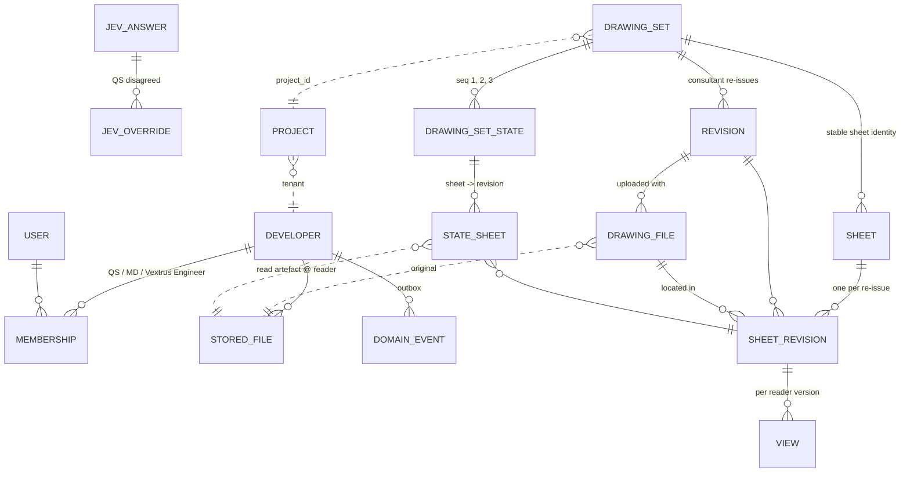
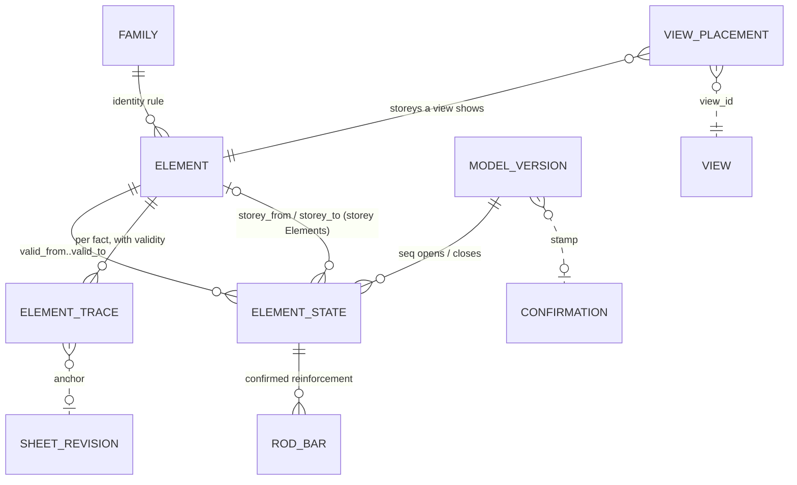
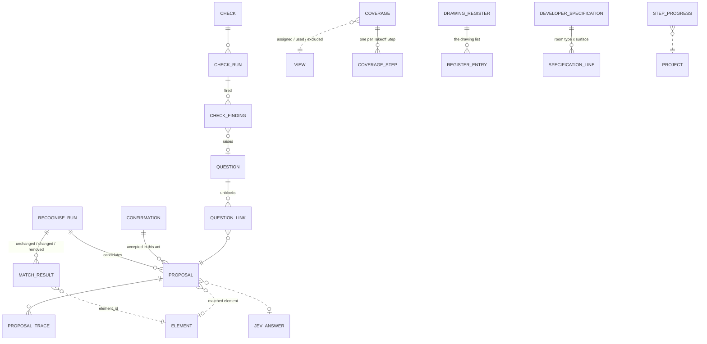
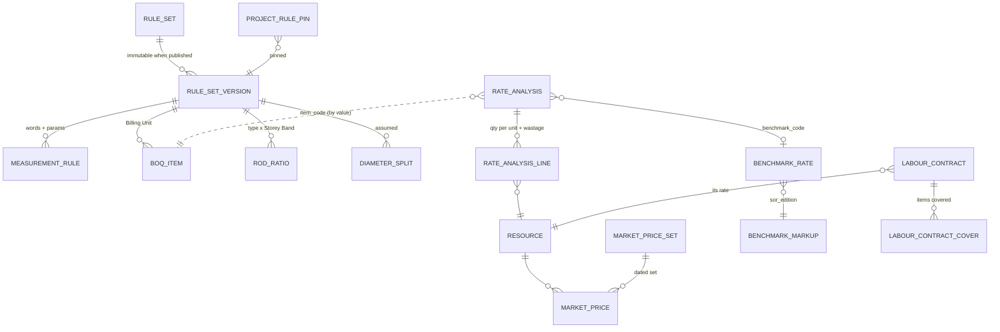
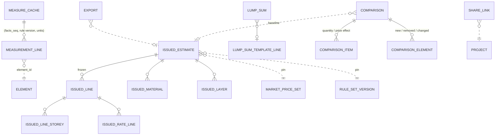

# Vextrus — the data model (draft)

Draft of 26 Sep 2026, session 01, for the owner to review. It starts from the sketch in
`docs/research/stack-data.md` §10 and applies every ADR that overrides it: 0002, 0005–0011, 0015,
0016, 0021, 0026–0029 and 0031, plus `docs/specs/bd-defaults.md`. Where this page and an ADR
disagree, the ADR wins; report the mismatch. Terms are `CONTEXT.md`'s; proposed new ones are
listed in §1.3. It is a guide for build sessions, so it gives key fields, not every column.
M0's additions (the M0 plan's step D0, 26 Sep 2026, from the M0 spec's "Amendments after sign-off"
and the plan's rulings) are in §3.0, §3.2 and §3.4: invitation fields, the drawings tables' M0
fields, the lists M0 fixes, Coverage with `assigned` and one row per Takeoff Step, and the drawing
list.

## 1. Conclusions

### 1.1 The shape
The data sits in four bands, in one Postgres with row-level security on every tenant table.
- **Drawings stay as read.** A Drawing Set has Sheets. Each Sheet has one Sheet Revision per
  consultant re-issue. A **Drawing Set State** maps every sheet to its current revision and names
  the reader version, and a Revision or a reader upgrade makes a new state.
- **`takeoff` holds what the machine says**, in drawing units: Proposals with their Traces,
  Questions, Checks, Coverage and the append-only Confirmations.
- **`building_model` holds only what the QS confirmed**, in SI.
  - An **Element** has a stable identity for its family.
  - Its **Element States** carry a validity range in Model Versions, and a new one is written only
    when a fact changes.
  - Traces are copied in on Confirmation.
- **Money is computed on read.** Measuring is a pure function of (confirmed facts, pinned Rule Set
  version). Pricing applies the Developer's Rate Analyses at the current Market Price set.
  - `boq` caches the measurement lines and stores nothing else live.
  - An **Issued Estimate** freezes the result together with its four pins: the facts version, the
    Drawing Set State, the Rule Set version and the Market Price set.
  - Every comparison splits the quantity effect from the price effect.

Library data (the Bangladeshi default Rule Set, Rate Analyses, Rebar Ratios and Benchmark Rates) lives
under one system tenant, the Vextrus Library. Tenants can read it, and a Developer gets a copy on
first use.

### 1.2 Where the sketch had to change

| # | Sketch (stack-data.md §10) | Now | Forced by |
|---|---|---|---|
| 1 | `DRAWING_SET_REVISION`: one letter for the whole set | Revision (the consultant's re-issue), Sheet Revision per sheet, and a Drawing Set State mapping each sheet to its revision | 0015 am. |
| 2 | Reader versions only on derived files | A reader upgrade makes a new Drawing Set State and runs through the same matching; every Trace names its reader and version | 0015 am., 0029, 0031 §3 |
| 3 | `ELEMENT_STATE` with status proposed / confirmed / removed; Proposals hang off it | Proposals and candidate geometry live in `takeoff`. `building_model` has no "proposed" status, only confirmed states | 0031 §4 |
| 4 | One Element State per Element per Revision | A validity range `[valid_from_seq, valid_to_seq)` in Model Versions, written only on change. Reissuing 3 sheets writes rows only for what changed | 0015 am. (per-sheet revisions) |
| 5 | Identity from type, mark and anchor | Identity per element family (column: grid intersection + Storey Band; beam: axis segment; wall: axis overlap; slab: polygon overlap; opening: host wall + position). A mark is only a hint | 0015 am. |
| 6 | One `TRACE` table keyed by entity handle + bbox, owned ambiguously | A Trace anchor is a value type owned by `drawings`: DWG (file sha256, reader + version, sheet, insert-handle chain, entity handle); PDF (…, page, path index, box). `ProposalTrace` lives in `takeoff`; `ElementTrace` lives in `building_model`, copied in on Confirmation | 0031 §2, §4; 0029 |
| 7 | `BOQ_ITEM` per Revision and a stored `QUANTITY_SOURCE` | The live Priced BOQ is computed on read; its Measurement Lines are a cache keyed by (facts version, Rule Set version, Display Units). Each project pins a Rule Set version, and published versions are immutable | 0031 §1 |
| 8 | "SI in every numeric column" | Drawings and Proposals stay in the drawing's units, and only `building_model` is SI. Market Prices are held in their quoted unit. A BOQ Item has a Billing Unit, set in the Rule Set, and its quantity is rounded per item | 0008 am. |
| 9 | Market Price history by effective date per Resource; `EXPORT_ISSUE` | Dated Market Price sets; an Issued Estimate is a frozen snapshot with its pins; exports point to it | 0028 |
| 10 | Direct cost only | Estimate Layers (preliminaries, site overheads, contingency, taxes at dated Tax Rates); the Benchmark Rate printed and net, with its mark-up as data per SoR edition | 0006 am. |
| 11 | A labour line inside each Rate Analysis | A Labour Contract has its own unit, its own BOQ line and a list of the items it covers; a covered item's labour lines drop out | 0006 am. |
| 12 | — | Cost Basis per Takeoff Step (measured, or an allowance held as consumption per sft priced at Market Prices; owner's rulings 26 Sep 2026); Construction Stages (fixed order, renamable); procurement lead time per Resource | 0002 am. |
| 13 | A single Rebar Basis and quantity on the state | Three Rebar Bases. Rebar Ratios by element type × Storey Band and an assumed diameter split, both in the Rule Set version. Confirmed bars are held in `building_model` | 0010 am., 0031 §4 |
| 14 | — | Junction ownership is a Measurement Rule, not an engine constant | 0009 am. |
| 15 | `QUESTION` unblocks Element States | Questions unblock Proposals; a Check catalogue, Check runs and findings; Coverage per view | 0027 |
| 16 | — | A per-tenant Jev answer cache and a log of the QS's overrides | 0011 am. |
| 17 | RLS "from the beta" | RLS from M0; a Vextrus Engineer's Membership is by invitation, time-bound and revocable | 0021 am. |
| 18 | Element type as a column | Element families are data rows (`Family`), mirroring `engine/families/<family>/` | 0031 §5 |
| 19 | — | Per upload: the LibreDWG vs ACadSharp cross-check with quarantine, a PDF upload report and a flag for Bangla text in ANSI fonts | 0029, 0014 am., 0031 §11 |
| 20 | — | The fourteen Takeoff Steps; the Developer's Specification by room type; a template of MEP lump-sum lines with ৳/sft sanity ranges | 0007 am. |
| 21 | Tenant-less library tables, copied on first use | The same tables, with the Library as a tenant whose rows every tenant may read but not write; copying is then a row copy. *My recommendation; no ADR forces it* | — |

### 1.3 Terms (most now in `CONTEXT.md`, added 26 Sep 2026; the rest are implementation words)
- **Element**: one confirmed thing in the Building Model with a stable identity across Revisions (a
  column over a Storey Band, a beam, a storey, a grid line, a General Notes fact). *Avoid*: object,
  entity.
- **Element Family**: the kind of Element that one package in `engine/families/` recognises,
  checks and measures. CONTEXT.md already uses the phrase in "Takeoff Step" without defining it.
- **Element State**: an Element's confirmed facts over a range of Model Versions.
- **Model Version**: a numbered state of a project's Building Model. Each Confirmation or carry-over
  makes one.
- **Sheet Revision**: one issue of one sheet ("S-201 rev B").
- **Drawing Set State**: the map from each sheet to its current Sheet Revision, read by one reader
  version.
- **BOQ Item**: one line kind of the Priced BOQ. It carries a description (with the Mix, grade and
  element class), a Billing Unit, a BOQ Section and a Trade. It is defined in the Rule Set and priced
  by its Rate Analysis. CONTEXT.md uses "BOQ item" loosely.
- **Measurement Line**: one line of the measurement sheet: element, Nos × L × B × H = quantity in the
  Billing Unit, and the rules that produced it (ADR 0016's "Measurement" sheet).
- **Estimate Layer**: one step of the Estimate above direct cost (preliminaries, site overheads,
  contingency, a tax).
- From `docs/research/qs-defaults.md` §6, and needed by these tables: **Mix**, **Wastage**, **Lap**,
  **Lump Sum**, **Provisional Sum**, **Mark-up**.
- **Two clashes with "Check".** CONTEXT.md defines a Check as a comparison *with the source
  drawings*, but ADRs 0006 and 0009 also call these Checks:
  - "labour from exactly one source";
  - "owned volumes sum to the union".

  Neither compares with the drawings. ADR 0016's "consumption checks" (rebar kg per sft against a
  range) clash with the term too. I recommend widening the definition to "…with the source drawings
  or with the confirmed model's own totals" and calling the MD's figures **Consumption Ranges**.

## 2. Conventions every module follows
- **Identity.** Every row has an `id uuid` (UUIDv7, generated by the app on PG16). Business keys are
  unique *within the tenant*, so a unique index never leaks another tenant's values (stack-data §6.1).
- **Tenancy.** Every tenant table has `tenant_id uuid NOT NULL`, and its policy is forced:
  - `tenant_id = current_setting('app.tenant_id')`, set per transaction;
  - the app connects as a non-owner role;
  - a CI test checks that every table has a policy (ADR 0021).

  Markers in the tables below:
  - **T**: tenant only;
  - **L**: the SELECT policy also admits the Library tenant, and writes stay own-tenant only;
  - **G**: global, with no tenant (only `User` and `ShareLink` lookups).
- **Types.**
  - Money in ৳ is `dec(16,2)`.
  - Prices and rates are `dec(14,4)` per their quoted unit.
  - SI lengths are `dec(12,6)` m, and SI quantities `dec(18,6)`.
  - Billed quantities are `dec(14,2)` in the Billing Unit.
  - Percentages are `dec(7,4)`.
  - Nothing that feeds a figure is a float. Drawing geometry stays float inside the read-artefact
    files.
  - JSONB is used only for family-specific facts, rule parameters, raw readings and Trace anchor
    detail. Numbers inside it are decimal strings.
- **Across modules.** The only foreign keys are within a module; ADR 0020 forbids joins across
  modules.
  - A *downward* id (to a lower layer) is read through that module's `services.py`.
  - An *upward* id (for example `ModelVersion.confirmation_id`) is an opaque audit stamp: stored and
    returned, never resolved by the lower module.
- **Append-only.** These tables are append-only:
  - Confirmation, DomainEvent and JevOverride;
  - Element States and Traces (only `valid_to_seq` is ever set);
  - published Rule Set versions, frozen Market Price sets and Issued Estimates.
- **Events.** Every domain act writes one `platform.DomainEvent` in its own transaction. Jobs are
  deferred in the same transaction (Procrastinate, in its own schema). A job's arguments carry only
  `tenant_id` and ids, and the job sets `app.tenant_id` before it touches data.

## 3. The modules, in layer order

### 3.0 `platform` (layer 0)
| Entity | Key fields | Identity | Tenant | References |
|---|---|---|---|---|
| Developer | name, market (`BD`), is_library bool | id (it *is* the tenant) | T (row = own) | — |
| User | email citext, name, phone, is_vextrus_staff | email | G (visible through Membership) | — |
| Membership | role (`qs`/`md`/`vextrus_engineer`), invited_by, starts_at, expires_at (required for a Vextrus Engineer, default +30 days), revoked_at; the invitation: invited_email, invite_token_hash, accepted_at (M0) | (tenant, user) | T | User, Developer |
| StoredFile | sha256, key, kind (`original`/`derived`/`export`), media_type, size, producer + producer_version, source_sha256 | (tenant, key) | T | project_id (upward stamp, used for the key prefix) |
| DomainEvent | kind (`confirmation.recorded`, `revision.read`, `market_prices.frozen`…), project_id, subject_type + subject_id, actor_user_id, payload (ids and counts only), occurred_at | id (time-ordered) | T | — |
| JevAnswer | cache_key = sha256(facts, question, options, model), node, model_version, options, choice, confidence dec(5,4) | (tenant, cache_key) | T | — |
| JevOverride | node, model_version, subject_id (a Proposal, upward stamp), jev choice, QS choice, user, at | id | T | JevAnswer |

Every action is recorded under the acting user's own name (a Vextrus Engineer included). The client
reads Membership to see who from Vextrus has access, and until when.

### 3.1 `projects` (layer 1)
| Entity | Key fields | Identity | Tenant | References |
|---|---|---|---|---|
| Project | code, name, address, market, sor_zone (PWD zone for the Benchmark, default Dhaka), display_units (`imperial`/`metric`), status; target_cost ৳ + set_by (the MD) + set_at; saleable_area m² dec + entered_by; gfa_entered m² dec (provisional, see walk-through a) | (tenant, code) | T | — |

### 3.2 `drawings` (layer 2)
| Entity | Key fields | Identity | Tenant | References |
|---|---|---|---|---|
| DrawingSet | name, current_state_id | (tenant, project_id): one per project in the MVP | T | project_id ↓ |
| Revision | label as the consultant marks it (`A`, `B`), kind (`first_issue`/`reissue`), received_at, received_by | (set, label) | T | DrawingSet |
| DrawingFile | sha256, format (`dwg`/`pdf`), original_name, writer fingerprint, read_status (`queued`/`reading`/`read`/`quarantined`/`failed`/`cancelled`, and `refused` for a scanned PDF), cross_check jsonb (LibreDWG vs ACadSharp: handles, counts per type and per layer), upload_report jsonb (PDF: producer, SHX comments per page, fonts, rotation, layer names, images and their area, the scan refusal and its reason). M0 adds: discipline_default (from the file name and its sheet numbers' prefix; the QS may change it), read_step and sheets_done / sheets_total (progress in words), font_report jsonb (each font asked for, what draws it, how close, the sheets using it), bangla_ansi jsonb (the Bangla-ANSI Check's finding: fonts named, texts and sheets affected, or found by byte pattern only) | (set, sha256) | T | Revision; stored_file_id ↓ |
| Sheet | number (as printed; may be empty), title (decoded, 1.3 of docs/design/m0-screens.md), discipline (`structural`/`architectural`/`mep`; from the file first, the number's prefix second), storeys_as_stated (the title's storey words, verbatim, for the Check of the title against the view titles), confirmed bool, excluded_reason (the fixed list below) + excluded_text (for `other`). A sheet's storeys are not stored: they are its views' lists together | (set, discipline, number); a sheet with no number: (set, source file, location) | T | DrawingSet |
| SheetRevision | revision_mark as printed, issue_date as printed, source file (the DrawingFile it was read from), location (DWG layout or model-space box; PDF page), sources jsonb (where each value was read: title-block attribute, text in the title block, the file), content_hash of its entities | (sheet, revision) | T | Sheet, Revision, DrawingFile |
| DrawingSetState | seq, cause (`revision`/`reader_upgrade`), reader + reader_version, status (`reading`/`read`/`current`/`superseded`), parent_state_id | (set, seq) | T | DrawingSet, Revision (nullable) |
| StateSheet | the map row. M0 adds: render_file_id ↓ (the per-sheet render artefact, 11's buffer format and its version); the Plot: plot_file_id (the PDF's DrawingFile), plot_page, plot_transform (scale, rotation in 90° steps, offset), plot_residual, render_f1; or plot_none_reason (no PDF for the Discipline; no page matched; the PDF was refused; the sheet has no number) | (state, sheet) | T | DrawingSetState, Sheet, SheetRevision; artefact_file_id ↓ (the entity dump @ reader version) |
| View | ordinal (reading order), kind as read + confirmed_kind (the one list below), title (decoded), box in drawing units, drawing_unit (`inch`/`mm`/`m`/`ft`), not_to_scale bool, stated_scale_text (verbatim: metric, imperial or N.T.S.), confirmed_scale dec (empty until M1), storeys_as_stated (verbatim), storeys (an explicit list of canonical levels, never a first–last range), storeys_meaning (`at_floor_level`: the members at those floor levels / `floor_to_floor`: the storeys, floor to floor), predecessor_view_id | (sheet_revision, reader_version, ordinal) | T | SheetRevision, View |

**The Trace anchor** is a value type, not a table. Its type (DWG: source sha256, reader and version,
sheet, insert-handle chain, entity handle; PDF: page, path index, box; to and from JSON) is defined
in `engine/read/anchor.py`; `drawings` stores and resolves it. Wherever it is stored,
`sheet_revision_id`, `source_sha256` and `reader_version` are real columns (so "which Traces use
this artefact" is a query), and the rest is jsonb. `drawings.services.resolve(anchor)` opens it. An
artefact any anchor names is never deleted (ADR 0031 §2). `drawings` raises no Questions itself;
`takeoff` reads quarantined files and raises them (ADR 0029).

**The lists M0 fixes** (the spec's amendments after sign-off, 26 Sep 2026; the engine's candidate types
in `engine/recognise/types.py` use the same lists):
- **View kinds, one list:** plan, section, elevation, schedule, detail, notes, legend, title block, key
  plan, 3D/perspective. 3D/perspective is excluded by default (amendment 6). A detail drawn inside a
  plan is its own view.
- **Storeys, the canonical levels** (amendment 3; code owns them, `engine/recognise/storeys.py`):
  pile, pile cap, plinth / grade-beam level, foundation, basement n, semi-basement / lower ground,
  ground, mezzanine, podium, 1st…nth, roof, stair-room roof, lift machine room and its roof, overhead
  tank and tank roof; a "Level n" or EL title kept as stated until Step 3 binds it; "typical (range
  from Step 3)"; "not stated". Per plan view as an explicit list with its meaning (amendments 1–2);
  a boundary storey is a Question.
- **Exclusion reasons, a fixed list** (amendment 9), for sheets and views alike: `mep`, `superseded`,
  `duplicate`, `cover_index`, `3d_perspective`, `reference_only`, `other` (with text).

### 3.3 `building_model` (layer 3): confirmed facts only, SI
| Entity | Key fields | Identity | Tenant | References |
|---|---|---|---|---|
| Family | key (`storey`, `grid_line`, `spec_note`, `pile`, `pile_cap`, `column`, `shear_wall`, `lift_core`, `beam`, `slab`, `slab_edge`, `stair`, `tank`, `wall`, `opening`, `room`, `roof`…), takeoff_step 1–14, label, identity_rule, milestone | key | L | — |
| ModelVersion | seq, cause (`confirmation`/`carry_over`/`unconfirm`), facts_changed bool, facts_seq (last seq that changed facts: the cache key), complete_for_state bool | (project, seq) | T | confirmation_id ↑, drawing_set_state_id ↓ |
| Element | family_key, identity_key (normalised: `col|B/2|GF..3F`), mark_hint, created_seq, retired_seq | (project, family_key, identity_key); overlap families match in code first | T | Family |
| ElementState | valid_from_seq, valid_to_seq; storey_from_id, storey_to_id (the Storey Band; Elements of family `storey`); grid_ref; position x, y m; mix (from General Notes: decides the BOQ Item); rebar_basis (`by_ratio`/`from_drawing`/`from_drawing_rules`/`none`); params jsonb in SI (column b, d; beam axis, width, depth; slab polygon, thickness; storey level, height, index; room type, polygon); facts_hash | (element, valid_from_seq) | T | Element; confirmation_id ↑, drawing_set_state_id ↓ |
| RebarBar | bar_mark, role (`main`/`stirrup`/`tie`/`extra`), diameter_mm, count, cutting_length m, shape_code, laps (count, length m, source: drawing or rule code) | (state, bar_mark) | T | ElementState |
| ElementTrace | fact (`size`, `position`, `mix`, `level`, `bar:<mark>`…), kind (`sheet_entity`/`question`/`qs_typed`/`default`/`developer_specification`), anchor, valid_from_seq, valid_to_seq | id | T | Element; question_id ↑ |
| ViewPlacement | storey_from_id, storey_to_id (the storeys a plan view shows; code owns storey ranges, ADR 0011 am.), valid range | (view, valid_from_seq) | T | view_id ↓, Element (storeys) |

The Building Model at version *v* is every state with `valid_from_seq ≤ v < valid_to_seq`. IFC and GLB
are export files built from that (`engine`), never the store.

### 3.4 Layer 4: `takeoff`, `measurement`, `rates` (independent siblings)

**`takeoff`**: what the machine says, and what the QS decided
| Entity | Key fields | Identity | Tenant | References |
|---|---|---|---|---|
| TakeoffStep | number 1–14, key, label, milestone | number | L | — |
| StepProgress | status (`not_started`/`reading`/`in_review`/`confirmed`/`reopened`), placed n, total N (from the drawing), open_questions, active_seconds (ADR 0012 telemetry) | (project, step) | T | project_id ↓ |
| RecogniseRun | family_key, cache_key = (read-artefact keys, confirmed-facts hash, Jev model version), status, candidates, reused_answers | (project, family, cache_key) | T | drawing_set_state_id ↓ |
| MatchResult | outcome (`unchanged`/`changed`/`removed`), old_facts_hash, new_facts_hash | (run, element) | T | RecogniseRun; element_id ↓ |
| Proposal | subject (`element`/`sheet`/`view`), family_key, outcome (`first_read`/`new`/`changed`/`removed`), values jsonb in *drawing units, named*, with verbatim text kept; source (`reader`/`code`/`jev`/`default`/`rebar_ratio`/`developer_specification`/`question_answer`/`qs_typed`), confidence, reader + version, candidate_geometry jsonb, status (`open`/`blocked`/`confirmed`/`rejected`/`superseded`), supersedes_id | (run, candidate_key) | T | RecogniseRun, Confirmation, Proposal; element_id ↓, jev_answer_id ↓ |
| ProposalTrace | fact, anchor | id | T | Proposal, Question |
| Confirmation | step, user, kind (`bulk`/`single`/`question_answer`/`revision`/`unconfirm`), proposals n, model_version_seq it produced, at | id | T | Question (nullable) |
| Question | step, kind (`missing`/`conflict`/`low_confidence`/`check`/`file_misread`/`labour_source`), question_key = hash(kind, subject identity, evidence content), text, options jsonb (candidates code found), check_code, status (`open`/`answered`/`withdrawn`), answer jsonb, answered_by + at | (project, question_key) | T | — |
| QuestionLink | the Proposals a Question blocks | (question, proposal) | T | Question, Proposal |
| Check | code, version, family_key, words, milestone | (code, version) | L | — |
| CheckRun | trigger (`read`/`confirmation`/`boq`), passed n, total N | id | T | Check; confirmation_id or state id |
| CheckFinding | subject ids, detail | id | T | CheckRun, Question |
| Coverage | status (`unaccounted`/`assigned`/`used`/`excluded`), reason (the fixed list) + reason_text, confirmed_by. A view is accounted for once assigned to a Takeoff Step that will read it, used, or excluded with a reason (ADR 0027 as amended). Step 1's screen also counts views "proposed" (docs/design/m0-screens.md 6.11); how that count maps onto these statuses is not yet decided | (state, view) | T | view_id ↓, drawing_set_state_id ↓ |
| CoverageStep | step; used bool (set when that step's Confirmation draws on the view, from M1). A view may be assigned to several Takeoff Steps, each marking it used separately (amendment 5) | (coverage, step) | T | Coverage |
| DrawingRegister | a drawing list for one Discipline: discipline, source (`sheet`: read from a sheet of the set; `pasted` or `typed` by the QS), source_sheet_id ↓ or entered_by + at, raw_text as pasted (amendment 7). Which list sets N when a read one and a pasted one disagree is not yet decided | id | T | project_id ↓ |
| RegisterEntry | number, title and revision mark as listed, line in the source | (register, number) | T | DrawingRegister |
| DeveloperSpecification + SpecificationLine | name; room_type × surface (`floor`/`skirting`/`wall`/`ceiling`/`door`/`window`/`fitting`) → item_code | (tenant, name); (spec, room_type, surface) | T | item_code (the Rule Set's code, by value) |
| ProjectTakeoffSetup | specification_id, precedence jsonb (plan vs section, confirmed once per consultant, ADR 0010) | project | T | DeveloperSpecification |

The confirm service is the only path into `building_model`. It converts drawing units to SI with
exact factors (ADR 0008), copies the anchors, and calls `building_model.services.apply(...)`
(downward). That call opens and closes states and writes a Model Version. `takeoff` previews
quantities on Proposals by calling `measurement` on their facts; the preview is not stored.

**`measurement`**: the Rule Set and measuring
| Entity | Key fields | Identity | Tenant | References |
|---|---|---|---|---|
| RuleSet | name; project_id nullable (a project fork, used for Storey Band overrides); based_on_id | (tenant, name) | L | RuleSet |
| RuleSetVersion | number, status (`draft`/`published`), parent_version_id, content_hash, published_by + at | (rule_set, number) | L | RuleSet |
| MeasurementRule | code (G1, F1, FW4, J1, R3, CA1…), kind (`quantity`/`junction`/`rebar_detailing`/`stage`/`rounding`), family_key, words (as a QS reads it), params jsonb (`{"threshold_m2": "0.4"}`), source label | (version, code) | L | RuleSetVersion |
| BoqItem | item_code (stable across versions: `RCC-COL-1:1.5:3`), description, trade, boq_section, group (element class), billing_unit_imperial + billing_unit_metric, quantity_dp (2), stage_kind, basis_kind (`measured`/`lump_sum`/`provisional`), labour_measure bool | (version, item_code) | L | RuleSetVersion |
| RebarRatio | family_key, band (null = the default; storey ids only in a project fork), value dec(10,4), unit as set (`kg/cft` or `kg/m3`) | (version, family, band) | L | RuleSetVersion |
| DiameterSplit | family_key, diameter_mm, share dec(6,4), Σ = 1 | (version, family, diameter) | L | RuleSetVersion |
| ProjectRulePin | from_at, to_at, pinned_by | (project) where to_at is null | T | RuleSetVersion; project_id ↓ |

`measurement.services.measure(project, facts_seq, version)` reads facts from `building_model`, calls
the pure `engine` function and returns Measurement Lines. It stores nothing. Each Rebar Ratio is kept
in the unit the owner set it in (kg/cft), because bd-defaults' kg/m³ column is rounded
(1.7 kg/cft = 60.03 kg/m³, not 60).

**`rates`**: Resources, prices, Rate Analyses, Benchmarks
| Entity | Key fields | Identity | Tenant | References |
|---|---|---|---|---|
| Resource | code, name, kind (`material`/`labour`/`plant`/`labour_contract`/`material_and_labour`), quoted_unit (`bag`/`cft`/`kg`/`ton`/`nos`/`sft`/`litre`…), schedule_group ("Cement OPC", "Rebar"), in_material_schedule bool, procurement_lead_days | (tenant, code) | L | — |
| MarketPriceSet | effective_date, label, status (`open`/`frozen`), parent_set_id | (tenant, effective_date, label) | L | MarketPriceSet |
| MarketPrice | price ৳ dec(14,4) per the Resource's quoted unit | (set, resource) | L | MarketPriceSet, Resource |
| RateAnalysis | item_code, per_unit (the unit it is analysed in), shown_per (100), mix, dry_volume_factor, benchmark_code (PWD) | (tenant, item_code) | L | — |
| RateAnalysisLine | kind (`material`/`labour`/`plant`), qty_per_unit dec(14,6) in the Resource's unit, wastage_pct | id | L | RateAnalysis, Resource |
| LabourContract | name, contractor, own_item_code (the labour-measure BoqItem that gives its quantity), trade; project_id nullable (null = Developer-wide) | (tenant, project, own_item_code) | T | Resource (kind `labour_contract`: its rate is a Market Price) |
| LabourContractCover | item_code covered | (contract, item_code) | T | LabourContract |
| BenchmarkRate | sor_edition, zone, pwd_code, description, metric unit, printed_rate ৳ | (edition, zone, code) | L (Library only) | — |
| BenchmarkMarkup | sor_edition, profit, overhead, VAT %, factor (1.2611), source | edition | L (Library only) | — |
| TaxRate | kind (`vat`/`ait`), applies_to, rate_pct, effective_from, source | (tenant, kind, applies_to, from) | L | — |

- **Working rate** per Billing Unit = Σ material (qty × (1 + wastage) × price) + labour + plant,
  times the exact unit factor, rounded to the paisa.
  - An item's labour lines drop out while a Labour Contract covers that item in the project.
  - A Material-and-Labour Contract is a Resource of that kind on one Rate Analysis line; its
    materials never reach the Material Schedule.
- **Library prices.** The Library holds Rate Analyses and a starter price set, but no Labour
  Contract rates (bd-defaults).

### 3.5 `boq` (layer 5)
| Entity | Key fields | Identity | Tenant | References |
|---|---|---|---|---|
| MeasureCache | computed_at, status | (project, facts_seq, rule_set_version, display_units) | T | ids ↓ |
| MeasurementLine | item_code, stage_kind, nos, l / b / h m (or area), qty_si dec(18,6), qty_billed dec(14,2), rule_codes text[], rebar_basis, diameter_mm, assumed_split bool | id | T | MeasureCache; element_id ↓, storey_id ↓ |
| TradeBasis (Cost Basis) | trade, basis (`measured`/`allowance`), allowance ৳/sft dec(10,2), source (`vextrus_default`/`past_project`/`typed`), switched_by + at | (project, trade) | T | project_id ↓ |
| StageName | stage_kind (`piling`/`substructure`/`slab_casting`/`masonry`/`finishes`/`services`/`external`), label | (tenant, stage_kind) | L | — |
| EstimateLayer | order, kind (`preliminaries`/`site_overheads`/`contingency`/`tax`), percent or amount ৳, applies_to (`direct`/`subtotal`/`labour`), label | (project, order) | T | tax_rate_id ↓ |
| LumpSumTemplateLine | code, trade, description, sanity range ৳/sft low–high | (tenant, code) | L | — |
| LumpSum | kind (`lump_sum`/`provisional`), trade, boq_section, description, amount ৳, entered_by + at | id | T | LumpSumTemplateLine |
| IssuedEstimate | issue_no, issued_at, issued_by; pins: facts_seq, drawing_set_state_id, rule_set_version_id, market_price_set_id; display_units; totals ৳ (direct, each layer, grand) | (project, issue_no) | T | pins ↓ |
| IssuedLine | number as shown (2.1.1), item_code, description, billing_unit, qty, rate, amount, benchmark printed + net, basis, cost basis | (issue, item_code) | T | IssuedEstimate |
| IssuedLineStorey, IssuedRateLine, IssuedMaterial, IssuedLayer | the per-floor breakdown; the Rate Analysis lines as priced (resource, qty/unit, wastage, price, covered_by); materials by storey × stage (with diameter and assumed flag); the layers | — | T | IssuedEstimate / IssuedLine |

- **The live Priced BOQ is computed on read.** Quantity per BoqItem = Σ of its Measurement Lines,
  each rounded to 2 dp in the Billing Unit. Amount = quantity × rate, rounded to the paisa.
  - An item without a Rate Analysis shows as unpriced under a visible "Unclassified" heading.
  - The Material Schedule is Σ quantity × Rate Analysis line × (1 + wastage), by Resource, storey
    and stage. It is gross, excludes Material-and-Labour materials, and is never stored live.
- **Frozen rows in an Issued Estimate.** Rate Analyses are edited in place (audited by events), so
  an Issued Estimate keeps its own rate and material rows.
- **Issuing freezes the price set.** Issuing calls `rates.services.freeze_set(set_id)`.

### 3.6 Layer 6: `revisions`, `summary`, `exports`, `assistant`
| Module | Entity | Key fields | Identity | Tenant | References |
|---|---|---|---|---|---|
| revisions | Comparison | kind (`revision`/`rule_remeasure`/`price_update`/`any`); baseline (`model_state`: facts_seq + rule version + price set; or `issued_estimate`); target pins; computed_at, by | id | T | ids ↓ |
| revisions | ComparisonItem | item_code, q0, r0, q1, r1, quantity_effect ৳ = (q1 − q0) × r0, price_effect ৳ = (r1 − r0) × q1 | (comparison, item) | T | Comparison |
| revisions | ComparisonElement | change (`new`/`removed`/`changed`), changed_facts jsonb, quantity_effect ৳ | (comparison, element) | T | Comparison; element_id ↓ |
| summary | ConsumptionRange | measure (rebar kg, cement bags, bricks, concrete cft per sft of Gross Floor Area), low, high, source | (tenant, measure) | L | — |
| exports | Export | kind (`excel`/`pdf`), input_hash, created_by + at; issued_estimate_id nullable (null = the working Estimate, printed "not issued") | id | T | file_id ↓, issued_estimate_id ↓ |
| exports | ShareLink | token_hash, facts_seq (pinned) or live, expires_at, revoked_at | token_hash (global unique) | T + a G lookup | project_id ↓ |
| assistant | AskLog | text, route, jev_answer_id, service answered from, at | id | T | ids ↓ |

- **The two effects add up.** Quantity effect + price effect = q1·r1 − q0·r0 exactly. A new item
  has only a quantity effect, at r1; a removed item has only a quantity effect of −q0·r0. Rate
  Analysis edits and Market Prices are price effects; facts and Rule Set edits are quantity effects.
- **What `summary` stores.** Nothing but ConsumptionRange. The Project Summary, the Target Cost
  warning (tested on measured + allowance) and ৳ by stage are computed on read.
- **How a share link reaches its data.** A share link is opened with no session, so its token is
  resolved by one narrow SECURITY DEFINER lookup (token hash → tenant, project). The request then
  runs under that tenant, read-only.

## 4. ER diagrams
Solid lines are foreign keys inside a module. Dotted lines are ids across modules, read through the
owning module's services.

**Platform, projects, drawings**

**Building Model**

**Takeoff**

**Measurement and rates**

**BOQ and the top layer**

## 5. Walk-throughs
Rows are written as `module.Entity`. Each step also writes one `platform.DomainEvent`; those are not
repeated below.

### (a) The QS confirms 86 columns in bulk, answers one Question, and the Priced BOQ updates
Given: storeys, grid and General Notes are confirmed (Model Version 7). The project pins Rule Set
version 3, and the current Market Price set is PS5.
1. `takeoff.RecogniseRun` R1 (family `column`, Drawing Set State S1, cache key) finds 89
   candidates, each a grid intersection over a Storey Band.
2. `platform.JevAnswer` rows are written for label binding (cache misses; later reads hit).
3. `takeoff.Proposal` ×89 (`first_read`; values in inches as drawn; mix from the notes; rebar basis
   "by ratio"), with `takeoff.ProposalTrace` ×~180 (size from the schedule cell, position from the
   layout insert).
4. `takeoff.CheckRun` (schedule against plan) passes 86 of 89. One `CheckFinding` becomes
   `takeoff.Question` Q1 ("C7, 4F–9F: the schedule's size cell is blank"; options that code found:
   400×400, 450×450). `QuestionLink` ×3 marks those Proposals `blocked`.
5. `takeoff.StepProgress` (step 6): 86 / 89, 1 Question open.
6. **Bulk act.**
   - `takeoff.Confirmation` K1 (`bulk`, 86); the 86 Proposals become `confirmed` with K1.
   - The confirm service converts inches to metres exactly and calls `building_model`, which writes:
     - `ModelVersion` 8 (`facts_changed`);
     - `Element` ×86 (identity `col|<grid>|<band>`);
     - `ElementState` ×86 (valid from 8);
     - `ElementTrace` ×~172 (anchors copied).
7. `takeoff.CheckRun` re-runs at the Confirmation (owned volumes sum to the union): passes.
8. **Q1 answered (450×450).**
   - `Question` Q1 becomes `answered`.
   - Three new `Proposal` rows (`question_answer`) supersede the blocked ones.
   - `Confirmation` K2 (`question_answer`, 3, linked to Q1) is written.
   - `ModelVersion` 9, `Element` ×3 and `ElementState` ×3 follow. The size Trace is
     `ElementTrace(kind=question, question_id=Q1)`.
   - StepProgress shows 89 / 89 and 0 Questions.
9. **The Priced BOQ is opened.**
   - `boq.MeasureCache` misses (project, facts 9, RSv3, imperial) and calls
     `measurement.measure`, which returns lines written as `boq.MeasurementLine` ×~1,100: each
     column per storey, for concrete (cft), formwork (sft), and rebar by ratio split per the assumed
     `DiameterSplit`. Rules applied: F1, F2, G3, FW2, R2, J1.
   - `rates` computes the working rates at PS5.
   - No other row is written: the amounts, the Material Schedule by storey × slab casting, the
     Target Cost warning and the Project Summary are all computed on read.

**Gaps this exposed, and how they were closed.**
- **Answering unblocks and confirms in one act** (K2), so the QS is not asked twice.
- **Early allowances need a Gross Floor Area before there are slabs to measure it from.** Allowances
  are ৳/sft of Gross Floor Area, but the GFA is measured from confirmed slabs, and in M1 slabs come
  after columns. Closed with `projects.Project.gfa_entered`, a provisional figure the QS types from
  the area statement, marked "entered" until the measured area replaces it.
- **A part-measured trade** (concrete from columns only) needs a rule: open question 2.
- **Which slab casting a column belongs to** is a Rule Set `stage` rule (default: a column belongs
  to the casting of the slab above it), not a hidden constant.

### (b) A Revision reissues 3 sheets, 2 columns change size, and the Revision Comparison against an Issued Estimate
Given: Issued Estimate IE1 (facts 40, State S1, RSv3, PS5, now frozen). Since then the rebar price has
moved (current set PS7).
1. **The re-issue arrives.** `drawings.Revision` B is written, then `DrawingFile` ×1 (the
   reissued DWG) and `platform.StoredFile` (original). The cross-check passes.
2. The read job writes derived `StoredFile`s (DXF and entity dump @ LibreDWG 0.14.x), then
   `SheetRevision` ×3 (S-201 column schedule, S-102 and S-103 column layouts, matched to their Sheets
   by number) and `View` rows with `predecessor_view_id`.
3. `DrawingSetState` S2 (cause `revision`, parent S1) and `StateSheet` ×N: 3 rows point at rev B,
   the rest are the same as S1. `DrawingSet.current_state_id` = S2.
4. `takeoff.Coverage` for the new views is proposed from their predecessors, and the QS confirms it
   with the sheet list.
5. Only families with a View or a live Trace on the 3 sheets re-run: `RecogniseRun` R40 (`column`).
6. `takeoff.MatchResult` ×89 by family identity: 87 `unchanged` (same facts hash in SI) and 2
   `changed` (C5 at C/3 and C5 at D/3, 4F–9F: 400×400 → 450×450). There are 0 new and 0 removed.
7. `Proposal` ×2 (`changed`, old and new facts, Traces into rev B).
   - Q1's evidence is unchanged (the cell is still blank), so its `question_key` matches and the
     answer is reused. The run counts it in `reused_answers`, and no new Question is written.
8. **Carry-over:**
   - `building_model.ModelVersion` 41 (`carry_over`, facts unchanged);
   - for the 87 unchanged columns, `ElementTrace` rows re-anchored to rev B (new rows valid from 41;
     the old ones closed at 41);
   - no Element State is written.
9. The QS confirms the 2: `Confirmation` K30 (`revision`, 2), then `ModelVersion` 42 (facts
   changed; complete for S2). The 2 old `ElementState`s close at 42, and 2 new ones open with their
   Traces. `CheckRun` re-runs.
   - The beams that frame into them need no re-confirmation: their length between column faces is
     measured by rule, so it follows.
10. **The MD picks IE1 as the baseline.**
    - `boq.MeasureCache` computes (facts 42, RSv3) if missing.
    - `revisions.Comparison` C1 (baseline IE1, target facts 42 + RSv3 + PS7).
    - `ComparisonElement` ×2 (changed b, d; quantity effect ৳).
    - `ComparisonItem` for each touched item: column concrete, formwork and rebar have a quantity
      effect of (q1 − q0) × r0 using IE1's frozen rates. Every rebar item also has a price effect of
      (r1 − r0) × q1 from PS7.
    - q0 is IE1's `IssuedLine`, and a test asserts it equals the recomputation at (facts 40, RSv3).

**Gaps this exposed, and how they were closed.**
- **Traces left on superseded sheets.** Unchanged elements whose Traces sat on a reissued sheet
  would still point at rev A. Closed by giving `ElementTrace` its own validity range and
  re-anchoring on carry-over.
- **Questions asked again.** Answered Questions would be asked again on every re-read. Closed by
  `question_key`, which reuses an answer only while its evidence is unchanged.
- **A carry-over busting the BOQ cache.** Closed by keying the cache on `facts_seq`, not on every
  Model Version.
- **What the BOQ shows between steps 7 and 9** (changed columns awaiting Confirmation): open
  question 1.

### (c) A reader upgrade re-reads a Drawing Set and yields zero changes
1. The reader goes from 0.14.2 to 0.14.3 (a constant in `engine/read`). The project is offered
   "re-read with the new reader", and the QS accepts. A job is deferred.
2. Derived `platform.StoredFile`s are written per file under new keys `…@0.14.3`. The old ones stay,
   because anchors name them.
3. `drawings.DrawingSetState` S3 (cause `reader_upgrade`, no Revision) and `StateSheet` ×N (the same
   Sheet Revisions, new artefact ids). New `View` rows are matched 1:1 to their predecessors, and
   Coverage and confirmed scales carry over.
4. A `takeoff.RecogniseRun` per family confirmed so far. The cache key misses on the artefact key,
   but every Jev call hits `platform.JevAnswer` (same facts, question, options and model), so it
   costs nothing and gives the same answers.
5. `MatchResult` ×every element: all `unchanged`. Proposals: 0. Questions: 0 new (every key matches
   an answered one). `CheckRun`s: all pass, n / N unchanged.
6. `building_model.ModelVersion` 43 (`carry_over`, facts unchanged). `ElementTrace` rows re-anchored
   to reader 0.14.3, so each Trace names the reader that now vouches for it (ADR 0029).
7. `boq.MeasureCache` hits (facts_seq is unchanged). The Priced BOQ is byte-identical.

The M1 test for ADR 0015 ("re-reading gives zero changes") asserts on the DB:
- 0 Proposals, 0 Element States and 0 Questions written;
- `facts_seq` unchanged;
- every new anchor resolves.

**Gaps this exposed, and how they were closed.**
- **Views and Coverage** had no identity across reads: closed with `View.predecessor_view_id`.
- **A reader fix that does change a figure** comes back as `changed` Proposals like a Revision, and
  its Comparison is labelled with cause `reader_upgrade`.

### (d) The Developer edits a Market Price and a Measurement Rule after issuing an Estimate
Given: IE1 issued on PS5 and RSv3, so PS5 is `frozen`.
1. **The Market Price edit.** The QS changes rebar from ৳95,000 to ৳102,000 per ton. PS5 is frozen,
   so `rates.MarketPriceSet` PS6 (`open`, parent PS5, today's date) is written, with `MarketPrice`
   ×~150 copied and rebar changed.
   - The working Estimate reprices on read. IE1 is untouched: it keeps PS5 and its frozen rows.
   - Further edits go into PS6 in place, until something is issued on it.
2. **The Measurement Rule edit.** The Developer's QS edits FW4 (openings not deducted from slab
   formwork: 0.4 → 0.2 m²).
   - `measurement.RuleSetVersion` 4 (`draft`, parent 3) with all `MeasurementRule` rows copied and
     FW4's params changed; then `published` with its content hash.
   - The project still pins RSv3, and nothing moves. The project shows "Rule Set v4 changes FW4:
     re-measure?"
3. **The preview.**
   - `boq.MeasureCache` (facts 42, RSv4) is computed.
   - `revisions.Comparison` (kind `rule_remeasure`, baseline = working facts 42 + RSv3 + PS6)
     shows only a quantity effect, on the slab formwork items.
4. **The QS accepts.** `measurement.ProjectRulePin` closes RSv3 and opens RSv4.
5. **The MD compares against IE1.** A `Comparison` against IE1 shows the formwork change as a
   quantity effect and the rebar change as a price effect, separately.

**Gaps this exposed, and how they were closed.**
- **A Rule Set edit silently re-measuring.** A Rule Set edit must never re-measure silently. It is
  closed by pins plus immutable published versions (ADR 0031 §1). An edit that changes a Billing
  Unit is compared by converting the baseline quantity exactly into the new unit.
- **Issued Estimates that could not be reproduced.** Rate Analyses are edited in place, so an Issued
  Estimate could not be reproduced without its own `IssuedRateLine` rows; added.
- **How often a new price set is made.** This walk-through makes a new set only when the current one
  is frozen. That narrows ADR 0028's "an update makes a new set": open question 6.

### (e) A Labour Contract per sft of casting area covers three items
Given: the default Rule Set ships the labour-measure BOQ Item `LAB-CAST` ("per sft of casting area";
Billing Unit sft / m²) and its rule CA1 (casting area = each slab's area over beams and columns, per
floor). It produces Measurement Lines, but they appear in the Priced BOQ only when a Labour Contract
prices them.
1. **The contract is set up.**
   - `rates.Resource` R-LC1 (`labour_contract`, quoted unit sft).
   - `rates.MarketPrice` R-LC1 = ৳150 per sft in the open set.
   - `rates.LabourContract` LC1 (project P, own_item_code `LAB-CAST`, contractor, trade).
   - `rates.LabourContractCover` ×3: the frame's casting (`RCC-SLB-BM-1:1.5:3`), its shuttering
     (`FW-SLB-BM`) and its rebar binding (`ROD-500W`).
2. On read, the `boq` Measurement Lines for `LAB-CAST` (one per slab per storey, in sft) become their
   own Priced BOQ line at ৳150. They are staged per slab casting, which matches Dhaka instalments.
3. `rates` computes the three covered items' working rates without their labour lines. The Rate
   Analyses themselves are unchanged, so other projects without LC1 still carry labour.
4. **The labour-source check.** A `takeoff.CheckRun` (trigger `boq`; check "labour from exactly one
   source", ADR 0006) counts each priced item's labour sources: its own labour lines plus the
   contracts covering it.
   - One source passes.
   - Zero or two sources raises a `Question` (`labour_source`), raised by `boq` through
     `takeoff.services` (a downward call).
5. **The Benchmark column.** Each covered item shows its allocated share of LC1, computed on read
   (the basis is open question 4). The Material Schedule is unchanged, since labour never enters it.

**Gaps this exposed, and how they were closed.**
- **Where the contract's quantity comes from.** A Labour Contract needs a quantity rule and a Billing
  Unit, so labour-measure BOQ Items ship in the default Rule Set rather than being invented per
  contract.
- **The check does not match CONTEXT's "Check".** The labour check is not against the source
  drawings (§1.3 terms).
- **Whether a Labour Contract is per project or Developer-wide** is open question 3.

## 6. Open questions for the owner (one at a time, each with a recommendation)
1. **What the Priced BOQ shows while a Revision's changes await the QS.** Recommendation: keep the
   last confirmed figure for changed and removed elements, flagged "changed in rev B, awaiting
   Confirmation"; a new element counts for nothing until it is confirmed. The whole-building figure
   then never drops on a half-read Revision.
2. **When a part-measured trade switches from allowance to measured.** Recommendation: the trade
   keeps its allowance until every Takeoff Step feeding it is confirmed (Vextrus proposes the
   switch, and the QS may switch earlier), with "measured so far" shown beside it. Splitting an
   allowance per step would be an invented number.
3. **Labour Contracts: per project or Developer-wide?** Recommendation: Developer-wide, with a
   project row that overrides it. Contractors and rates repeat across a Developer's buildings.
4. **How a Labour Contract's ৳ is allocated to its covered items for the Benchmark.**
   Recommendation: in proportion to the labour their own Rate Analyses would have carried at Market
   Prices.
5. **Rounding.** Recommendation:
   - each Measurement Line is rounded to 2 dp in the Billing Unit, and the item quantity is their
     sum, as on a QS's measurement sheet;
   - the rate is rounded to the paisa, and the amount = quantity × rate, rounded to the paisa
     (`ROUND(C*D,2)` in Excel).
6. **Market Price sets: copy on write only when a set is frozen by an Issued Estimate** (not a new
   set on every edit). Recommendation: yes. It keeps what ADR 0028 protects without dozens of sets a
   week.

### The owner's rulings on §6 (26 Sep 2026)
1. **While a Revision awaits the QS:** changed and removed elements keep their last confirmed figure,
   flagged "changed in rev B, awaiting Confirmation" in the grid, the Project Summary and exports; new
   elements count for nothing until confirmed. "Agree".
2. **Allowance to measured:** a Trade keeps its allowance until every Takeoff Step feeding it is
   confirmed, with "measured so far: ৳X of an allowance of ৳Y" beside it; Vextrus proposes the switch
   and the QS may switch earlier (recorded). "Agree".
   **Superseded the same day:** allowances are held per Takeoff Step, not per Trade (ADR 0002 history),
   because per Trade the Summary prototype showed 7 % measured with most of the frame done.
3. **Labour Contracts** belong to the Developer, with a per-project override of rate or scope; for
   the Benchmark, a contract's ৳ is shared across its covered items in proportion to the labour their
   own Rate Analyses would have carried at Market Prices. "Agree".
4. **Rounding:** each Measurement Line to 2 dp in its Billing Unit, the item quantity their sum;
   countable units (nos, bags, kg of rebar) to whole numbers, tons to 3 dp (a Rule Set parameter); rates
   to the paisa; amount = ROUND(qty × rate, 2); the Estimate's layers on the rounded amounts; the
   Material Schedule rounds up. "Agree".
5. **Market Price sets:** edits go into the current working set; a new set is copied only when an
   Issued Estimate freezes the current one; each price keeps its last-changed date. "Agree".
6. **Rebar Measurement Lines** are held to 2 decimals of a kg and the item total to whole kg (refines 4;
   the BOQ grid prototype showed whole-kg lines up to 8 % off). "Agree with 1–6".

## 7. Deliberately left out of the MVP
- **Answer Keys and Hand Takeoffs** never enter the product database (ADR 0026).
- **One building, one Drawing Set per project.** Multi-building projects wait.
- **Rate Analysis alternatives.** A per-project alternative Rate Analysis (for example, ready-mix for
  one project only) waits; the Developer's one Rate Analysis per item is used.
- **Rebar prices.** Per-diameter rebar prices wait: one rebar Resource per grade, with the diameter as a
  split of the quantity.
- **PWD added rates** per floor and per metre over 4 m (Benchmark only).
- **Construction baselines.** Cast stages marked done, and the construction baseline after work
  starts (QS critic #16).
- **The watcher.** Watch rules and alert rows wait: the Target Cost warning is computed on read.
  The DomainEvent outbox is already there for the watcher.
- **Project memory:** `Document` and `DocumentChunk` with pgvector.
- **Row-history triggers** on money tables.
- **Billing Developers.** Vextrus's own per-project billing records (ADR 0012) wait.
- **Re-anchoring old Traces** so old artefacts can be deleted. Every artefact is kept; the trigger
  to revisit is measured storage cost.
- **IFC import** and scanned drawings.
