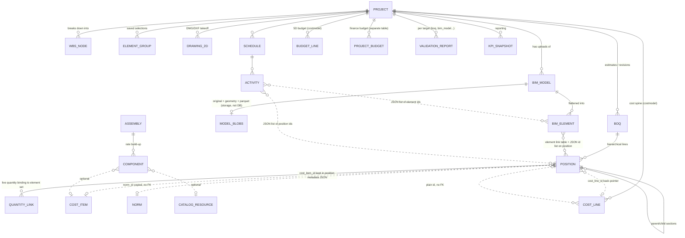

# OpenConstructionERP: the project dataset, data model and data flow

Question: how does OpenConstructionERP (OCE) structure one project's data, and how does that data
move from CAD/BIM ingestion through elements, BOQ, cost database, 4D, 5D, validation and reporting?

Source: the code at `~/reference/openconstructionerp/` (v18.0.0, commit e7e18cd0e, AGPL-3.0), read
on 2026-09-25. All paths below are relative to that checkout. Everything here is described in our
own words. No code, schema or string has been copied. Table names appear only as references.
Measurements were taken with `wc`, `grep` and `find` against the tree. The running product was not
walked for this question.

## 1. Summary

OCE markets a dataset-centred design: every CAD/BIM format is converted by the DDC cad2data
pipeline into one "canonical format", and every module reads that format and not a vendor file
(`DEVELOPING.md`, "Briefing an AI coding assistant"; `docs/architecture/OVERVIEW.md`, "Data Flow";
`docs/adr/002-no-ifcopenshell-ddc-canonical-only.md`). The code does not match that picture well.
The "canonical format" is not a schema defined in the repository. It is whatever the proprietary
DDC converter emits (a wide spreadsheet/Parquet table plus COLLADA geometry), flattened into JSON
`properties` and `quantities` on one element row. When the converter is missing, a 4,096-line
hand-written IFC text parser with box geometry takes over (`backend/app/modules/bim_hub/ifc_processor.py`).
The project itself is a hub: about 274 `project_id` columns spread across 640 table declarations in
194 loaded modules (855k lines of module code, about 3,770 route handlers, all counted with grep).
The core chain is **element → BOQ position → (budget line / cost line) → schedule activity → EVM**.
It is joined mostly by loose ID columns and JSON arrays, with few foreign keys. Much of the value
sits in JSON metadata, such as a position's resource breakdown. The in-process event bus is
supposed to automate the chain, but it does not: OCE's own test lists 31 subscriptions that no
module publishes. Among them are "BIM model ready → draft BOQ", "estimate approved → budget" and
"schedule progress → EVM snapshot" (`backend/tests/unit/test_event_name_wiring.py`). In practice
each step is a user-triggered "generate from X" endpoint.

## 2. Stack and module architecture

- **Backend:** FastAPI + Pydantic v2 + async SQLAlchemy on Python 3.12
  (`docs/architecture/OVERVIEW.md`, `backend/app/database.py`).
- **Database:** PostgreSQL only. By default an embedded PostgreSQL 16 starts with the app, and an
  external one can be set through `DATABASE_URL` (`backend/app/database.py`, module docstring and
  the URL check near line 229). Older documents still describe SQLite as the default
  (`docs/adr/001-snapshot-storage-model.md`), and several model comments justify design choices by
  SQLite limits (for example the money-as-string comment in `backend/app/modules/boq/models.py`).
  That is drift.
- **Binary and analytical storage:** a pluggable storage backend (local filesystem or S3) holds the
  original uploads, geometry (DAE/GLB) and a Parquet "dataframe" sidecar for each BIM model, laid
  out per project and model (`docs/BIM-STORAGE-ARCHITECTURE.md`, `backend/app/core/storage.py`,
  `backend/app/modules/bim_hub/dataframe_store.py`). DuckDB queries the Parquet files for
  analytics (`backend/app/modules/dashboards/duckdb_pool.py`; ADR-001). Redis, MinIO and Qdrant
  appear in the overview diagram as optional extras (`docs/architecture/OVERVIEW.md`).
- **Base row:** every ORM model inherits a UUID `id`, `created_at` and `updated_at`. The convention
  is to name tables `oe_<module>_<entity>` (`backend/app/database.py`, `Base`). The UUID type is
  stored as `varchar(36)` on every dialect. The docstring admits that 50 Alembic revisions declare
  native UUID columns, so a database built by walking the migration chain does not match one built
  by `create_all` (`backend/app/database.py`, `GUID` docstring). Fresh installs are built with
  `create_all` and not with the migrations (`backend/app/core/pg_optimizations.py`, docstring).
  There are 364 migration files (`backend/alembic/versions/`).
- **Types:** money, quantities and most dates are stored as strings and converted to Decimal in
  the service layer (`backend/app/modules/boq/models.py`, the comment above the `quantity` column;
  `backend/app/modules/projects/models.py`, where `contract_value` and the planned and actual dates
  are string columns). Newer tables use Numeric (`backend/app/modules/costs/models.py` in
  `RegionalIndex`; `backend/app/modules/schedule/models.py` in `Activity.cost_planned`), so typing
  is inconsistent.
- **Modules:** each module is a package under `backend/app/modules/<name>/` with a `manifest.py`
  (name, version, depends, category). The loader scans for manifests, sorts them by dependency,
  imports each package, then imports `router`, `models`, `hooks`, `events`, `validators` and
  `pipeline_nodes` if they exist, and mounts the router at a kebab-case `/api/v1/...` URL
  (`DEVELOPING.md`, "The backend: modules and the loader"; `backend/app/core/module_loader.py`,
  918 lines). A module is written in layers: models, schemas, repository, service, router
  (`docs/architecture/OVERVIEW.md`). Modules can be switched on per project through a
  project-module table (`backend/app/modules/projects/models.py`, `ProjectModule`).
- **Inter-module communication:** an in-process pub/sub bus that matches event names by string
  (`backend/app/core/events.py`). Publishing is fire-and-forget and detached. The helper
  `publish_after_commit` delays delivery until the transaction commits. There is no outbox and no
  persistence, so an event is lost if the process dies (`backend/app/core/events.py`, the docstring
  of `publish_after_commit`). The central wiring lives in `backend/app/core/event_handlers.py`
  (1,858 lines), and modules add their own subscriptions (133 `subscribe` calls under `modules/`).
  Modules also import each other's services directly and heavily. For example, `boq` imports 15
  other modules, including `bim_hub`, `costmodel`, `schedule` and `takeoff`, while `bim_hub`
  imports `boq`, `schedule` and `validation` back (measured by grepping `from app.modules.`), so
  the bus is not the only seam.
- **Validation engine:** `backend/app/core/validation/engine.py` (584 lines) with rules registered
  at import time. Modules can add their own `validators.py` (44 modules do), but most rules live
  in one file: `backend/app/core/validation/rules/__init__.py` has 9,939 lines and holds the
  `boq_quality`, DIN 276, NRM, GAEB, MasterFormat, CPWD, GESN and other families. There are about
  386 distinct rule IDs in the tree (grep of `rule_id = "..."`). This contradicts `DEVELOPING.md`,
  which says "there is no central list of rules".

## 3. Core entities and relationships (our own sketch)

Solid lines are real foreign keys. Dotted lines are loose references: a plain UUID or string
column, or an ID kept inside JSON. The entities:

- **Project** (`oe_projects_project`): a large row holding region, country code, currency,
  locale, classification standard, the names of its validation rule sets and compliance packs, FX
  rates, custom units, a VAT rate, a parent project for programmes, and free JSON
  (`backend/app/modules/projects/models.py`). WBS nodes and milestones hang off it with real
  foreign keys (same file). The regional pack is resolved at runtime from the country code
  (`backend/app/core/regional_packs.py`; `DEVELOPING.md`, "Adapting the platform").
- **BIM model and element** (`oe_bim_model`, `oe_bim_element`): the model has a status, a
  format, a version, a `parent_model_id` for revisions and the path of its canonical file. The
  element has a converter-assigned `stable_id` (unique only within its model), a type, a storey, a
  discipline, **free JSON `properties` and `quantities`**, a geometry hash, a bounding box, a mesh
  reference and asset information (`backend/app/modules/bim_hub/models.py`). The full wide table
  stays in the Parquet sidecar (`backend/app/modules/bim_hub/dataframe_store.py`). Around these sit
  a link table from element to BOQ position, rule-based "quantity maps" (filter → quantity field
  × multiplier + waste → BOQ target), model diffs, saved element groups (dynamic filter or static
  list) and federations (same file; `docs/BIM-STORAGE-ARCHITECTURE.md`).
- **2D drawings** (`oe_dwg_takeoff_*`): the drawing, its versions, annotations and entity groups
  (`backend/app/modules/dwg_takeoff/models.py`). This is a separate store from BIM elements. PDF
  and plan takeoff has its own documents, measurements and "CAD extraction sessions"
  (`backend/app/modules/takeoff/models.py`).
- **BOQ and Position** (`oe_boq_boq`, `oe_boq_position`): the BOQ belongs to a project, has
  status, lock and approval fields, a revision chain (`parent_estimate_id`) and an optional
  variation link. A position is a tree node with an ordinal, a description, a unit, a quantity, a
  unit rate and a total, plus a three-tier rate (cost, target, sale), a classification in JSON, a
  source and confidence, **the linked element IDs as a JSON array together with the owning
  model**, a validation status, many loose cross-module IDs (WBS, cost code, contract, funding,
  stage, cost line, norm) and an optimistic-concurrency version
  (`backend/app/modules/boq/models.py`). A **QuantityLink** row binds a position's quantity to a
  set of element stable IDs with an aggregation and a formula, and records what was last applied
  (same file). Markups, snapshots and an activity log complete the module.
- **Resources of a position:** these are *not* rows. They live in position metadata as a
  `resources` list, and a mixed-material/labour/equipment split is stamped from it into
  `resource_breakdown` (`backend/app/modules/boq/service.py`, the resource-breakdown helper near
  line 584). The cost-item reference is also a metadata key (`boq/service.py` around lines 3338
  and 3992).
- **Cost database** (`oe_costs_item`, `oe_costs_catalog`, `oe_regional_indices`,
  `oe_resource_price`, `oe_cost_item_usage`): cost items are global, not tied to a project. Each
  has a code, multilingual descriptions, a unit, a rate, a currency, a region, a classification
  and a JSON `components` list. Regional factors, per-region resource prices and an append-only
  usage ledger (which drives a "rate freshness" badge) complete it
  (`backend/app/modules/costs/models.py`). A separate **catalog** of materials, plant and labour
  exists (`backend/app/modules/catalog/models.py`), and **assemblies** build composite rates from
  components that point at either a cost item or a catalog resource
  (`backend/app/modules/assemblies/models.py`).
- **The "resources" module is something else:** it models people, crews and plant for capacity
  planning (skills, availability, assignments) and is not the cost resources
  (`backend/app/modules/resources/models.py`).
- **Schedule and Activity** (`oe_schedule_*`): an activity has CPM fields (early and late dates,
  float, critical flag), constraints, earned-value fields and **JSON lists of dependencies,
  resources, BOQ position IDs and BIM element IDs** (`backend/app/modules/schedule/models.py`). A
  real relationship table, baselines, progress tables and an EAC link also exist (same file). The
  dates are strings.
- **5D: two or three budget models.** `costmodel` holds budget lines, cash flow, cost snapshots,
  control accounts and a "cost spine" of cost lines, each pointing back to a BOQ position by a
  plain UUID that is deliberately not a foreign key (`backend/app/modules/costmodel/models.py`).
  `finance` has its own `ProjectBudget` (`backend/app/modules/finance/models.py`, line 190).
  `full_evm` is another EVM module (`backend/app/modules/full_evm/`).
- **Validation report** (`oe_validation_report`): one row for each run against a target (type
  and ID), with counts and results in JSON (`backend/app/modules/validation/models.py`).
- **Reporting:** KPI snapshots, report templates and generated reports
  (`backend/app/modules/reporting/models.py`). The reporting service reads from 14 other modules
  directly (import grep).
- **Project export bundle:** a `.ocep` zip of JSON tables and attachments. It covers 27 table
  groups (project, WBS, BOQ, positions, assemblies, schedule, budget, risks, change orders,
  tenders, documents, BIM models and elements, DWG), not the whole ~640-table model
  (`backend/app/modules/projects/bundle_export.py`, the `_BUNDLE_TABLES_*` lists). This is the
  closest thing the code has to a "single project dataset" artefact.

## 4. Data flow end to end

| Step | Module(s) | Reads | Writes | How it is triggered |
|---|---|---|---|---|
| 1. Ingest a 3D model (RVT/IFC/DGN) | `bim_hub` (`/upload-cad/`, `/upload/`) | uploaded file | original and geometry blobs, Parquet sidecar, `oe_bim_model` (processing → ready), bulk `oe_bim_element` | the upload endpoint; conversion runs the DDC converter if it is installed, otherwise the text IFC parser with box geometry (`bim_hub/router.py` around lines 988 and 2155; `bim_hub/ifc_processor.py`, docstring and `process_ifc_file`; `docs/BIM-STORAGE-ARCHITECTURE.md`, "Write path") |
| 1b. Ingest a 2D drawing | `dwg_takeoff` | DWG/DXF | drawing, version, annotation and group rows | `dwg_takeoff/router.py` line 216; the DWG route uses a DDC parser or a native DXF path (`dwg_takeoff/ddc_dwg_parser.py`, `dxf_processor.py`) |
| 1c. Ad-hoc CAD data sessions | `takeoff` (`/cad-extract/`, `/cad-data/*`, `/cad-group/create-boq/`) | converter output | `oe_takeoff_cad_session` (expires after 24 h), then BOQ positions | a second, parallel CAD→BOQ path (`takeoff/router.py` around lines 2376–4124; `takeoff/models.py`) |
| 1d. Analytical snapshots | `dashboards` | IFC/RVT through the same processor; DWG/DGN "not yet wired" | Parquet entities, materials and source files per snapshot | a third element representation (`dashboards/cad2data_bridge.py`, docstring; ADR-001) |
| 2. Elements → BOQ | `bim_hub` (quantity maps, element groups `link-to-boq`), `boq` (quantity links), `match_elements` / `match` / `cost_match` (ranked candidates) | element JSON quantities, filters | `oe_bim_boq_link` plus the JSON ID list on the position (kept in sync), `oe_boq_quantity_link`, position quantity | user action; the automatic "model ready → draft BOQ" handler never fires (step 8 below) (`docs/BIM-STORAGE-ARCHITECTURE.md`, "Group → BOQ link"; `boq/models.py`, `QuantityLink`) |
| 3. BOQ ← cost database | `boq`, `costs`, `assemblies`, `norm_expansion`, `catalog` | cost items, assemblies, norms, regional indices | position rate, resources in metadata JSON, `cost_item_id` and `norm_id` copied onto the position, a usage ledger row | user picks or applies (`boq/service.py`; `costs/models.py`, `CostItemUsage`; `boq/models.py`, the comment on `norm_id`) |
| 4. BOQ → 4D | `schedule` | BOQ positions | activities (summaries per section, tasks per position) with durations from production rates and simple dependencies | `generate_from_boq` endpoint (`schedule/service.py` around line 2403); 4D EAC links in `schedule/service_4d.py` |
| 5. BOQ → 5D | `costmodel` | BOQ positions, schedule | budget lines (made idempotent after an audit found doubled BAC), a cost spine, cash flow from the schedule, EVM, variance | `generate_budget_from_boq`, `generate_from_boq`, `generate_cash_flow_from_schedule`, `calculate_evm` (`costmodel/service.py` lines 1466, 2109, 1564, 974) |
| 6. Validation | `validation` + core engine | BOQ, BIM model and element data, the project's rule sets | `oe_validation_report`; position `validation_status` | `run_validation` endpoint (`validation/service.py` line 92) |
| 7. Reporting | `reporting`, `dashboards`, `project_controls`, `bi_dashboards` | direct service reads from many modules | KPI snapshots, generated reports | on demand or cron (`reporting/cron.py`) |
| 8. Automation between steps | `core/event_handlers.py` | events | budget rows, EVM snapshots, draft BOQ, flags | **not working**: `bim_model.ready`, `bim_model.new_version`, `estimate.approved`, `schedule.progress_updated`, `variation.approved` and `document.revision.created` are subscribed but never published, because bim_hub publishes under a `bim_hub.` prefix and schedule publishes `schedule.activity.progress_updated` (`backend/tests/unit/test_event_name_wiring.py`, `KNOWN_DEAD_SUBSCRIPTIONS`, 31 entries) |

## 5. What is strong

- **The quantity lineage is designed carefully.** A position's quantity can be bound to a named
  element set with an aggregation, a formula and a record of the last applied value and model
  version (`boq/models.py`, `QuantityLink`). Element groups can be dynamic (a filter that
  re-resolves on each new revision) or static (`docs/BIM-STORAGE-ARCHITECTURE.md`). Model diffs by
  stable ID and geometry hash are meant to flag the positions a revision touches
  (`core/event_handlers.py`, docstring of the new-version handler), though see §6.
- **Provenance is treated as data.** Norm identity is *copied* onto the position so that it
  survives later edits to the library. `price_basis` is kept separate from `source`. A
  `risk_dispersion` column stores how wrong a line could be. NULL is the honest "not judged yet"
  (`boq/models.py`, comments on these columns). The cost-item usage ledger grades how fresh a rate
  is (`costs/models.py`).
- **Separation of storage.** Heavy geometry and wide property tables go to blobs and Parquet with
  DuckDB, and the relational database keeps the metadata (`docs/adr/001-snapshot-storage-model.md`,
  `bim_hub/dataframe_store.py`). This is sound and cheap for large models.
- **Project-scoped by default.** Most rows carry `project_id` (274 columns, 208 with real
  foreign keys to the project, counted by grep). The project carries its own currency, locale,
  classification standard and validation rule sets (`projects/models.py`).
- **Validation is a first-class output** with persisted reports and many national-standard rule
  families (`core/validation/rules/__init__.py`, `validation/models.py`).
- **The project is candid about itself.** Docstrings and tests record their own defects: the dead
  subscriptions (`test_event_name_wiring.py`), the UUID mismatch between migrations and models
  (`database.py`), and the doubled-BAC fix (`costmodel/service.py` line 1467).

## 6. What is weak, partial or stub (measured)

- **The "canonical format" exists only in the docs.** No schema for it exists in the repository.
  Elements hold free-form JSON `properties` and `quantities` in whatever shape the converter emits
  (`bim_hub/models.py`). Real fidelity depends on proprietary DDC binaries that are downloaded at
  install time from a pinned commit (`core/converter_source.py`). Without them, the fallback is a
  4,096-line text IFC parser with placeholder boxes (`bim_hub/ifc_processor.py`). That parser
  contradicts the ADR's claim that OCE never parses IFC itself (ADR-002).
- **Elements have at least four representations:** the BIM element rows, the takeoff CAD
  sessions, the dashboard snapshot Parquet files and the match-elements sessions (see §4, rows
  1–2), besides a separate DWG store. The single link table promised in the BIM storage document
  was never built (`docs/BIM-STORAGE-ARCHITECTURE.md`, "oe_bim_link unification" is listed under
  future work). Positions and activities still carry element IDs as JSON arrays.
- **The `cad` module is a shell.** It has a manifest and two helper files (1,422 lines) but no
  router and no models (`backend/app/modules/cad/`). Ingestion actually happens in
  `bim_hub`, `takeoff`, `dwg_takeoff` and `boq/cad_import.py`.
- **The event-driven chain is broken.** 31 subscriptions receive no publisher, including every
  automatic step of the BIM→BOQ→budget→EVM flow (`tests/unit/test_event_name_wiring.py`). The bus
  itself is in-process and not durable (`core/events.py`).
- **Cross-module references are loose.** The cost line → position link, the norm, the contract,
  WBS and cost-code IDs are plain columns, and the activity → position link is a JSON list
  (`boq/models.py`, `costmodel/models.py`, `schedule/models.py`). Integrity is left to the service
  code. This is a deliberate trade for module independence (`boq/models.py`, the comment on
  `variation_request_id`), but nothing enforces it.
- **Cost resources are JSON inside the position,** so a resource cannot be queried relationally
  across a project without reading every position's metadata (`boq/service.py`, the
  resource-breakdown helper). `resource_summary`, the module that rolls them up, is 1,180 lines
  with 5 endpoints.
- **Overlapping 5D and EVM.** Budgets live in `costmodel.BudgetLine`, `costmodel.CostLine` and
  `finance.ProjectBudget`. EVM functions exist in `costmodel`, `finance`, `schedule`
  (`evm_math.py`, `evm_snapshot_*`), `schedule_advanced`, `progress`, `bi_dashboards` and
  `full_evm` (grep for evm and earned-value function definitions).
- **Typing and schema drift.** Money and dates are strings. UUIDs are varchar. Migrations and
  `create_all` disagree (`database.py`). Documents say SQLite while the code requires PostgreSQL
  (ADR-001 against `database.py`).
- **Breadth over depth.** 194 modules, 855k lines of module code and about 3,770 endpoints.
  `property_dev` (35k lines, 230 endpoints) is larger than `bim_hub` (21.5k lines, 63 endpoints),
  and `contracts` (20.6k lines, 122 endpoints) is almost as large. Nine of the thirteen regional packs are 210–600 lines with one
  endpoint. `estimate_rollup` is 797 lines with one endpoint, and `match` is 783 lines with four
  (module sizes measured over non-test `.py` files; endpoints counted from `@router.<verb>`
  decorators). Test files by module name: `boq` 86, `schedule` 39, `takeoff` 39, `bim_hub` 14,
  `costmodel` 11, `assemblies` 5, `dwg_takeoff` 2, `resource_summary` 2, from 2,097 backend test
  files in total. There are 45 TODO, FIXME or NotImplementedError markers outside tests.
- **No Bangladesh coverage.** No regional pack claims `BD` (`backend/app/modules/*_pack/config.py`).
  The only traces are a country-name mapping (`core/country_resolver.py`) and a currency map entry
  (`core/match_service/ranker_qdrant.py`). Under the resolver's rules, a BD project resolves to
  "unconfigured" (`DEVELOPING.md`, "Adapting the platform").

## 7. Lessons for Vextrus

1. **If we claim a canonical project dataset, define it as our own versioned schema** (element,
   quantity, classification, provenance) and put converters behind it. OCE's "canonical format"
   is a label on a vendor's output. That leaves its data model at the mercy of a proprietary
   binary.
2. **Keep one element store and one link model.** Four element representations and JSON ID lists
   are the most visible cost of OCE's growth. A single typed link (element or element set → line,
   with its quantity rule) should be the spine from day one.
3. **Make the core chain explicit and tested end to end,** not an implicit event cascade. OCE's
   own gate proves that string-matched, fire-and-forget events rot silently. Use direct
   orchestration or a durable outbox, and add a test that publishers and subscribers agree.
4. **Keep what is good in its position design:** quantity bindings that remember what they last
   applied, provenance copied and not referenced, NULL meaning "not judged", a rate-freshness
   ledger, and three-tier rates.
5. **Use real types:** Decimal money, native dates, native UUIDs, one migration path. OCE's
   string columns and the split between `create_all` and the migrations are debts it now cannot
   pay without migrating all ~600 tables.
6. **Keep resources relational** if we want resource-level procurement, 4D loading or carbon
   figures. Resources hidden in JSON cannot be queried across a project.
7. **Go narrow and deep.** A few hundred rule IDs and 194 modules still leave the central flow
   broken. For Bangladesh (PWD schedules, BNBC), the first slice must work end to end before
   anything widens it.

## What I could not determine

- What the DDC converter actually outputs (its column set and quantity semantics). It is
  proprietary and was not run. Its MIT docs are covered separately in
  `docs/research/ddc-thesis-and-cad2data.md`.
- Whether the automatic flows fire through a path my grep missed, for example dynamically built
  event names. OCE's own test agrees they do not.
- How complete the data is at run time: I did not walk the running product at 127.0.0.1:8080 or
  inspect its database for how many positions really carry element links, resources or cost
  lines.
- Frontend data flow (`frontend/src/features/`) was not read.
- The test counts are file counts matched by name, not coverage.
