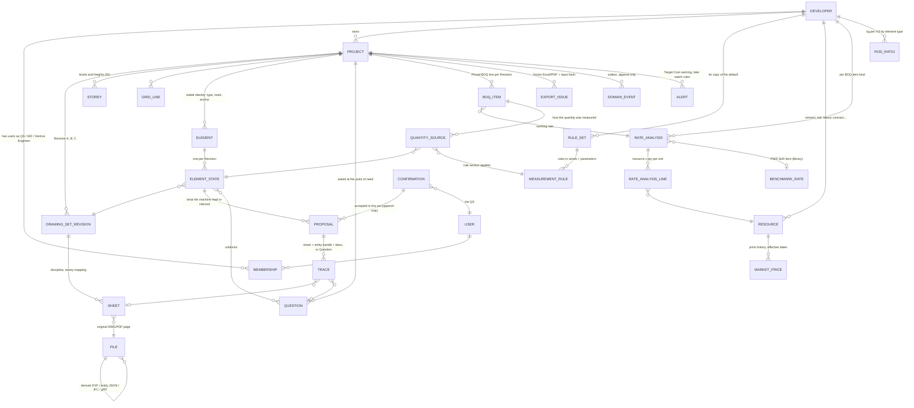

# Stack: how Vextrus stores and moves its data

Question: how should Vextrus store and move its data (the Building Model and the project dataset,
files, background jobs, search and semantic search, events) so that it is simple for AI agents to
build now, correct for money and quantities, multi-tenant and secure, and able to grow?

Date: 2026-09-25. Researcher: background agent (medium effort). The backend is Python, and
Postgres 16 runs on the dev machine at port 5544 (`CLAUDE.md`). Framework choice (Django or
FastAPI) is researched separately. Where a recommendation depends on it, both paths are named.

Sources are listed at the end as [S1]–[S63]. Repo documents are cited by path. "Measured" means a
command was run on this machine on 2026-09-25. Nothing from OpenConstructionERP (OCE) is copied.
Its design is described in our own words, from `docs/research/oce-data-model.md` and a short read of
its tree.

---

## 0. The answer in one table

| Area | MVP recommendation | Deferred to beta / scale |
|---|---|---|
| Project dataset | One Postgres database. The core is **relational and typed**: the Element with a stable identity, a per-Revision element state, Proposals, append-only Confirmations, Questions, Traces, Rule Sets, Rate Analyses, Market Prices, BOQ items. Use `numeric` for money and quantities, and JSONB only for element-type-specific attributes and parameters. | A columnar copy (Parquet + DuckDB) only when analytics across many projects or 100k+ element models is measured to be slow |
| IFC | An **export artefact** generated from our tables with IfcOpenShell, stored as a file, never the store | IFC import (for the rare RVT/IFC client); IFC5 once it is stable |
| Audit | **No event sourcing, no CQRS.** Current-state tables, plus an **append-only Confirmation log** (the Confirmation is the audit fact), plus a **domain-event table written in the same transaction** (a transactional outbox) | Row-history triggers on money tables if a client asks; the outbox feeds the "wake" watcher |
| Files | One small `FileStore` seam. **Local filesystem in dev.** Content-addressed keys (sha256) under `tenant/project/`. Originals are immutable. Derived artefacts (DXF, JSON, IFC, glTF) are keyed by source hash and reader version. | Beta: managed S3-compatible storage (AWS S3 in the database's region, or Cloudflare R2). **Not MinIO**: its community edition is archived. |
| Jobs | **A Postgres-backed queue: Procrastinate** (MIT), with its jobs enqueued in the same transaction as the data. CPU-heavy CAD and IFC steps run in a **child process with a timeout**. No Redis, no broker. | Hatchet or Temporal only if multi-step workflows outgrow a queue; scale the workers separately |
| Tenancy | **Shared tables with a `tenant_id` on every tenant row, plus Postgres row-level security** set per transaction. The app role is not the owner and has no BYPASSRLS. RLS is forced. | Database-per-tenant for one large client who demands it; the code does not change |
| Security | TLS in transit, and managed at-rest encryption (Postgres has none of its own). PITR backups. Secrets outside the repo. | Customer-managed keys; a Bangladesh data-residency answer (see §6.4, an open legal question) |
| Search | **Postgres full-text search + `pg_trgm` + pgvector in the same database**, fused with reciprocal rank fusion. No separate vector database. | pgvectorscale or a partitioned vector table if one tenant passes millions of chunks |
| Embeddings | Project memory is post-MVP (ADR 0012). When it comes: **BGE-M3** (MIT, 100+ languages, 1024-d) self-hosted, or Voyage (hosted, Anthropic's recommended provider), chosen by a retrieval test on real documents | Re-embedding job when the model changes |
| Events and "wakes" | A `domain_event` outbox table. A watcher job reads new events and checks **rules held as data** (the first rule is the Target Cost warning, ADR 0016). `LISTEN/NOTIFY` is only a doorbell. | Notification channels beyond in-app and email: WhatsApp templates, then SMS (it needs a sender ID registered for Bangladesh) |
| Stages | Dev: one machine, native Postgres, filesystem, no Docker. Beta: managed Postgres + object storage in one region near Dhaka, PITR. Scale: read replica, separate worker fleet, then partitioning. | — |

The theme: **one Postgres, used properly**, with small seams (a FileStore, a job-defer function, an
event writer and a search function) so that each piece can be swapped without touching the domain.
That is the opposite of both failed stacks. The ERP ran NestJS/CQRS/DDD, Prisma, **Redis** and
Docker in dev. Cubit had six seams that parallel agents collided on (`docs/postmortem.md`, cause 6).

> Correction to the brief: it says the old ERP had "no Redis". The postmortem lists **Redis in the
> ERP stack** (`docs/postmortem.md`, lines 9 and 81). Cubit used **pg-boss**, a Postgres queue.
> Either way, this design needs no Redis.

---

## 1. What the design must satisfy (from the repo)

- **One dataset at the centre**, every module a view or transformation of it
  (`docs/research/ddc-thesis-and-cad2data.md` §5.1; `docs/intent.md`).
- **The Element needs a stable identity across Revisions.** Unchanged elements keep their
  Confirmation, and a Revision Comparison is element by element (ADR 0015).
- **The machine proposes and the QS confirms, in bulk.** Only confirmed elements count (ADR 0007;
  `CONTEXT.md` "Proposal", "Confirmation").
- **Every figure has a Trace** to a sheet location or to a Question (`CONTEXT.md` "Trace";
  `docs/postmortem.md` "What is worth carrying").
- **Measurement Rules, Rule Sets, Rate Analyses, Rod Ratios and markets are data** (ADRs 0006, 0009,
  0010, 0017).
- **SI inside, Display Units outside, money in ৳** (ADR 0008).
- **OCE's data lessons** (`docs/research/oce-data-model.md` §6–7):
  - money and dates are stored as strings, and UUIDs as varchar;
  - elements have four representations;
  - resources are hidden in JSON;
  - element links are JSON arrays;
  - the in-process event bus is non-durable, and 31 of its subscriptions are dead.

---

## 2. The project dataset

### 2.1 Relational core, typed

**Recommendation.** Model the dataset as ordinary normalised Postgres tables with real foreign keys.
Every row that belongs to a Developer carries `tenant_id`, and every project row carries
`project_id`.
- **Money and quantities are `numeric`.** Postgres "especially recommend[s]" `numeric` "for storing
  monetary amounts and other quantities where exactness is required", and warns that `real` and
  `double precision` are inexact [S1].
- **Decimal arrives as Decimal in Python.** psycopg converts Postgres `numeric` to Python `Decimal`
  and back by default [S2]. Code therefore never meets a float amount unless it asks for one.
- **Geometry stays float.** Coordinates and parametric sizes come out of ezdxf and IfcOpenShell as
  floats, and that is fine. A quantity is computed from geometry, rounded to a declared precision in
  SI, and stored as `numeric`. Display rounding and lakh/crore grouping happen only at the edge
  (ADR 0008).
- **IDs are UUIDs**, time-ordered (UUIDv7) so that indexes stay compact. Postgres 18 ships
  `uuidv7()` [S3]. On 16 the app generates them. This avoids OCE's varchar-UUID drift
  (`oce-data-model.md` §2).
- **One migration path** (Alembic or Django migrations) builds every database, dev and prod. OCE
  builds fresh installs with `create_all` and upgrades with migrations, and the two disagree
  (`oce-data-model.md` §2).

**JSONB where it helps, and only there:**
- the type-specific attributes of an element: a column's section and Storey Band, a stair's
  risers, a wall's layers;
- a Measurement Rule's parameters;
- a Proposal's raw reading.

JSONB is binary, indexable with GIN, and faster to process than `json` [S4]. Postgres advises
keeping documents to "a manageable size" because "any update acquires a row-level lock on the whole
row" [S4]. Anything summed, joined or filtered across a project stays a real column, and that
includes Resources. OCE keeps a position's resources in JSON metadata and cannot query them
relationally (`oce-data-model.md` §6, lesson 6).

### 2.2 Element identity, Revisions, Proposals, Confirmations

The shape that satisfies ADR 0015:
- **Element.** A stable identity: its type (the Takeoff Step), its mark and its anchor (grid
  position, storey). It lives across Revisions.
- **Element state.** One row per Element per Revision, holding that Revision's confirmed attributes
  and parameters. A Revision Comparison is then a join of two sets of element states on
  `element_id`, and nothing more.
- **Proposal.** What a reader, a Jev node or a default proposes for an element or a fact, with its
  Trace and a confidence. It is never counted.
- **Confirmation.** One append-only row per QS act (who, when, which Takeoff Step, how many), with
  the Proposals it accepted. Confirming promotes the proposal's values into the element state.
- **Matching** a new Revision's readings to existing Elements (grid, storey, mark) is code. It
  produces Proposals marked "unchanged", "changed", "new" or "removed", and unchanged ones inherit
  the prior Confirmation (ADR 0015).

The raw reading of a sheet (every line, text and block that ezdxf returns) is **not** stored as
rows. It becomes a derived file per sheet, keyed by the source file hash and the reader version
(§4). Traces point into it by entity handle and bounding box. The DDC study recommends keeping this
raw entity layer as its own stored stage because it is cheap, re-runnable and "the anchor for the
Trace" (`ddc-thesis-and-cad2data.md` §5.4). A file is enough for that. Rows would bloat the
database for data that is read only when a Trace is opened.

### 2.3 A columnar copy (Parquet + DuckDB)?

**Not at MVP.** OCE added Parquet and DuckDB for dashboards that must answer `GROUP BY attribute`
over snapshots of 100k to 10M entities in under 500 ms. It judged JSONB path extraction "10-100×
slower than columnar" at that shape (OCE `docs/adr/001-snapshot-storage-model.md`, "Context").
Vextrus's MVP projects are single RCC buildings of thousands of elements, not federated models,
and its Priced BOQ is a join over typed columns, not over JSON paths. The cost of adding the copy
later is small:
- DuckDB (MIT) can read a running Postgres directly [S5][S6];
- a nightly Parquet export is one job.

**Trigger to revisit:** a measured slow query on cross-project analytics (the "project memory" of
costs, or benchmarking across a Developer's buildings).

### 2.4 How IFC relates

**IFC is an output, generated from our tables, not the store.**
- IFC 4.3 is ISO 16739-1:2024 [S7] and is the exchange standard.
- IfcOpenShell (LGPL) parses IFC2x3 to IFC4x3 [S8] and can serialise geometry to glTF through
  IfcConvert [S9].
- IFC5, the next version, is JSON-based but still "preliminary" and "not suitable for production"
  [S10].

Why not store IFC:
- Our facts carry things IFC has no place for: Proposal/Confirmation state, the Trace, Rod Basis
  and the Rule Set that measured them.
- An IFC file is a document, rewritten as a whole. It is not a transactional store, and nothing in
  IfcOpenShell's documentation offers one [S8][S9].

Both the DDC study and the 2D→BIM prototype reached the same conclusion: mesh for display, IFC as
the export (`ddc-thesis-and-cad2data.md` §5.7; `docs/research/2d-to-bim-prototype-lessons.md`).
The browser viewer reads glTF, generated either from IfcOpenShell or directly from element states.
Each glTF node carries its `element_id`, so a click in 3D opens the element and its Trace.

---

## 3. Auditability

The need: who confirmed what, when; what changed between Revisions; and what a figure was
computed from.

| Option | What it gives | Cost to us |
|---|---|---|
| Current-state tables only | Fast, simple | History is lost ([S11], "Auditability") |
| **Current state + append-only Confirmation log + domain-event outbox** | Who confirmed what and when, as first-class domain rows. Each Revision's element states are kept, so history is by design. The event rows feed notifications and the watcher. | One extra insert per domain act, in the same transaction |
| Full event sourcing (+ CQRS) | Replay, full intent history | Microsoft calls it "a complex pattern that introduces significant trade-offs… costly to migrate to or from", says "for most systems… traditional data management is sufficient", and lists "MVPs" and teams without event-driven experience as poor fits [S11]. Other costs [S11]: events are versioned and upcast forever; projections are eventually consistent; querying needs projections; the given-when-then testing adds surface. Fowler: "for most systems CQRS adds risky complexity" [S12]. |

**Recommendation: the middle row.** Full event sourcing is what the ERP's CQRS/DDD stack
approximated, and agents fought it (`docs/postmortem.md`, cause 6). The Microsoft guidance itself
suggests applying event sourcing "selectively" to a ledger-like part and CRUD elsewhere [S11]. In
Vextrus, the ledger-like parts are already append-only by design:
- **Confirmations** are never updated. A reversal is a new Confirmation that un-confirms.
- **Market Prices** are held as a price history with effective dates, so an old Priced BOQ can be
  re-priced exactly as it was.
- **Element states** are per Revision, so a Revision is history.
- **Issued exports** (the Excel/PDF the MD received) are frozen with the input hash, so "what did
  we send on 3 March" has an exact answer.

**The transactional outbox.** Writing a `domain_event` row in the same transaction as the change
guarantees the message exists "if and only if the database transaction commits". A relay may
deliver it more than once, so consumers must be idempotent [S13]. This is the durable replacement
for OCE's lost-on-crash in-process bus (`oce-data-model.md` §2, "no outbox and no persistence").
With a Postgres queue, the outbox can even be the queue: Procrastinate can defer a job on the
caller's own connection, so the job row commits or rolls back with the data [S14]. Keep a separate
`domain_event` table anyway. It is the permanent, queryable record of what happened in a project,
which the watcher and project memory will read. Queue rows are deleted after they run.

---

## 4. Files

**Recommendation.**
- **Seam.** One `FileStore` interface (`put`, `get`, `url`, `exists`), with a local-filesystem
  implementation in dev and an S3 implementation from beta. Python clients are permissively
  licensed: boto3 (Apache-2.0), obstore (MIT) and fsspec (BSD-3) (measured on PyPI [S15]).
- **Keys.**
  - Originals: `tenants/<tenant>/projects/<project>/originals/<sha256>.<ext>`.
  - Derived artefacts: `.../derived/<source-sha256>/<artefact>@<producer-version>.<ext>`.
- **Immutability.** Originals are never overwritten.
- **Reproducibility.** A derived artefact (DXF from LibreDWG, the per-sheet JSON entity dump, IFC,
  glTF) is reproducible from its source hash and producer version, so a re-run after a reader fix
  writes a new key instead of mutating an old one.
- **Metadata in Postgres.** A `file` row holds the key, size, hash, kind, the uploader and the
  Revision it belongs to.
- **Uploads and downloads** go through presigned URLs in beta. S3 grants "time-limited permission",
  up to 7 days through the SDK/CLI [S16]. The API server never streams large DWGs.

**Local S3 emulation is not needed.** The seam makes S3 a beta concern, and Docker-free dev is a
stated goal. If one is wanted:
- **MinIO is out.** Its community repository is marked "NO LONGER MAINTAINED" and was archived on
  25 Apr 2026, and it is AGPL-3.0 [S17].
- **Garage** (AGPL-3.0) is a single binary. Its own quick start says the single-node form is not
  for production. It lacks object versioning, object lock and server-side encryption [S18][S19][S20].
- **SeaweedFS** (Apache-2.0) has a one-process `weed mini` S3 mode suitable for dev and single-node
  use [S21].

**Beta storage:** managed object storage in the database's region. Examples:
- **AWS S3**;
- **Cloudflare R2**: $0.015/GB-month, free egress and a 10 GB-month free tier [S22]. Its data
  location near Bangladesh was not checked.

The bill is small either way. A Drawing Set is tens of MB.

---

## 5. Background jobs

The work is:
- reading DWG (a LibreDWG subprocess, then ezdxf);
- reading vector PDFs;
- running Jev calls in batches;
- assembling IFC and glTF;
- exporting Excel and PDF;
- later, ingesting documents and running the watcher.

All of it is seconds to minutes per job, and tens of jobs per project.

| Option | Needs | Licence | Note |
|---|---|---|---|
| **Procrastinate** 3.10.0 (23 Sep 2026) | Postgres ≥ 13 only | MIT | Retries, periodic tasks, locks and queueing locks; async and sync; Django integration with its own Django migrations [S14][S23][S24]. Can defer inside the caller's transaction [S14]. "Looking for additional maintainers" [S25]. |
| **PgQueuer** 1.4.0 (14 Sep 2026) | Postgres ≥ 13 only | MIT | `LISTEN/NOTIFY` + `FOR UPDATE SKIP LOCKED`, transactional enqueue, cron, concurrency limits, an in-memory mode for tests [S26]. Framework-neutral. |
| Django 6 Tasks | a third-party backend | BSD-3 | Django ships only Immediate and Dummy backends and says production "should rely on backends that supply a worker process and a durable queue" [S27]. The DB backend was split out of `django-tasks` into `django-tasks-db` [S28]. An API, not a queue yet. |
| django-q2 1.11.1 | Django ORM broker | MIT | Django-only [S15] |
| Celery 5.6.3 / Dramatiq 2.2.1 | a broker (Redis or RabbitMQ) | BSD-3 / **LGPL-3.0+** | Adds a second stateful service [S15] |
| Hatchet | its engine + API + Postgres (RabbitMQ optional); a "Lite" single image for low throughput | MIT | A workflow engine, heavier than we need now [S29][S30] |
| Temporal | Temporal Service (Frontend, History, Matching, Worker services) + persistence and visibility stores | MIT | The strongest durability, and the heaviest to operate [S31][S30] |
| DBOS Transact | a library; checkpoints workflows in Postgres (SQLite by default) | MIT | Durable steps without a server [S32]. Worth a look if multi-step workflows grow. |

**Recommendation: Procrastinate if the framework is Django, PgQueuer if it is FastAPI.** Both keep
jobs in the same Postgres. `SELECT … SKIP LOCKED` is Postgres's documented tool for "multiple
consumers accessing a queue-like table" [S33]. Rules:
1. **Jobs are enqueued in the same transaction as the data they act on** [S14][S26]. There are no
   ghost jobs and no lost jobs.
2. **CPU-heavy steps run in a child process with a hard timeout.** CPython's GIL lets "only one
   thread execute Python bytecode at a time" [S34], and a malformed DWG can hang a reader.
   LibreDWG is already a CLI. ezdxf and IfcOpenShell steps run under a process pool. A crash kills
   one job, not the worker.
3. **Job code sits behind one `defer()` function** that we own. Procrastinate and PgQueuer are
   small projects (about 1.4k and 1.5k stars [S25][S26]), and a swap must touch one file.
4. **The queue's schema is managed by our one migration path, pinned, in its own schema, with least
   privilege.** Cubit's pg-boss needed a hand-written repair migration: the app role had been
   granted CREATE on the database, and a SECURITY DEFINER queue-delete function had been handed to
   it (`db/migrations/0019_job-store-repair.sql`, header). pg-boss 12 also could not migrate a v10
   schema (`.claude/rules/database.md`, line 28).
5. **Every job is idempotent,** keyed by (input hash, producer version), which §4's keys already
   give.

---

## 6. Multi-tenancy and data security

### 6.1 Isolation model

AWS names three models [S35]:
- **silo**: a database per tenant, with the most separation and the highest cost;
- **bridge**: a schema per tenant, with "complicated" maintenance;
- **pool**: shared tables with a tenant key, the cheapest, but it needs enforcement.

Vextrus will have tens of tenants for years (ADR 0017: ten paying Developers before a second
market). Schema-per-tenant multiplies migrations by the tenant count. Database-per-tenant
multiplies backups, connections and upgrades.

**Recommendation: pool + row-level security.**
- **`tenant_id` everywhere.** Every tenant-owned table has `tenant_id NOT NULL` and a policy
  `tenant_id = current_setting('app.tenant_id')::uuid`. This is the pattern in AWS's guide [S35].
- **Default deny.** With RLS enabled and no policy, "a default-deny policy is used" [S36]. A
  forgotten policy therefore fails closed.
- **Per transaction, not per session.** The app sets the tenant with
  `set_config('app.tenant_id', …, true)`, which applies "only during the current transaction"
  [S37]. That is safe with pooled connections. AWS warns that session-level variables may conflict
  with server-side poolers like PgBouncer [S35].
- **Who bypasses RLS.** Superusers and BYPASSRLS roles "always bypass", and table owners bypass
  unless `FORCE ROW LEVEL SECURITY` is set [S36]. Hence:
  - migrations run as an owner role;
  - the app runs as a separate non-owner role without BYPASSRLS;
  - every tenant table is `FORCE`d.

  A test asserts that every table with `tenant_id` has RLS enabled, forced and a policy. It is
  cheap and it catches the one mistake that matters.
- **Covert channels.** Unique, primary-key and foreign-key checks "always bypass row security", so
  a unique constraint can leak another tenant's values [S36]. Scope every business unique key with
  `tenant_id` (for example `(tenant_id, project_code)`) and use UUIDs for identity.
- **Library data.** Shared defaults (the PWD-based Rule Set, starter Rate Analyses, Benchmark Rates,
  default Rod Ratios) live in tenant-less tables and are *copied* into a tenant on first use
  (ADRs 0006, 0009). They are never edited in place by a tenant.
- **One big client later** can be moved to its own database (silo) with the same code. Only the
  connection string differs.

### 6.2 Encryption

- **Postgres has no built-in transparent at-rest encryption.** Its documentation offers pgcrypto
  per column, file-system or block encryption, SSL/TLS, and client-side encryption [S38].
- **Managed Postgres supplies it.** For example, RDS encrypts storage, logs, automated backups,
  replicas and snapshots with AES-256 under a KMS key. Encryption must be chosen at creation and
  cannot be turned off later [S39].
- **Recommendation:**
  - TLS on every connection;
  - managed at-rest encryption from the first beta database, because it cannot be added in place
    [S39];
  - no pgcrypto column encryption at MVP, since no field needs it beyond what disk encryption gives;
  - the object store bucket private, encrypted and reached only by presigned URL.

### 6.3 Backups

A `pg_dump` is a logical snapshot. Point-in-time recovery needs a base backup plus archived WAL
[S40].
- **Beta:** managed PITR. RDS keeps automated backups for a configurable retention and supports
  PITR [S41]. Add a nightly logical dump per tenant into the object store, which doubles as the
  Developer's export.
- **Self-hosting:** pgBackRest (MIT) or WAL-G (Apache-2.0) [S42].
- **Restore drill** before the first paying client. An untested backup is a claim, not evidence.

### 6.4 What a Developer will ask about their data, and our answers

| Question | Answer the design allows |
|---|---|
| Where is it stored? | One named cloud region near Dhaka (§8), stated in the client agreement |
| Can other Developers see it? | No. Row-level security, forced, enforced in the database, not only in code [S36] |
| Can Vextrus staff see it? | Only a Vextrus Engineer on an onboarding engagement, logged (ADR 0016 role) |
| Is it sent to anyone? | Jev calls go to TypeSafe (US), under terms stated in the agreement (ADR 0013). Embeddings, if hosted, go to the embedding provider. |
| Is it used to train AI? | TypeSafe says it does not train on inputs (ADR 0013). Same question for any embedding provider. |
| Can I get it all out? | Yes: a per-tenant export (DB dump + files), which the backup job already produces |
| Is it deleted when I leave? | Yes, on request. Tenant rows and the tenant's object prefix are deleted, and backups age out. |

**Open legal question (for the owner and counsel, not decided here).** Bangladesh's Personal Data
Protection Ordinance 2025 (No. 61, 6 Nov 2025) applies to anyone processing the personal data of
people in Bangladesh, including from abroad (s.1(2)). Section 29(7)(b), in its English print, says
that for personal data placed in any cloud, "at least one synchronized real-time copy of all data
stored in the cloud must be kept within Bangladesh" [S43]. Later reports:
- a February 2026 Amendment Ordinance narrowed that residency rule to restricted data and Critical
  Information Infrastructure [S44];
- Parliament replaced the Ordinance with the Personal Data Protection Act 2026 (Law 63 of 2026) in
  April 2026 [S44][S45].

I did not read the Act's text. Vextrus holds little personal data (users' names, emails and phone
numbers), and its drawings and costs are business data. Before beta, counsel should confirm whether
a region outside Bangladesh is acceptable. If a Bangladesh copy is needed, the design allows it: a
logical replica or nightly dump to a Bangladeshi host.

---

## 7. Search and semantic search (project memory)

### 7.1 Where the index lives

**Recommendation: in Postgres.**
- **Keyword search.** Postgres full-text search, with `websearch_to_tsquery` for user input (it
  "never raises syntax errors") and `ts_rank_cd` for proximity ranking [S46].
- **Fuzzy search.** `pg_trgm` for part numbers, marks and names (available locally, measured
  [S47]).
- **Semantic search.** pgvector with HNSW indexes on `halfvec`. It indexes up to 4,000
  dimensions, 2,000 for `vector` [S48].
- **Hybrid search.** pgvector's README recommends combining it with full-text search through
  reciprocal rank fusion or a cross-encoder [S48].
- **Filtered queries.** With approximate indexes "filtering is applied *after* the index is
  scanned". Iterative index scans (0.8.0+) fix short results. For tenant isolation the README
  suggests list partitioning or separate tables [S48]. With tens of tenants, RLS plus iterative
  scans suffices first, and partition by tenant when one grows.

**Why not Qdrant or Weaviate now.** Qdrant is Apache-2.0 and strong. Its own guidance is one
collection with a tenant payload key, not a collection per tenant [S49]. But a second database
means a second copy of every document chunk, kept in sync by application code. OCE shows the
failure mode:
- its vector layer is fed through its non-durable event bus;
- it is "non-fatal": if the backend is unavailable, calls log and return empty;
- it runs two vector backends (Qdrant, with LanceDB as a legacy fallback).

(OCE `backend/app/core/vector_index.py` docstring; `backend/app/config.py`, the vector backend
settings.) A chunk and its vector in one Postgres row are written and deleted in one transaction
and inherit RLS.

**Scale path.** pgvectorscale (PostgreSQL licence) adds a StreamingDiskANN index and label
filtering. It is benchmarked at 50M 768-d vectors against Pinecone [S50], a vendor benchmark. It is
**not** offered on RDS, which ships pgvector 0.8.2 [S51]. That favours plain pgvector until a
measured need arises.

**Dev caveat (measured).** Ubuntu 24.04's package `postgresql-16-pgvector` is **0.6.0**, which
predates iterative scans. pgvector is not installed on the dev database today [S47]. Install from
the PostgreSQL APT repository, which pgvector's README names [S48], to get 0.8.x and match beta.

### 7.2 Language

The MVP is English only (ADR 0016), but a Developer's old documents will include Bangla. The local
Postgres has **no Bengali text-search configuration** (the list runs from `arabic` to `yiddish`
with `hindi`, `nepali` and `tamil`, but no `bengali`; measured [S47]). Bangla text therefore gets
the `simple` configuration plus `pg_trgm`, and relies on a multilingual embedding for meaning.

### 7.3 Embedding models

| Model | Licence | Languages / Bengali | Size / dims | Where it runs |
|---|---|---|---|---|
| **BAAI BGE-M3** | MIT | 100+ languages; dense, sparse and multi-vector | 1024-d, 8,192 tokens [S52] | Self-hosted, CPU-feasible |
| intfloat multilingual-e5-large | MIT | tagged `bn` on HF [S53] | 1024-d | Self-hosted |
| Qwen3-Embedding-0.6B | Apache-2.0 | 100+ languages | up to 1024-d (MRL), 32k context [S54] | Self-hosted |
| nomic-embed-text-v2-moe | Apache-2.0 | tagged `bn` [S53] | — | Self-hosted |
| jina-embeddings-v3 | **CC-BY-NC-4.0** | — | — | **Excluded: non-commercial** [S53] |
| EmbeddingGemma-300m | Gemma terms | — | — | Custom licence, check before use [S53] |
| Voyage 4 family | commercial API (voyage-4-nano open-weight, Apache-2.0) | "multilingual" | 1024-d default, 32k context | Hosted. Anthropic has no embedding model of its own and points to Voyage [S55]. |

**Recommendation.** Project memory is post-MVP: firm subscriptions come "once something lives
across projects… project memory" (ADR 0012). ADR 0011 (no LLM in the MVP) does not forbid an
embedding model, but none is needed for the MVP's Levels 1–2. When project memory starts:
1. Default to **BGE-M3, self-hosted**. It is MIT-licensed and multilingual, it gives dense and
   sparse vectors from one pass [S52], and tenant data never leaves our infrastructure. That makes
   the §6.4 answer simplest.
2. Run a small retrieval test on real (permitted) Developer documents, English and Bangla, against
   Voyage and Qwen3. Pick on measured recall, not leaderboard scores.
3. Store `model_id` and `dims` beside every vector, and make re-embedding a job. A model change is
   then a background migration, not a rewrite.

### 7.4 Ingesting raw old documents

- **PDF text:** pdfplumber / pdfminer.six (MIT) and pypdfium2 (BSD-3/Apache-2.0).
- **Layout-aware conversion:** Docling (MIT), or MarkItDown (MIT) as a lighter alternative.
- **Excel:** openpyxl (MIT) and python-calamine (MIT).
- **Excluded:** PyMuPDF is AGPL/commercial dual-licensed. ADR 0014 already prefers permissive
  readers.

(Licences measured on PyPI [S15].)

**Pipeline:** upload → `file` row → a job classifies the document (Jev: BOQ, rate analysis, work
order, letter) → extract text and tables → chunk → embed → a `document_chunk` row with a
`tsvector` and a `halfvec`, all under RLS. Excel BOQs and rate analyses from old projects are also
parsed into *structured* rows (Resources, Market Price history), because the most valuable memory
for a Developer is its own past rates, and those must be numbers, not chunks. Scanned PDFs need OCR
and are out of scope, consistent with ADR 0014.

---

## 8. Events and the "wakes" idea

**Mechanism.**
1. **Writes commit a `domain_event` row** in the same transaction (§3), for example
   `confirmation.recorded`, `revision.read`, `market_price.changed` or `boq.total_changed`.
2. **The watcher is a queue job**, triggered by those events and also run periodically. It reads
   the events since its checkpoint and evaluates **watch rules held as data**, in the same spirit
   as Measurement Rules (ADR 0009). It then writes an alert row and sends notifications.
3. **The first watch rule already exists in the MVP: the Target Cost warning** (ADR 0016). It is
   the "wake" pattern in its smallest form. Later rules could include:
   - a rate moving outside the PWD benchmark band;
   - rod from the drawing departing from the ratio by more than N%;
   - a Revision adding more than ৳X.

   Level 3 AI (ADR 0011) can later *explain* an alert. Code decides that it fires.
4. **`LISTEN/NOTIFY` is only a doorbell** to wake the watcher or push to the browser. It is not a
   store:
   - notifications are delivered only on commit;
   - payloads must be under 8,000 bytes;
   - if the 8 GB queue fills, transactions "will fail at commit" [S56].
   - At very high write concurrency, NOTIFY serialises commits under a global lock. Recall.ai hit
     this with "tens of thousands" of concurrent writers [S57]. That is far beyond Vextrus's scale,
     but it is the reason events live in a table and NOTIFY carries no data.
5. **Idempotency.** The watcher stores its last processed event id, and alerts are unique per
   (rule, subject, window). The outbox pattern and Microsoft's guidance both require idempotent
   consumers [S13][S11].

**Notifications.**
- **In-app first.** An alert list on the Project Summary.
- **Email:** any transactional provider. Amazon SES is $0.10 per 1,000 emails à la carte [S58].
- **WhatsApp:** Meta charges per delivered template message since 1 July 2025. Messages outside
  the 24-hour window must use approved templates, and utility templates inside an open window are
  free [S59].
- **SMS in Bangladesh:** Twilio's guidelines require a **pre-registered alphanumeric sender ID**
  for Grameenphone, Robi and Teletalk from 8 Sep 2025, with about 3 weeks' provisioning. There are
  no numeric sender IDs on the major operators and no two-way SMS [S60]. A local aggregator may be
  cheaper; not researched.

**Recommendation:** in-app and email at MVP; WhatsApp or SMS at beta, chosen by asking the
founding Developers which one their MD actually reads. That is the owner's call, since it is a
product question.

---

## 9. Three stages

| | **Dev** (now) | **Beta** (a few Developers) | **Scale** |
|---|---|---|---|
| Postgres | Native Postgres on 5544. Add pgvector 0.8.x from the PostgreSQL APT repo when project memory starts. One database, with a separate owner role and app role from day one, so RLS is real in tests. | Managed Postgres in one region near Dhaka, same major version as dev. Candidates: AWS RDS in Mumbai (`ap-south-1`) or Singapore, with pgvector 0.8.2 on PG 16–18 [S51]; Supabase in Mumbai or Singapore [S61]; Neon in Singapore only [S62]. PITR on, encryption at creation, TLS. **Measure latency from Dhaka before choosing; not measured here.** | Read replica for reports; partition large tables (events, chunks) by tenant or time; move one large tenant to its own database if asked |
| Postgres version | 16 (installed; supported to Nov 2028 [S63]) | **Recommend 18** (uuidv7, async I/O [S3]; supported to Nov 2030 [S63]), with dev moved to 18 before beta so both match. Nothing in this design *requires* 18. | Upgrades with pg_upgrade |
| Files | Local directory behind `FileStore` | S3 or R2 bucket, private, presigned URLs | Lifecycle rules for old derived artefacts |
| Jobs | Procrastinate or PgQueuer worker as a second process | Same, on its own small machine(s) for CPU work | More workers; a workflow engine only if needed |
| Search | Postgres FTS + `pg_trgm` | + pgvector, when project memory starts | pgvectorscale or partitioning if measured |
| Events | `domain_event` table + watcher job | + email, WhatsApp/SMS | Same; consider logical replication to analytics |
| Backups | Not needed (reproducible) | Managed PITR + nightly per-tenant dump + a restore drill | Cross-region copy |
| Docker | Not required | Optional for deploy packaging | — |

---

## 10. Data-model sketch for the MVP (our own words and our terms)

Terms follow `CONTEXT.md`. "Tenant" means the Developer firm. Library tables (no tenant) hold the
Vextrus defaults that tenants copy.

Notes on the sketch:
- **Element and Element state.** The Element never changes identity. Its per-Revision state holds
  typed columns (type, storey from/to as the Storey Band, grid anchor, mark, SI dimensions) and a
  JSONB for type-specific parameters. It also holds a status (`proposed`, `confirmed`, `removed`)
  and a **Rod Basis** with its rod quantity (ADR 0010).
- **Proposal** holds the proposed values, the source (reader, Jev node, default, QS-typed), a
  confidence, and the reader or model version. A confirmed Proposal is kept, not deleted. It is the
  audit of what the machine said.
- **Trace** is its own table so that a single figure can have several: a column's size from the
  schedule and its position from the layout. Its kinds are `sheet_entity`, `question`, `qs_typed`
  and `default_ratio`.
- **QUANTITY_SOURCE** is the one typed link from a BOQ figure to elements and rules. It replaces
  OCE's four element stores and JSON id lists (`oce-data-model.md` lesson 2). Every quantity is a
  sum of these rows, so "why is this number what it is" is a query.
- **Rates are computed, not stored:** Σ(Rate Analysis line qty × current Market Price). An
  **EXPORT_ISSUE** freezes the computed Priced BOQ and Material Schedule with the price-history and
  rule versions used. The **Material Schedule** is a query: Σ over BOQ items × Rate Analysis lines,
  grouped by Resource, storey and stage. It is not a separate store, so it cannot disagree with the
  Priced BOQ (ADR 0006).
- **Market and units as data:** currency, Display Units and language sit on the Developer or
  Project (ADR 0017), and SI sits in every numeric column (ADR 0008).
- **Every tenant table has `tenant_id`** (not drawn) and an RLS policy (§6.1).
- **Post-MVP additions:** `DOCUMENT` and `DOCUMENT_CHUNK` (text, `tsvector`, `halfvec`,
  `model_id`) for project memory, and `WATCH_RULE` as data for the watcher.

Terms this sketch introduces that are **not yet in `CONTEXT.md`**:
- Element state;
- Export Issue;
- Alert / Watch Rule;
- Quantity Source.

They are candidates for the owner to name or reject. I did not edit `CONTEXT.md`.

---

## 11. Risks

1. **An RLS misconfiguration is a data leak between Developers.** It would take a table without a
   policy, the app running as owner, or a unique key not scoped to the tenant. *Mitigation:* the
   schema test in §6.1, a separate app role, `FORCE`, and a cross-tenant test that tries to read
   another tenant's project.
2. **The job library is small and its maintainers few** (Procrastinate is asking for maintainers
   [S25]). *Mitigation:* our own `defer()` seam, pinned versions and schema under our migrations.
3. **The float/decimal boundary.** A float leaking into an amount is a silent money bug.
   *Mitigation:* `numeric` columns, Decimal in the domain, and a lint/test that no money field is
   typed float.
4. **Element matching across Revisions is the hard, identity-critical algorithm** (ADR 0015). A bad
   match silently carries a Confirmation onto a changed element. *Mitigation:* the match yields
   Proposals ("unchanged" included). Any change in a matched element's read attributes forces
   re-confirmation. Test it on Edison revisions.
5. **Data residency law is unsettled for us** (§6.4). It could force a Bangladesh copy.
6. **Dev/prod drift:** pgvector 0.6 on Ubuntu against 0.8 managed, and PG 16 against 18.
   *Mitigation:* install from the PostgreSQL APT repository and match major versions before beta.
7. **Over-building.** Every "later" item here (columnar copy, vector DB, workflow engine, event
   sourcing) is attractive to agents. *Mitigation:* each has a stated, measured trigger. None is
   built without it (`docs/postmortem.md`, "A process proportionate to the stage").

## 12. Deferred, with the trigger that brings each back

| Deferred | Trigger |
|---|---|
| Parquet + DuckDB analytical copy | A measured slow cross-project query |
| IFC import | A client with RVT/IFC who asks |
| Qdrant / pgvectorscale | Millions of chunks per tenant, or measured slow recall |
| Hatchet / Temporal / DBOS | Multi-step workflows with human waits that a queue handles badly |
| Row-history triggers on money tables | A client or auditor asks for field-level history |
| SMS / WhatsApp | Founding Developers say which channel the MD reads |
| Database per tenant | A client contract requires it |
| Customer-managed keys | Enterprise ask |

## What I could not determine

- The text of the Personal Data Protection Act 2026. Only the 2025 Ordinance (an English print) was
  read, and the later changes come from secondary reports [S44][S45].
- Network latency from Dhaka to Mumbai versus Singapore. It was not measured.
- Whether R2 or any provider offers storage *in* Bangladesh.
- How Procrastinate runs sync tasks (thread or process). Its docs page did not say. §5 rule 2 avoids
  depending on it.
- Whether OCE's automatic vector indexing actually fires in its running product. I read its code,
  not its runtime.
- Embedding quality on Bangla construction documents. No benchmark was run. §7.3 asks for one.
- Local SMS aggregator prices and terms in Bangladesh.

---

## Sources

- [S1] PostgreSQL 16, Numeric types. https://www.postgresql.org/docs/16/datatype-numeric.html
- [S2] psycopg 3, Adapting basic Python types. https://www.psycopg.org/psycopg3/docs/basic/adapt.html
- [S3] PostgreSQL 18 released (25 Sep 2025). https://www.postgresql.org/about/news/postgresql-18-released-3142/
- [S4] PostgreSQL 16, JSON types. https://www.postgresql.org/docs/16/datatype-json.html
- [S5] DuckDB postgres extension. https://duckdb.org/docs/current/core_extensions/postgres/overview.html
- [S6] DuckDB repository (MIT). https://github.com/duckdb/duckdb
- [S7] ISO 16739-1:2024 (IFC 4.3). https://www.iso.org/standard/84123.html; buildingSMART announcement https://www.buildingsmart.org/ifc-4-3-approved-as-a-final-standard/
- [S8] IfcOpenShell repository (LGPL; schema support). https://github.com/IfcOpenShell/IfcOpenShell
- [S9] IfcOpenShell geometry processing (glTF via IfcConvert). https://docs.ifcopenshell.org/ifcopenshell-python/geometry_processing.html
- [S10] buildingSMART IFC5-development README. https://github.com/buildingSMART/IFC5-development
- [S11] Microsoft Azure Architecture Center, Event Sourcing pattern (updated 2026-03-27). https://learn.microsoft.com/en-us/azure/architecture/patterns/event-sourcing
- [S12] Martin Fowler, CQRS. https://martinfowler.com/bliki/CQRS.html
- [S13] Chris Richardson, Transactional outbox. https://microservices.io/patterns/data/transactional-outbox.html
- [S14] Procrastinate source via Context7: `contrib/django/django_connector.py`, `manager.py` (`defer_job_async(connection=…)`). https://github.com/procrastinate-org/procrastinate
- [S15] PyPI JSON API, versions and licences measured 2026-09-25 (procrastinate, pgqueuer, django-tasks, django-q2, dramatiq, celery, hatchet-sdk, temporalio, dbos, docling, markitdown, unstructured, pypdfium2, pdfplumber, pdfminer.six, openpyxl, python-calamine, pymupdf, boto3, obstore, fsspec, ezdxf, ifcopenshell, psycopg, sqlalchemy, alembic, django). https://pypi.org/pypi/<name>/json
- [S16] AWS S3, Sharing objects with presigned URLs. https://docs.aws.amazon.com/AmazonS3/latest/userguide/ShareObjectPreSignedURL.html
- [S17] minio/minio repository (archived 25 Apr 2026; AGPLv3). https://github.com/minio/minio
- [S18] Garage home page. https://garagehq.deuxfleurs.fr/
- [S19] Garage S3 compatibility. https://garagehq.deuxfleurs.fr/documentation/reference-manual/s3-compatibility/; quick start https://garagehq.deuxfleurs.fr/documentation/quick-start/
- [S20] Garage GitHub mirror, licence AGPL-3.0 (GitHub API). https://github.com/deuxfleurs-org/garage
- [S21] SeaweedFS repository (Apache-2.0, `weed mini`). https://github.com/seaweedfs/seaweedfs
- [S22] Cloudflare R2 pricing. https://developers.cloudflare.com/r2/pricing/
- [S23] Procrastinate documentation. https://procrastinate.readthedocs.io/en/stable/
- [S24] Procrastinate Django how-to. https://procrastinate.readthedocs.io/en/stable/howto/django.html
- [S25] Procrastinate repository (MIT; "looking for additional maintainers"). https://github.com/procrastinate-org/procrastinate
- [S26] PgQueuer repository (MIT). https://github.com/janbjorge/pgqueuer
- [S27] Django Tasks framework (Django 6.0+). https://docs.djangoproject.com/en/stable/topics/tasks/
- [S28] django-tasks repository. https://github.com/RealOrangeOne/django-tasks
- [S29] Hatchet self-hosting. https://docs.hatchet.run/self-hosting
- [S30] Licence files: hatchet-dev/hatchet (MIT), temporalio/temporal (MIT), pgbackrest (MIT), wal-g (Apache-2.0), weaviate (BSD-3 / Weaviate License). https://raw.githubusercontent.com/<repo>/<branch>/LICENSE
- [S31] Temporal Service. https://docs.temporal.io/temporal-service
- [S32] DBOS Python programming guide. https://docs.dbos.dev/python/programming-guide
- [S33] PostgreSQL 16, SELECT (locking clause, SKIP LOCKED). https://www.postgresql.org/docs/16/sql-select.html
- [S34] Python 3.13 glossary, global interpreter lock. https://docs.python.org/3.13/glossary.html
- [S35] AWS Database Blog, Multi-tenant data isolation with PostgreSQL Row Level Security. https://aws.amazon.com/blogs/database/multi-tenant-data-isolation-with-postgresql-row-level-security/
- [S36] PostgreSQL 16, Row Security Policies. https://www.postgresql.org/docs/16/ddl-rowsecurity.html
- [S37] PostgreSQL 16, System administration functions (`set_config`). https://www.postgresql.org/docs/16/functions-admin.html
- [S38] PostgreSQL 16, Encryption options. https://www.postgresql.org/docs/16/encryption-options.html
- [S39] Amazon RDS, Encrypting Amazon RDS resources. https://docs.aws.amazon.com/AmazonRDS/latest/UserGuide/Overview.Encryption.html
- [S40] PostgreSQL 16, Continuous archiving and PITR. https://www.postgresql.org/docs/16/continuous-archiving.html
- [S41] Amazon RDS, automated backups. https://docs.aws.amazon.com/AmazonRDS/latest/UserGuide/USER_WorkingWithAutomatedBackups.html (the fetch returned only a header; retention and PITR support are stated from the tool's summary, so verify the exact retention range there)
- [S42] pgBackRest https://github.com/pgbackrest/pgbackrest; WAL-G https://github.com/wal-g/wal-g (licences per [S30])
- [S43] Personal Data Protection Ordinance, 2025 (Ordinance No. 61 of 2025), English print from bdlaws.minlaw.gov.bd (act-print-1574), ss.1(2)–(3), 29(3)–(7); copy read at https://dpo-india.com/Resources/Privacy_Regulations_in_Asia_Pacific_Countries/Bangladesh-Personal-Data-Protection-Ordinance,2025(Ordinance.No.61-2025).pdf
- [S44] Web search summary (secondary): Digital Policy Alert on the Personal Data Protection (Amendment) Ordinance 2026 (No. 23 of 2026) https://digitalpolicyalert.org/change/18757-personal-data-protection-amendment-ordinance-2026-ordinance-no-23-of-2026; Daily Sun https://www.daily-sun.com/bangladesh/856282/personal-data-protection-ordinance-reissued-after-amendment
- [S45] Securiti, Overview of Bangladesh's Personal Data Protection Act, 2026 (secondary). https://securiti.ai/bangladesh-personal-data-protection-act-overview/
- [S46] PostgreSQL 16, Controlling text search. https://www.postgresql.org/docs/16/textsearch-controls.html
- [S47] Measured on the dev machine: `psql --version` (16.15); `pg_available_extensions` on 127.0.0.1:5544 (pg_trgm, pgcrypto, unaccent available; no `vector`); `pg_ts_config` list (no Bengali); `apt-cache policy postgresql-16-pgvector` (candidate 0.6.0-1).
- [S48] pgvector README (v0.8.6). https://github.com/pgvector/pgvector
- [S49] Qdrant, Multitenancy guide. https://qdrant.tech/documentation/guides/multitenancy/
- [S50] pgvectorscale README. https://github.com/timescale/pgvectorscale
- [S51] Amazon RDS for PostgreSQL extensions. https://docs.aws.amazon.com/AmazonRDS/latest/PostgreSQLReleaseNotes/postgresql-extensions.html
- [S52] BAAI/bge-m3 model card. https://huggingface.co/BAAI/bge-m3
- [S53] Hugging Face model API, licence and language tags for intfloat/multilingual-e5-large, nomic-ai/nomic-embed-text-v2-moe, jinaai/jina-embeddings-v3, google/embeddinggemma-300m. https://huggingface.co/api/models/<id>
- [S54] Qwen/Qwen3-Embedding-0.6B model card. https://huggingface.co/Qwen/Qwen3-Embedding-0.6B
- [S55] Anthropic (Claude) docs, Embeddings. https://platform.claude.com/docs/en/build-with-claude/embeddings
- [S56] PostgreSQL 16, NOTIFY. https://www.postgresql.org/docs/16/sql-notify.html
- [S57] Recall.ai, Postgres LISTEN/NOTIFY does not scale. https://www.recall.ai/blog/postgres-listen-notify-does-not-scale
- [S58] Amazon SES pricing. https://aws.amazon.com/ses/pricing/
- [S59] Meta, WhatsApp Business Platform pricing. https://developers.facebook.com/docs/whatsapp/pricing/
- [S60] Twilio, Bangladesh SMS guidelines. https://www.twilio.com/en-us/guidelines/bd/sms
- [S61] Supabase, Available regions. https://supabase.com/docs/guides/platform/regions
- [S62] Neon, Regions. https://neon.com/docs/introduction/regions
- [S63] PostgreSQL versioning policy. https://www.postgresql.org/support/versioning/
